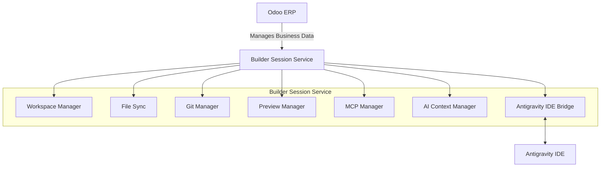

# ADR-0003
## Title
Introduce Builder Session Service

## Status
Accepted

## Date
2026-07-10

## Context
- Nexora Studio currently uses Odoo as the internal ERP.
- Client websites are generated from the Template Store.
- Antigravity IDE will be used for editing projects.
- AI agents require a persistent workspace instead of interacting directly with Odoo.
- Future features include Git integration, Preview server, MCP tools, AI orchestration, and file synchronization.

## Decision
- Introduce a Builder Session Service as an independent orchestration layer between Odoo and Antigravity IDE.
- The Builder Session Service owns the complete editable project workspace.
- Odoo manages business data only and never edits project files directly.
- Every client project has exactly one active Builder Session.
- The service is responsible for lifecycle management of workspaces.

## Responsibilities
- Workspace creation and management
- File synchronization
- Git repository management
- Preview server lifecycle
- MCP server lifecycle
- AI context/session management
- Builder state persistence
- Communication with Odoo
- Communication with Antigravity IDE

## Architecture Diagram

## Consequences
- Odoo remains lightweight and strictly focused on business logic.
- Builder logic becomes independently scalable outside of the ERP architecture.
- Multiple IDEs can be supported seamlessly in the future without deep refactoring.
- AI agents interact strictly and only with the Builder Session Service, preserving context securely.
- Workspaces become isolated, reproducible, and distinct entities.
- Git, Preview, and MCP services become loosely coupled and replaceable implementations.

## Alternatives Considered
- **Odoo directly managing project files**: Rejected because Odoo is not designed to be a file system manager or a source code versioning tool, which would lead to heavy technical debt and poor performance.
- **IDE communicating directly with Odoo**: Rejected because this forces Odoo to handle complex contextual AI session state, preview server lifecycle management, and real-time syncing.
- **Embedded workspace inside Odoo**: Rejected because it violates the principle of keeping frontend source code completely outside the database.

## Future Work
- Workspace Manager implementation
- Preview Engine
- Git Integration
- MCP Integration
- AI Orchestrator
- Session Recovery
- Multi-user collaboration
