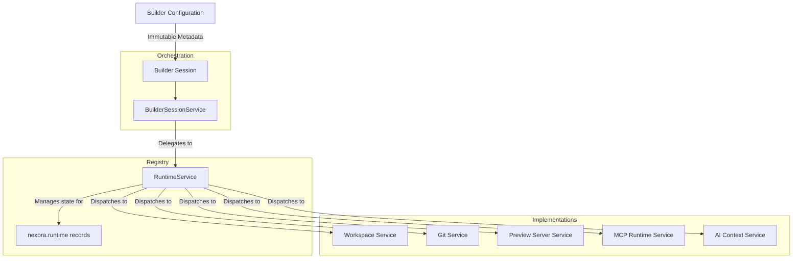

# ADR-0004
## Title
Runtime Registry Architecture

## Status
Accepted

## Date
2026-07-11

## Context
- Phase 4 transitioned Nexora Studio into managing external dependencies.
- A single Builder Session relies on multiple independent runtime services (Workspace, Git, Preview, MCP, AI).
- Coupling these services directly into the BuilderSessionService creates a bloated orchestrator and breaks the open/closed principle for adding new runtimes.
- We require a unified architecture (a Registry) that dynamically registers, discovers, and orchestrates runtimes via a common interface.

## Decision
- Establish a **Runtime Registry** (`nexora.runtime` and `nexora.runtime_service`) that sits between the Builder Session and the individual implementations.
- The `BuilderSessionService` becomes a pure orchestrator, delegating all runtime lifecycle operations (start, stop, restart, refresh) to the `RuntimeService`.
- Each runtime capability MUST be abstracted into an independent service that registers itself with the `RuntimeService`.
- The Registry tracks the state, health, port, endpoint, and metadata of each running component independently via `nexora.runtime` records.

## Runtime Abstraction
Every physical or external resource is represented as a runtime abstraction.
A runtime component:
- Inherits from or implements a standard interface dictated by the Registry.
- Is stateless at the class level and operates on deterministic inputs from its `nexora.runtime` record.
- Exposes a standard lifecycle interface (`start_runtime_instance`, `stop_runtime_instance`, `check_health`).

## Session Orchestration
The `BuilderSessionService` acts as the conductor, but it delegates to `RuntimeService`:
- **Top-Down Control**: `RuntimeService` orchestrates startup and shutdown of each attached runtime in dependency order (e.g., Workspace -> Git -> Preview).
- **Error Boundary**: If one runtime fails during startup, the Registry marks it as `error`, cascading the status back to the Builder Session.
- **State Aggregation**: The orchestrator queries the `RuntimeService` for the health of all runtimes and aggregates them into the `runtime_health` metric on the session.

## Runtime Lifecycle
The standard lifecycle transitions recorded on `nexora.runtime` are:
1. **Stopped**: No resources are active.
2. **Starting**: Resources are being provisioned (Workspace initialized, Preview Server booting).
3. **Running**: All required runtimes are successfully initialized and healthy.
4. **Busy**: A runtime is actively performing a blocking operation (e.g., Git pull, deployment).
5. **Stopping**: Graceful teardown of allocated resources.
6. **Error**: A failure occurred requiring user intervention or restart.

## Runtime Registration and Discovery
Runtimes are registered as loosely coupled hooks within the `RuntimeService` registry.
1. `discover_runtimes()`: Automatically provisions necessary `nexora.runtime` database records for a new session based on configuration or active plugins.
2. `register_runtime()`: Maps runtime types (e.g., 'workspace') to their actual Odoo service classes (e.g., 'nexora.workspace_service').

## Dependency Graph

## Future Plugin Architecture
This registry architecture is specifically designed to support the dynamic addition of new runtime services in subsequent phases:
1. **Git Runtime**: Source control operations localized to the provisioned workspace.
2. **Preview Server**: Background process serving the website.
3. **MCP Runtime**: Model Context Protocol connections for AI tooling.
4. **AI Context**: Agent session state and context persistence.
5. **Deployment Pipeline**: Push-to-production logic.
6. **Docker Runtime**: For isolated execution environments.

## Implementation Notes (Phase 5B Refactor)
- **Plugin Registry Purification**: `RuntimeService` acts as a pure dispatcher. It no longer contains hardcoded implementation logic like `if runtime_type == 'workspace'`.
- **Standard Interface**: All runtime plugins must implement `start_runtime_instance(runtime)`, `stop_runtime_instance(runtime)`, `restart_runtime_instance(runtime)`, `refresh_runtime(runtime)`, and `check_health(runtime)`.
- **AbstractModel ACL Clean Up**: Service classes (`models.AbstractModel`) like `nexora.workspace_service` are purely logical boundaries and do not persist in the database. Access rules in `ir.model.access.csv` are strictly limited to concrete persistence models.
- **Ownership vs. Lifecycle**: `BuilderSession` maintains ownership of the Workspace via the `workspace_id` relation, while the `RuntimeService` oversees its runtime state execution natively through the registry.
