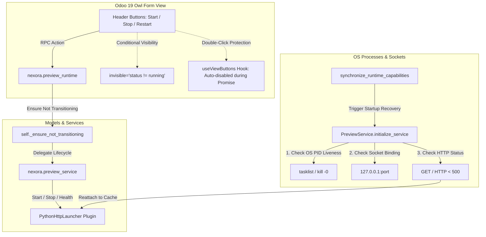

# ADR-0006
## Title
Preview Runtime Lifecycle Design, Recovery Mechanism, Process Ownership, and Odoo 19 UI Strategy

## Status
Accepted

## Date
2026-07-12

## Context
In Phase 6C, we built and verified the `PreviewService` (`nexora.preview_service`) and its associated persistent entity `nexora.preview_runtime` to orchestrate live local development servers for Builder Sessions. The preview system conforms to the Runtime Plugin Contract (ADR-0005) and integrates cleanly into the multi-runtime dependency graph (Workspace -> Git -> Preview).

During verification and UI debugging of `nexora.preview_runtime.form`, several critical technical challenges emerged:
1. **Frontend Button Lockout in Odoo 19**: Despite `nexora.runtime` reaching `running` state with `health = 'healthy'`, the form view's header buttons (`Stop Preview`, `Restart Preview`) remained permanently disabled (`<button disabled="">`). We needed to determine exact underlying Odoo 19 view compilation and component lifecycle rules.
2. **Process Ownership & Multi-Worker Resilience**: Spawned preview server processes (`subprocess.Popen`) live at the OS level. If an Odoo server worker restarts or the application crashes, in-memory process handles (`Popen` objects) are lost while the OS process and port binding remain active.
3. **Orphan Process Cleanup & Port Management**: Preview servers occupying TCP ports (`3000-3999`) must be cleanly reattached across restarts or terminated if their owning database records are deleted or corrupted.
4. **Race Condition & Double-Click Prevention**: Preventing duplicate execution of lifecycle transitions without breaking UI button availability.

## Decision

We establish the architectural standards for **Preview Runtime Orchestration, Process Recovery, and Odoo 19 UI State Management**.

### 1. Dynamic Launcher Strategy Architecture (`nexora.preview_launcher`)
- **Abstract Launcher Plugin**: `PreviewService` delegates OS-level execution to strategy plugins inheriting from `nexora.preview_launcher`.
- **Default Strategy (`python_http`)**: The `PythonHttpLauncher` spawns zero-dependency static HTTP servers (`python -m http.server <port> --bind 127.0.0.1`) inside the workspace root.
- **In-Memory Tracking & Port Allocation**: Launchers maintain an internal registry (`_active_processes`) linking PID to active `Popen` and log file handles. Port allocation (`allocate_port`) searches `3000-3999` while cross-referencing both database allocations (`allocated_port > 0`) and physical OS socket availability (`socket.bind()`).

### 2. Automatic Startup Recovery & Reattachment (`initialize_service`)
To ensure zero data loss or port exhaustion when Odoo restarts:
- On system initialization (`synchronize_runtime_capabilities()`), `PreviewService.initialize_service()` is invoked automatically.
- The service enumerates all `nexora.preview_runtime` records claiming active execution (`process_id > 0` and `allocated_port > 0`).
- For each candidate, a **3-Way Health Verification** is executed:
  1. **OS Process Liveness Check**: Verifies if the PID exists at the OS level (`tasklist /FI "PID eq <pid>"` on Windows or `os.kill(pid, 0)` on POSIX).
  2. **TCP Socket Binding Check**: Verifies if `127.0.0.1:<allocated_port>` is actively listening via `socket.create_connection()`.
  3. **HTTP Endpoint Health Check**: Sends an HTTP GET request (`urllib.request.urlopen()`) to confirm the server returns status `< 500`.
- **Reattachment**: If all checks pass, the launcher reconstructs the in-memory process cache (`launcher.reattach(pid, port)`) and synchronizes `nexora.runtime` to `running` / `healthy`.
- **State Cleanup**: If any check fails, the stale database tracking fields are cleanly cleared (`process_id = 0`, `allocated_port = 0`, `status = 'stopped'`).

### 3. Orphan Process Detection & Termination
- If `initialize_service()` encounters a preview process or socket that fails health verification while physical OS processes (`tasklist` / `netstat`) are still bound, `launcher.stop()` explicitly terminates the orphaned PID and confirms TCP port closure before releasing the allocation.

### 4. Odoo 19 UI Button Strategy & View Architecture
Header buttons on form views (`nexora.preview_runtime.form`) MUST follow strict Odoo 19 view compiler rules:

- **Prohibition of Dynamic `disabled` and `readonly` Attributes**:
  Header `<button type="object">` elements **MUST NOT** include `disabled="..."` or `readonly="..."` domain expressions.
  *Technical Justification*: In Odoo 19 (`@web/views/view_compiler.js`), `disabled` is categorized under `BUTTON_STRING_PROPS = ["string", "size", "title", "icon", "id", "disabled"]`. When the compiler processes `disabled="status in ('starting', 'stopping')"`, it assigns the literal string value to `this.props.disabled`. In JavaScript, any non-empty string evaluates to truthy (`Boolean("status in ('starting', 'stopping')") === true`). Consequently, Owl's `ViewButton` getter unconditionally locks the DOM element (`<button disabled="">`) permanently on every render.
- **Exclusive Use of `invisible` for Conditional Availability**:
  Dynamic button visibility and state availability must be driven solely by `invisible="domain_expr"`:
  ```xml
  <button name="action_start_preview" string="Start Preview" type="object" class="btn-primary"
          invisible="status not in ('stopped', 'error')"/>
  <button name="action_stop_preview" string="Stop Preview" type="object" class="btn-warning"
          invisible="status != 'running'"/>
  <button name="action_restart_preview" string="Restart Preview" type="object"
          invisible="status != 'running'"/>
  <button name="action_refresh_status" string="Refresh Status" type="object"
          invisible="not runtime_id"/>
  <button name="action_open_preview" string="Open Preview" type="object" class="btn-info"
          invisible="status != 'running'"/>
  ```
- **Frontend Double-Click Prevention**:
  Odoo 19 provides native UI double-submission locking via the `useViewButtons` hook (`@web/views/view_button/view_button_hook.js`), which automatically disables all active buttons on the form (`el.querySelectorAll("button:not([disabled])")`) during pending RPC execution Promise resolution.
- **Backend Lifecycle Protection**:
  All lifecycle methods (`action_start_preview`, `action_stop_preview`, `action_restart_preview`) enforce backend state integrity via `self._ensure_not_transitioning()` on `nexora.preview_runtime`. If a transition (`starting` or `stopping`) is underway, the model raises a `ValidationError`, guaranteeing transaction safety without UI button lockouts.

## Consequences

**Positive:**
- Complete synchronization between database state, in-memory launcher caches, and OS-level processes across Odoo restarts.
- Zero orphaned background processes or exhausted TCP ports.
- Responsive, reliable form view lifecycle buttons compliant with Odoo 19 Owl rendering pipelines.
- Clean separation between frontend UI visibility rules (`invisible`) and backend concurrency safety (`_ensure_not_transitioning`).

**Negative:**
- Requires strict adherence to the Odoo 19 `BUTTON_STRING_PROPS` rule across all future view architectures; developers must never attempt to dynamically disable header buttons via `disabled="expr"`.

## Architecture Diagram


