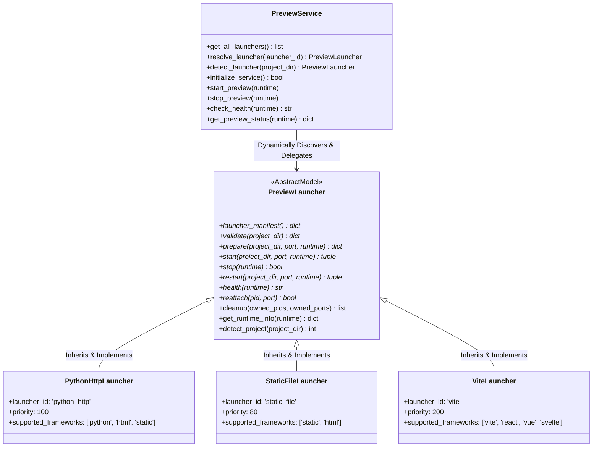

# ADR-0007
## Title
Framework-Agnostic Preview Launcher Architecture (`nexora.preview_launcher`)

## Status
Accepted

## Date
2026-07-12

## Context
As `nexora_studio` evolved from Phase 6C/6D to support diverse local development stacks (Python static servers, static HTML folders, Vite, React, Vue, Next.js, etc.), the orchestration service (`PreviewService` / `nexora.preview_service`) faced two major architectural risks:
1. **Coupling to Specific Frameworks**: Hardcoding `if framework == 'vite': ...` or `if launcher_type == 'python_http': ...` inside `PreviewService` violates the Open/Closed Principle and requires updating core orchestration code whenever a new frontend framework or server type is introduced.
2. **Inconsistent Lifecycle & Diagnostics**: Different dev servers (`npm run dev`, `python -m http.server`, `npx serve`) have distinct command flags, environment requirements, binary dependencies (`node`, `npm`, `python`), and process hierarchies. Without a rigid interface contract, error handling, startup validation, health monitoring, and orphan process cleanup become fragmented and unpredictable across frameworks.

To solve this while preserving the **Runtime Plugin Architecture** (ADR-0004/ADR-0005) and **Preview Runtime Lifecycle** (ADR-0006), `PreviewService` must become completely framework-agnostic. Every supported dev server or framework must be encapsulated as an independent launcher plugin (`nexora.preview_launcher`) discovered dynamically through Odoo's registry.

## Decision

We establish the **Framework-Agnostic Preview Launcher Architecture (`nexora.preview_launcher`)** governed by the following architectural components:

### 1. The `PreviewLauncher` Abstraction & Interface Contract (`nexora.preview_launcher`)
`PreviewService` never executes OS processes or builds shell commands directly. Instead, all launcher plugins inherit from the abstract base class `nexora.preview_launcher` and must implement the complete **Preview Launcher Contract**:

- `launcher_manifest()`: Exposes metadata defining the plugin identity, priority, and capabilities.
- `validate(project_directory)`: Verifies required system executables (`python`, `node`, `npm`) and workspace structure *before* execution.
- `prepare(project_directory, port, runtime, **kwargs)`: Prepares the execution command, log file targets, and environment variables (`PORT`).
- `start(project_directory, port, runtime, ...)`: Spawns the underlying process, records inside in-memory caches, and returns `(process_id, preview_command, preview_url)`.
- `stop(runtime)`: Gracefully terminates processes (`SIGTERM`/`taskkill`), waits for process tree exit, and explicitly confirms TCP port closure (`_wait_for_port_release`).
- `restart(...)`: Coordinates clean stop followed by start.
- `health(runtime)`: Performs OS liveness checks (`kill -0`/`tasklist`) and socket probes (`127.0.0.1:<port>`).
- `reattach(pid, port)`: Reconstructs in-memory process caches (`_active_processes`) from persisted database metadata across Odoo server restarts.
- `cleanup(owned_pids, owned_ports)`: Scans the OS and cleanly terminates any unmanaged orphan processes produced by this launcher strategy.
- `get_runtime_info(runtime)`: Returns standardized, structured runtime status across all frameworks.
- `detect_project(project_directory)`: Inspects workspace files (`package.json`, `vite.config.*`, `index.html`) and returns a match score indicating suitability.

### 2. Why `PreviewService` Must Remain Framework-Agnostic
- **Separation of Concerns**: `PreviewService` (`nexora.preview_service`) is strictly responsible for orchestration, database state tracking (`nexora.preview_runtime`), dependency graph ordering (`workspace -> preview`), port allocation (`3000-3999`), and Odoo 19 UI state management (`action_start_preview`, `action_stop_preview`).
- **Zero Conditional Branches**: `PreviewService` must never contain statements like `if framework == 'vite'` or `if launcher_type == 'python_http'`. All strategy logic, binary verification, command building, and process tracking belong exclusively inside the launcher plugins (`nexora.preview_launcher_*`).
- **Plug-and-Play Extensibility**: Adding support for a new technology (e.g., Next.js, Flutter, Docker) requires only adding a new Python module inheriting from `nexora.preview_launcher` with appropriate priority and `detect_project` logic. Zero changes to `PreviewService` are required.

### 3. Dynamic Runtime Discovery Mechanism
Instead of hardcoding launcher registries or dictionaries:
- `PreviewService.get_all_launchers()` inspects Odoo's `env.registry.models` at runtime for all subclasses of `nexora.preview_launcher`.
- Discovered plugins are sorted in descending order of `priority` defined in their `launcher_manifest()` (e.g., `ViteLauncher` [200] > `PythonHttpLauncher` [100] > `StaticFileLauncher` [80]).
- Both `resolve_launcher(launcher_id)` and `initialize_service()` loop over this dynamic list, allowing any installed module to register new launcher capabilities seamlessly.

### 4. Automatic Framework Detection Architecture
When `PreviewService` initializes or creates a `nexora.preview_runtime` for a Builder Session without an explicit launcher override:
- `detect_launcher(project_directory)` invokes `detect_project(project_directory)` across all registered launcher plugins.
- Each plugin returns a numeric suitability score (`score >= 0`):
  - **`ViteLauncher` (`priority: 200`)**: Returns score `20` if `package.json` exists AND `vite.config.js`/`.ts`/`.mjs` exists. Returns `18` if `"vite"` is in `package.json` scripts/dependencies.
  - **`StaticFileLauncher` (`priority: 80`)**: Returns score `15` if `index.html` exists inside the workspace AND no `package.json` exists.
  - **`PythonHttpLauncher` (`priority: 100`)**: Acts as the robust default/fallback, returning `10` for Python workspaces (`*.py` exists) and `5` as a generic static fallback.
- The launcher with the highest match score is automatically assigned (`preview_rt.launcher_type = best_launcher.launcher_manifest()['launcher_id']`).

### 5. Launcher Metadata Contract (`launcher_manifest`)
Every launcher plugin MUST return a manifest dictionary structured as follows:
```python
{
    'launcher_id': str,             # Unique canonical ID (e.g., 'vite', 'python_http', 'static_file')
    'launcher_type': str,           # Backward-compatible alias matching launcher_id
    'display_name': str,            # Human-readable title (e.g., 'Vite Development Server')
    'supported_frameworks': list,   # List of strings (e.g., ['vite', 'react', 'vue', 'svelte'])
    'priority': int,                # Numeric order for discovery/detection (e.g., 200, 100, 80)
    'supported_platforms': list,    # OS platforms (e.g., ['win32', 'darwin', 'linux'])
    'dependency_requirements': list,# Required binaries (e.g., ['node', 'npm'] or ['python'])
    'health_strategy': str,         # Diagnostic mechanism (e.g., 'http_and_socket')
    'recovery_strategy': str,       # Recovery strategy (e.g., 'process_cache_and_port')
    'description': str,             # Detailed operational description
    'version': str,
    'provider': str
}
```

### 6. Dependency Validation Strategy (`validate`)
To prevent unhandled OS exceptions (`FileNotFoundError`) during background process spawning:
- Every launcher executes `validate(project_directory)` before `prepare()` or `start()`.
- `validate()` verifies that all required system binaries (`shutil.which('node')`, `shutil.which('npm')`, `sys.executable`) are present on the host OS path, and that workspace configuration files (`package.json`) exist.
- It returns a structured dictionary instead of throwing exceptions during diagnostic checks:
```python
{
    'valid': bool,
    'errors': list,               # Clear, user-actionable strings if invalid
    'warnings': list,             # Non-fatal configuration warnings
    'dependencies_checked': dict  # Binary path or status map (e.g., {'node': 'C:/.../node.exe', 'npm': True})
}
```
If `validate()['valid']` is `False` when `start()` is attempted, the launcher raises a `ValidationError` containing the exact structured error messages.

### 7. Identical Health & Runtime Info Contract (`get_runtime_info`)
Whether running a Python static server (`python -m http.server`) or a complex frontend bundler (`vite --port 3000`), every launcher exposes identical structured status via `get_runtime_info(runtime)`:
```python
{
    'status': 'running' | 'stopped' | 'error',
    'health': 'healthy' | 'critical',
    'pid': int,
    'port': int,
    'endpoint': str,
    'process_information': {
        'launcher_id': str,
        'display_name': str,
        'command': str
    },
    'last_health_check': str,     # Standardized Odoo string timestamp
    'last_activity': str
}
```

## Consequences

**Positive:**
- **Zero Framework Logic in Core**: `PreviewService` contains zero framework conditionals or command strings, ensuring clean domain boundaries.
- **Universal Contract**: All current and future dev servers conform to the same 10-method lifecycle, validation, recovery, and health contract.
- **Automatic Multi-Stack Support**: Out-of-the-box discovery and detection handles static HTML websites, Python apps, and Vite single-page applications without manual configuration.
- **Enterprise Robustness**: Structured dependency validation (`validate`) catches missing Node/Python environments before process spawning, while dynamic orphan cleanup (`cleanup`) guarantees clean port management across all launcher plugins.

**Negative:**
- **Plugin Implementation Responsibility**: Adding future launchers (e.g., `NextJsLauncher`, `FlutterLauncher`) requires implementing the full 10-method contract (`validate`, `prepare`, `start`, `stop`, `restart`, `health`, `reattach`, `cleanup`, `get_runtime_info`, `detect_project`), though they inherit common boilerplate from `nexora.preview_launcher`.

## Architecture Diagram


