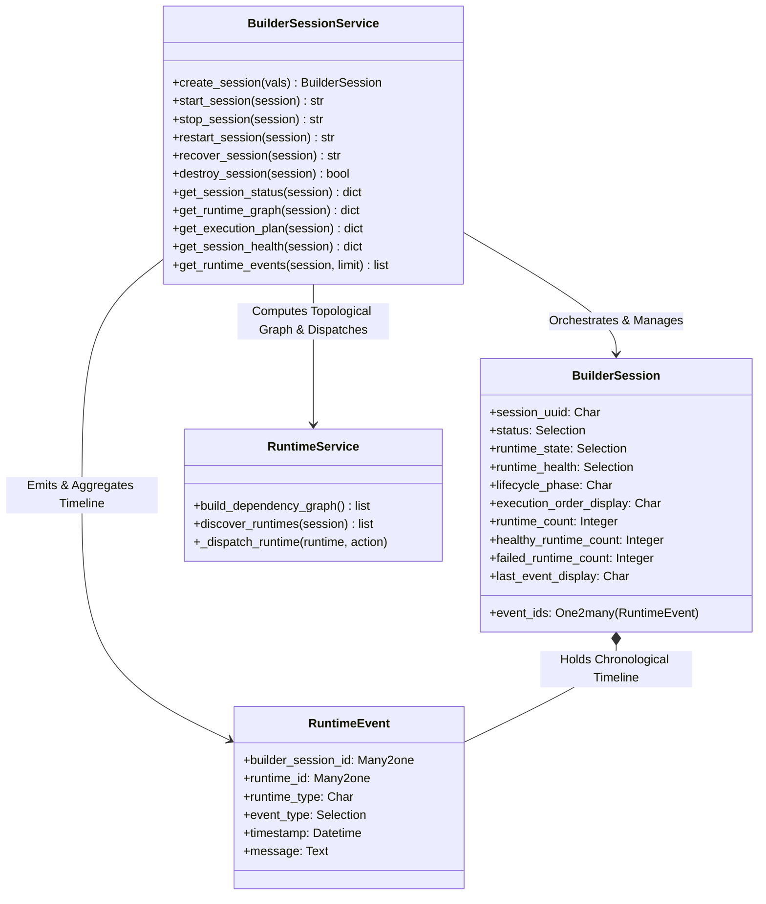

# ADR-0008
## Title
Builder Session Orchestrator (`nexora.builder_session_service` & `nexora.runtime_event`)

## Status
Accepted

## Date
2026-07-12

## Context
Across phases 6A through 6E, `nexora_studio` established foundational architecture:
- Metadata-driven registry (`nexora.runtime_capability`) and dynamic topological graph (`RuntimeService.build_dependency_graph()`) (ADR-0002 / ADR-0004).
- Runtime Plugin Contract (`nexora.runtime_plugin`) abstracting service implementations (`WorkspaceService`, `GitService`, `PreviewService`) (ADR-0005).
- Preview Runtime Lifecycle (`nexora.preview_runtime`) and Framework-Agnostic Preview Launchers (`nexora.preview_launcher`) (ADR-0006 / ADR-0007).

However, until now, individual runtimes (`Workspace`, `Git`, `Preview`) were either managed in isolation or loosely iterated during session start/stop. There was no single authoritative orchestration model where the `BuilderSession` (`nexora.builder_session`) owned lifecycle management, event timeline tracking, deterministic ordered shutdown, state-derived health aggregation, and structured startup recovery across all runtime plugins without hardcoding runtime IDs.

To provide a robust, enterprise-grade orchestration backbone for all future features (Antigravity IDE integration, AI agents, MCP, live deployment pipelines, and multi-developer collaboration), `nexora.builder_session` must become the **Single Orchestration Root** coordinated by the **Builder Session Orchestrator (`nexora.builder_session_service`)**.

## Decision

We establish the **Builder Session Orchestrator Architecture** governed by the following core specifications:

### 1. Builder Session as the Single Orchestration Root
`BuilderSession` (`nexora.builder_session`) owns the overall lifecycle (`status`, `runtime_state`, `runtime_health`, `lifecycle_phase`). Individual runtime records (`nexora.runtime`) and domain services (`nexora.workspace_service`, `nexora.git_service`, `nexora.preview_service`) manage solely their own instance execution and state transitions (`created -> starting -> running -> stopping -> stopped -> error -> recovering`). Users and external systems interact exclusively with the Builder Session Orchestrator APIs (`start_session`, `stop_session`, `restart_session`, `recover_session`, `destroy_session`).

### 2. Topological Graph Execution & Reverse Order Shutdown
The orchestrator never contains hardcoded lists like `['workspace', 'git', 'preview']` or `if runtime_type == 'workspace': ...`. Instead:
- **Ordered Startup**: The orchestrator invokes `RuntimeService.build_dependency_graph()` to resolve capabilities from `nexora.runtime_capability`. It generates a topological execution plan (`Workspace -> Git -> Preview -> Future Plugins`) and starts each runtime sequentially. If any dependency fails (`status == 'error'`), orchestration halts immediately and marks dependent runtimes as blocked (`status == 'stopped'`).
- **Ordered Shutdown**: When stopping or destroying a session, the orchestrator computes the reverse dependency graph (`Preview -> Git -> Workspace`). It guarantees that no parent dependency (e.g., `workspace` directory or `git` repository) is shut down before its child dependents (e.g., `preview` server) have cleanly stopped.
- **Dynamic Restart**: `restart_session()` executes a full reverse `stop_session()`, waits for complete process termination, recomputes the latest topological dependency graph (`build_dependency_graph`), and executes `start_session()`. No cached ordering is permitted.

### 3. Runtime Event Model (`nexora.runtime_event`)
We introduce the `nexora.runtime_event` database model (`_name = 'nexora.runtime_event'`) to provide an event-driven timeline:
- **Standardized Events**: Every runtime emits chronological lifecycle events: `STARTING`, `STARTED`, `HEALTHY`, `DEGRADED`, `STOPPING`, `STOPPED`, `FAILED`, `RECOVERED`.
- **Event Schema**:
  ```python
  {
      'builder_session_id': Many2one('nexora.builder_session', required=True, ondelete='cascade'),
      'runtime_id': Many2one('nexora.runtime', required=False, ondelete='set null'),
      'runtime_type': Char(), # e.g., 'workspace', 'git', 'preview', 'session'
      'event_type': Selection(['STARTING', 'STARTED', 'HEALTHY', 'DEGRADED', 'STOPPING', 'STOPPED', 'FAILED', 'RECOVERED']),
      'timestamp': Datetime(default=fields.Datetime.now),
      'message': Text()
  }
  ```
- **Chronological Timeline**: `BuilderSession` exposes `event_ids = fields.One2many('nexora.runtime_event', 'builder_session_id')` ordered by `timestamp desc, id desc`, providing complete diagnostic transparency (`10:10 Workspace Started -> 10:11 Git Started -> 10:12 Preview Started -> 10:13 Preview Failed`).

### 4. Rule-Based Health Aggregation & State Derivation
`BuilderSessionService.get_session_health(session)` aggregates overall session health from its discovered `nexora.runtime` records:
- **`healthy`**: All active/enabled runtimes have `health == 'healthy'` (and `status == 'running'`).
- **`degraded`**: All critical root dependencies (`workspace`, `git`) are `healthy`, but a non-critical or leaf runtime (`preview`, `mcp`, `ai`) is `warning`, `critical`, or `error`.
- **`failed`**: Any root/critical dependency (`workspace` or `git`) is `critical` or `error`, or the entire session encountered an unrecoverable exception during startup.
- **`unknown`**: No runtimes initialized or session in `draft`/`stopped` state.

### 5. Failure Handling & Isolation
If a non-critical leaf runtime (e.g., `preview`) fails while its parent dependencies (`workspace`, `git`) are healthy:
- The orchestrator marks the failed runtime (`runtime.status = 'error'`, `runtime.health = 'critical'`) and emits a `FAILED` event.
- It keeps independent and parent runtimes (`workspace`, `git`) alive (`running`/`healthy`).
- It updates the overall `BuilderSession` health to `degraded` without destroying the entire development environment.

### 6. Startup Recovery Engine (`recover_session`)
Across Odoo server restarts or process crashes, `BuilderSessionService.recover_session(session)` coordinates multi-tier recovery:
1. Re-synchronizes capabilities (`synchronize_runtime_capabilities()`).
2. Discovers the runtime graph (`discover_runtimes(session)`).
3. Iterates over the topological graph in dependency order (`Workspace -> Git -> Preview -> ...`).
4. For each runtime, dispatches the lifecycle hook (`_dispatch_runtime(runtime, 'recover_runtime_instance')` or `refresh_runtime`), reattaching in-memory process caches (`PythonHttpLauncher._active_processes`, `ViteLauncher`, etc.) and verifying physical directories and sockets (`127.0.0.1:<port>`).
5. Emits `RECOVERED` events for successfully restored runtimes and updates session status to `ready`/`busy` (`runtime_state = 'running'`).

### 7. Public Orchestrator API (`nexora.builder_session_service`)
External integrations (Antigravity IDE, CLI, UI) must communicate exclusively through standardized public API methods:
- `create_session(vals)`: Creates a new Builder Session record and initializes its capability graph.
- `start_session(session)`: Executes ordered topological startup across all runtime plugins.
- `stop_session(session)`: Executes reverse topological shutdown.
- `restart_session(session)`: Coordinates full stop, graph recomputation, and start.
- `recover_session(session)`: Reattaches running processes and reconciles state after Odoo restart.
- `destroy_session(session)`: Stops all runtimes, deletes physical workspace directories via `workspace_service`, and cleans up session records.
- `get_session_status(session)`: Returns current status dictionary (`{'status': ..., 'runtime_state': ..., 'runtime_health': ...}`).
- `get_runtime_graph(session)`: Returns structured node/edge dependency graph of active capabilities.
- `get_execution_plan(session)`: Returns topological startup order and reverse shutdown order (`{'startup': [...], 'shutdown': [...]}`).
- `get_session_health(session)`: Returns aggregated session health dictionary (`{'health': ..., 'runtimes': {...}}`).
- `get_runtime_events(session, limit=50)`: Returns chronological list of emitted `nexora.runtime_event` dictionaries.

## Consequences

**Positive:**
- **Zero Framework Logic & 100% Extensible**: Adding any future runtime plugin (`nexora.runtime_plugin_mcp`, `nexora.runtime_plugin_ai`) requires zero edits to `BuilderSessionService`. The topological sorter immediately includes it in startup, shutdown, recovery, and health aggregation.
- **Enterprise Observability**: Chronological `nexora.runtime_event` timelines and UI dashboards allow developers and IDE agents to trace exact failure points and execution order instantaneously.
- **Fault-Tolerant Isolation**: Leaf runtime crashes (e.g., Vite build errors or HTTP socket disconnects) no longer kill the physical workspace directory or Git state.

**Negative:**
- **Event Volume**: Frequent lifecycle transitions (e.g., repeated rapid restarts of preview servers) can accumulate rows in `nexora.runtime_event`, requiring periodic retention cleanup or cascade deletion when sessions close.

## Architecture Diagram


