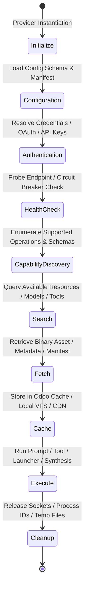

# ADR-0029: Unified Provider Platform Architecture

**Status:** Proposed & Architecture-Validated (Phase 15A Architecture-First Foundation)  
**Date:** July 2026  
**Authors:** Nexora Studio Advanced Architecture & Governance Team  
**Supersedes / Unifies:** Fragmented provider registries across AI, MCP, Preview, Plugins, Design, and Assets  

---

## 1. Context & Architecture Audit Findings

Following comprehensive read-only architecture audits of both the **Nexora Studio Odoo Backend OS (`nexora_studio`)** and the **Nexora Developer Console (`nexora-console` + FastAPI BFF)**, our analysis revealed a mature, highly decoupled foundation that nevertheless suffers from **registry fragmentation and lifecycle duplication** across its subsystem boundaries. 

Historically, as Nexora Studio expanded its domain capabilities, each domain engineering team implemented an independent provider or registry abstraction:
1. **AI Provider Framework (`services/ai/provider_manager.py`, `base_adapter.py`):** Implements a 4-tier model routing engine (Task-Specific, Provider-Default, Fallback, System-Default) with custom adapters (OpenAI, Anthropic Claude, Gemini, Ollama, OpenRouter, NVIDIA). It manages its own health checks (`provider_health_service.py`), configuration (`ai_configuration_service.py`), and execution policies (`provider_execution_policy.py`).
2. **MCP Registry & Tool Framework (`services/mcp_registry.py`, `mcp_service.py`, `tool_registry.py`):** Implements an independent Odoo model and service for registering Model Context Protocol servers and internal workspace tools, utilizing ad-hoc execution wrappers and discovery methods.
3. **Plugin Manager (`services/plugin_manager.py`, `plugin_lifecycle_service.py`):** Manages runtime plugins and manifest validation (`plugin_manifest_validator.py`), maintaining a separate state machine for installation, enablement, and capability injection.
4. **Capability Registry (`services/capability_discovery_service.py`, `capability_lifecycle_service.py`):** Resolves project capabilities against framework providers without a shared caching or health diagnostic contract.
5. **Design Intelligence & Providers (`services/design/design_provider.py`, `penpot_provider.py`):** Implements standalone provider interfaces for design generation, template analysis, theme synthesis, and external design tool bridging (Penpot/Figma).
6. **Asset Planning Engine (`services/design/asset_planning_engine.py`, `asset_domain.py`):** Declaratively models asset requirements (`PromptSpecification`, `AssetPlan`) but lacks a unified provider contract for searching, fetching, caching, and uploading binary assets (images, fonts, icons) from external sources (Unsplash, Pixabay, Google Fonts).
7. **Preview Provider System (`services/preview_service.py`, `preview_launcher.py`):** Defines an abstract `PreviewLauncher` with custom port allocation, process tracking, and health checking logic tailored exclusively to dev servers (Vite, HTTP, Custom).

### The Architectural Problem
While each subsystem works well in isolation, maintaining **seven independent provider frameworks** introduces severe architectural debt:
- **Duplicated Cross-Cutting Concerns:** Authentication (API keys, OAuth tokens, headers), health monitoring (circuit breakers, ping intervals, degradation status), configuration schemas, and caching layers are implemented multiple times with slight variations.
- **Inconsistent Execution & Error Handling:** An error in an AI adapter raises different exception types and follows different retry/fallback semantics than a failure in an MCP server, asset fetcher, or preview launcher.
- **Split-Brain Frontend UI Integration:** Because each backend provider category exposes different REST/JSON-RPC API payloads and status structures, the Nexora Console frontend is forced to maintain parallel Zustand stores and UI inspector tabs for AI providers, MCP tools, preview servers, and design assets.

To eliminate this fragmentation and establish a production-grade, extensible OS, we must consolidate these independent systems into a single **Unified Provider Platform**.

---

## 2. Decision

We define and mandate the **Unified Provider Platform** as the sole architectural foundation for all integrations and extensible capabilities within Nexora Studio. 

Going forward, the platform consolidates all existing and future provider systems under a single, polymorphic architecture governed by a universal lifecycle and common interfaces. This architecture covers:
- **AI Providers** (LLMs, vision models, embedding engines, code generation models)
- **Asset Providers** (Raster images, vector icons, typography/fonts, design templates)
- **Component Source Providers** (Penpot design systems, Figma UI kits, React component libraries)
- **Design Providers** (Theme generators, token synthesizers, layout engines)
- **MCP Providers** (Local filesystem tools, Git operations, external stdio/SSE servers)
- **Future Provider Categories** (Deployment targets, analytics engines, database provisioners)

Every provider category must extend a common `BaseProvider` contract and execute within a standardized lifecycle managed centrally by Odoo.

---

## 3. Provider Lifecycle Contract

To guarantee deterministic behavior, observability, and safe resource management across all subsystems, every provider must conform to a strict **10-Stage Universal Lifecycle Contract**:

### Stage Definitions & Governance:
1. **Initialize:** The provider class is instantiated by `ProviderFactory` using its unique registration key and category manifest.
2. **Configuration:** Environment variables, Odoo database settings, and workspace project manifests are validated against the provider's `ProviderConfiguration` schema.
3. **Authentication:** Credentials (API keys, bearer tokens, SSH keys, OAuth grants) are securely resolved via `ProviderAuthentication` without exposing secrets to logs or AI prompt contexts.
4. **Health Check:** The provider executes a standardized diagnostic probe (`check_health()`). If degraded or unreachable, Odoo's circuit breaker marks the provider status in `ProviderHealth` and routes traffic to configured fallbacks.
5. **Capability Discovery:** The provider emits a structured `ProviderCapability` manifest listing its supported operations (e.g., `text-generation`, `image-search`, `tool-call`, `jsx-render`, `port-bind`), rate limits, and parameter schemas.
6. **Search:** For asset, component, and tool providers, the system executes structured queries returning normalized `ProviderSearchResult` collections for UI presentation or AI selection.
7. **Fetch:** External payloads (AI completions, binary image blobs, font stylesheets, MCP tool definitions) are retrieved through network adapters with strict timeout and retry governance.
8. **Cache:** Fetched responses and capability manifests are passed through `ProviderCache`, leveraging Odoo's internal cache backends or local filesystem storage to eliminate redundant external calls.
9. **Execute:** The primary business operation is performed within a sandboxed `ProviderExecutionContext` that tracks token costs, execution latency, and audit timestamps.
10. **Cleanup:** Temporary files, open network sockets, background OS subprocesses, and memory buffers are guaranteed to be released via context managers (`__exit__` / `cleanup()`).

---

## 4. Separation of Responsibilities

To prevent architectural bleed and maintain clean boundaries between infrastructure orchestration, UI presentation, and vendor communication, responsibilities are strictly divided across three tiers:

### 4.1 Odoo Backend OS (`nexora_studio`) — The Orchestration Engine
Odoo acts as the authoritative kernel for the Unified Provider Platform. It is strictly responsible for:
- **Provider Registry & Persistence:** Maintaining the central SQL catalog (`nexora.provider.registry`) of all registered providers, their categories, activation state, and priority weights.
- **Metadata & Configuration Schema:** Storing and validating JSON schemas for provider settings, API endpoints, and project-level overrides.
- **Secure Authentication & Permissions:** Encryption, vaulting, and role-based access control (RBAC) governing which users and builder sessions can invoke specific providers.
- **Health Monitoring & Circuit Breaking:** Periodic background cron probing, error threshold tracking, and automatic failover routing when a primary provider fails.
- **Execution Orchestration & Policies:** Enforcing rate limits, cost budgets, concurrency quotas, and telemetry logging via `nexora.runtime_event`.
- **Centralized Caching:** Managing TTLs, invalidation rules, and storage backends for provider capabilities, search results, and binary assets.

### 4.2 Nexora Console (FastAPI BFF + React UI) — The Presentation & Experience Layer
The frontend developer console and its BFF adapter are strictly responsible for:
- **Provider Management UI:** Visual dashboard tabs allowing agency administrators to configure API keys, toggle provider activation, and view real-time health/latency metrics.
- **Interactive Provider Selection:** Dropdown selectors, fallback routing planners, and cost estimators integrated into the Builder UI and AI Assistant panels.
- **Rich Search & Preview Experience:** Grid browsers, filter panels, and live visual preview cards for assets (images, icons, typography) and design components (Penpot/React UI kits).
- **Developer Workflow Interaction:** Exposing real-time provider events, error alerts, and capability inspector panels during live coding and generation sessions.
- **BFF Transport Adaptation:** Converting clean Odoo HTTP REST/SSE provider payloads into optimized TypeScript interfaces and Zustand/TanStack Query client states.

### 4.3 Provider Adapter (`services/providers/adapters/...`) — The Pure Communication Bridge
A provider adapter is a lightweight, vendor-specific implementation class. It is strictly responsible for:
- **Vendor API Communication:** Translating normalized Odoo provider requests into vendor-specific HTTP requests, JSON-RPC calls, stdio streams, or SDK invocations.
- **Response Normalization:** Parsing vendor-specific JSON responses, binary streams, or error codes into standardized `ProviderResponse` and `ProviderException` objects.
- **Zero Business Logic:** An adapter must contain **ABSOLUTELY ZERO** business logic, workflow orchestration, database persistence, state machine transitions, or UI rendering rules. It receives an execution context, talks to the external service, and returns a normalized result.

---

## 5. Consequences

### 5.1 Advantages
- **Universal Observability:** Every provider call across AI, MCP, Assets, and Preview emits identical audit telemetry (`ProviderEvent`) and health metrics, simplifying debugging and system monitoring.
- **Single Caching & Security Infrastructure:** Authentication secrets, rate limits, circuit breakers, and cache expiration rules are authored once in the Odoo core and inherited by all provider categories.
- **Zero Vendor Lock-In:** Swapping an AI model, icon provider, or MCP server requires zero changes to calling services or frontend UI components; callers interact exclusively with polymorphic provider interfaces.
- **Streamlined Frontend Console Development:** The Nexora Console UI can use a single, unified set of React components (`<ProviderCard />`, `<AssetBrowser />`, `<CapabilityBadge />`) to manage all extension points.

### 5.2 Disadvantages
- **Upfront Architectural Abstraction Overhead:** Defining clean, category-agnostic interfaces requires careful design to avoid lowest-common-denominator abstractions that stifle category-specific features.
- **Refactoring Complexity:** Migrating over 25 existing standalone adapters (OpenAI, Claude, Gemini, ViteLauncher, MCP servers, Penpot) to conform to the new 10-stage lifecycle requires methodical, phased adapter wrappers to avoid regressions.

### 5.3 Future Extensibility
- Adding a new external provider category (e.g., Video Generation Providers, Cloud Database Provisioners, Automated Security Scanners) simply requires registering a new category enum in the central registry and implementing a class extending `BaseProvider`.

### 5.4 Migration Strategy & Backward Compatibility
- **Phase 15A (Current - Architecture First):** Define all abstract base classes, domain contracts, and consolidation plans without altering existing service files or modifying runtime behavior.
- **Phase 15B/C (Incremental Adapter Wrappers):** Implement the `ProviderRegistry` and wrap existing AI, MCP, Preview, and Design providers in lightweight adapter bridges that satisfy the `BaseProvider` contract while delegating execution to legacy underlying services.
- **Phase 15D+ (Legacy Cutover):** Once all test suites pass against the unified interfaces, deprecate and prune redundant standalone registry services (`ai_provider_manager.py`, standalone `mcp_registry.py`, etc.), maintaining 100% backward compatibility for API callers and frontend UIs.
