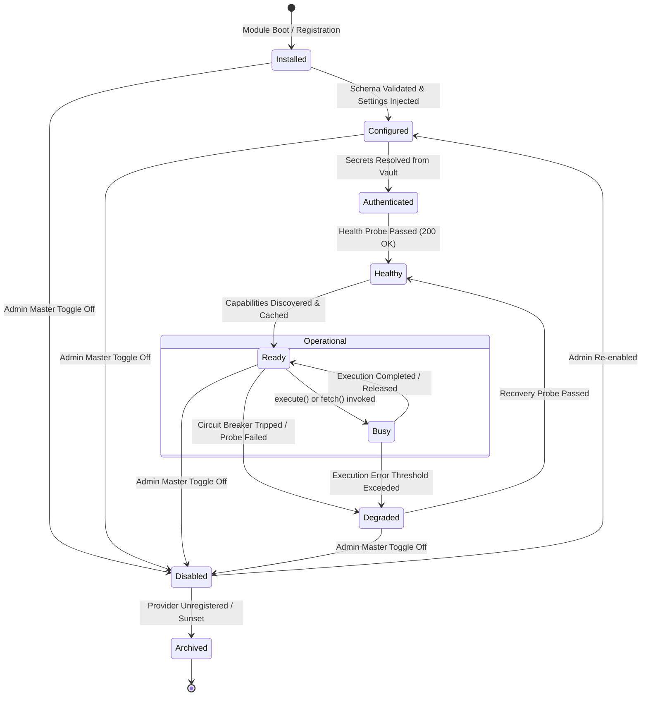

# ADR-0030: Provider Runtime & Lifecycle Governance

**Status:** Proposed & Architecture-Validated (Phase 15A Architecture-First Extension)  
**Date:** July 2026  
**Authors:** Nexora Studio Advanced Architecture & Governance Team  
**Extends / Supplements:** ADR-0029 (Unified Provider Platform Architecture)  

---

## 1. Context & Architectural Evolution

In **ADR-0029**, we established the foundational architecture of the **Unified Provider Platform**, consolidating six fragmented domain registries across AI, MCP, Preview, Design, Component, and Asset subsystems into a single polymorphic hierarchy governed by a 10-stage lifecycle. 

While ADR-0029 successfully standardized interface abstractions (`BaseProvider`, `ProviderMetadata`, `ProviderResponse`), deep architectural simulation revealed ten critical governance requirements necessary to operate an enterprise-grade, multi-tenant OS:

1. **String Category Fragility:** Relying on raw strings (`'ai'`, `'mcp'`) for provider categorization invites typo-induced routing failures and lacks static typing safety.
2. **Metadata vs. Runtime State Contention:** Coupling immutable static provider identity (name, vendor URL, version) with rapidly mutating operational runtime metrics (latency, health status, active session locks) creates SQL lock contention and prevents clean caching.
3. **Underspecified Lifecycle Transitions:** Without a formal Finite State Machine (FSM), adapters can be invoked while unconfigured or mid-authentication, leading to race conditions.
4. **Fragmented Event Routing:** Telemetry logging, real-time UI websocket pushes, Prometheus metrics, and security audit logs currently lack a unified pub/sub distribution topology.
5. **Manifest & API Version Drift:** Providers evolve independently across adapter versions, manifest schema revisions, and external vendor API versions; tracking a single version string is insufficient.
6. **Capability Versioning & Deprecation:** When an AI model or MCP tool updates its parameter schema, calling services need to negotiate specific capability revisions (`v1` vs `v2`) without breaking legacy workflows.
7. **Unordered Startup & Dependency Resolution:** Certain composite providers (e.g., a Design System Synthesizer) depend on foundational providers (e.g., an LLM Provider and a Font Asset Provider). The platform requires formal topological dependency sorting.
8. **Unconstrained Execution Security:** Third-party MCP servers, external asset fetchers, and community plugins execute in the Odoo runtime without granular capability-based sandboxing (filesystem restrictions, network whitelisting, shell access execution limits).
9. **Fragmented Quota & Cost Accounting:** Financial budgeting and rate-limiting are currently implemented only for AI token consumption, leaving asset downloads, MCP tool invocations, preview dev server uptime, and storage bytes unmonitored.
10. **Marketplace Distribution Readiness:** To support a future Nexora Studio Plugin Marketplace, provider manifests must standardize attribution, licensing, documentation links, and minimum OS compatibility requirements.

---

## 2. Decision

We extend the **Unified Provider Platform** with **ADR-0030: Provider Runtime & Lifecycle Governance**. This decision mandates ten structural enhancements across all current and future provider integrations:

### 2.1 `ProviderCategory` Type-Safe Enum
All category identifiers must transition from string literals to a standardized Python `Enum`:
```python
from enum import Enum

class ProviderCategory(str, Enum):
    AI = "ai"
    ASSET = "asset"
    COMPONENT = "component"
    DESIGN = "design"
    MCP = "mcp"
    PREVIEW = "preview"
    STORAGE = "storage"
    CUSTOM = "custom"
```

### 2.2 Strict Separation of Metadata & Runtime State
Static provider identity is permanently separated from dynamic runtime operational state:
- **`ProviderMetadata` (Immutable Manifest Identity):** Stored in `nexora.provider.registry`. Cached in-memory indefinitely with zero lock contention.
- **`ProviderStateRecord` (Mutable Runtime Status):** Stored in a separate, highly optimized SQL model (`nexora.provider.runtime_state`) tracking current FSM state, active concurrency locks, probe latency, and degradation timers.

### 2.3 Formal Provider Runtime State Machine (FSM)
Every provider instance operates within a strict 9-state Finite State Machine governed by `ProviderStateMachine`:



### 2.4 Centralized Provider Event Bus Architecture
All lifecycle transitions, execution metrics, and error events are published to `ProviderEventBus`, which asynchronously broadcasts payloads across six dedicated channels:
1. **`telemetry`:** Timeline logging ingested into `nexora.runtime_event` for debugging and trace correlation.
2. **`websocket`:** Real-time push notifications to the Nexora Console frontend (Zustand store synchronization).
3. **`metrics`:** In-memory counters and gauges exported to Prometheus and Odoo system dashboards (e.g., requests per second, error ratios).
4. **`logging`:** Python standard logging (`_logger.info/error`) formatted with trace IDs.
5. **`audit`:** Immutable security compliance logs recording credential resolution, permission checks, and shell executions.
6. **`notifications`:** User and administrator alerts (e.g., toast alerts in UI when a primary AI provider trips its circuit breaker).

### 2.5 Triple-Version Manifest Governance
Every provider manifest must declare three distinct semantic versioning vectors:
- **`provider_version`:** The semantic version of the adapter code (e.g., `'1.4.2'`).
- **`manifest_version`:** The version of the Nexora Studio manifest specification (e.g., `'2026-07'`).
- **`api_version`:** The targeted external vendor REST/HTTP/RPC API version (e.g., `'v1'`, `'2024-05-13'`).

### 2.6 Multi-Revision Capability Versioning
Individual capabilities in `ProviderCapability` support concurrent revision negotiation:
- **`capability_version`:** Active schema revision (e.g., `'v2'`).
- **`supported_revisions`:** List of all compatible historical schemas (e.g., `['v1', 'v2']`).
- **`deprecated_revisions`:** List of revisions scheduled for sunsetting with mandatory sunset timestamps.

### 2.7 Directed Acyclic Dependency Graph (`ProviderDependencyGraph`)
Providers can declare dependencies on other providers in their manifest (`requires: ['ai.openai>=1.0', 'storage.local>=2.0']`). At Odoo boot, `ProviderDependencyGraph` constructs a topological sort, verifies cycle absence, and enforces deterministic startup ordering (e.g., initializing Storage and Auth providers before initializing MCP or AI providers).

### 2.8 Granular Provider Sandbox Policy (`ProviderSandboxPolicy`)
To secure the Odoo runtime against untrusted or compromised external tools, every provider executes under a mandatory security contract defining seven permission boundaries:
- **`filesystem`:** Explicit read/write directory whitelists (e.g., `{'read': ['/workspace/project'], 'write': ['/workspace/project/assets']}`).
- **`network`:** Allowed outbound domain names and CIDR blocks (e.g., `['api.openai.com', 'images.unsplash.com']`).
- **`shell`:** Boolean authorization to spawn OS subprocesses via `subprocess.Popen` or `os.system`.
- **`python`:** Boolean authorization to execute dynamic Python code (`exec` / `eval` / AST reflection).
- **`docker`:** Boolean authorization to bind to the Docker socket or spin up containers.
- **`gpu`:** Boolean authorization and maximum VRAM allocation in MB for local model inference.
- **`memory_mb`:** Hard RAM consumption ceiling for child processes and in-memory caching buffers.

### 2.9 Unified Cost & Quota Service (`UnifiedCostQuotaService`)
Financial budgeting and rate-limiting are elevated into a universal cross-cutting service monitoring five resource dimensions across all categories:
1. **AI Providers:** Token consumption (prompt tokens, completion tokens, cached tokens) and USD cost.
2. **Asset Providers:** Download bandwidth (megabytes transferred) and asset licensing quotas.
3. **MCP Providers:** Tool invocation frequency and execution CPU duration.
4. **Preview Providers:** Dev server uptime (running hours) and port binding allocations.
5. **Storage Providers:** Disk volume consumption (bytes stored in VFS or cloud S3 buckets).

### 3.0 Marketplace Distribution Metadata
To prepare for community and third-party provider distribution, `ProviderMetadata` is expanded with eight mandatory marketplace attributes: `author`, `homepage`, `documentation_url`, `license`, `support_url`, `tags`, `compatibility_matrix`, and `minimum_platform_version`.

---

## 3. Architecture Validation & Compatibility Guarantees

### 3.1 Zero Breaking Changes to ADR-0029
- All 14 original abstractions defined in ADR-0029 (`BaseProvider`, `ProviderResponse`, etc.) remain intact. ADR-0030 acts as an **additive architectural expansion**, enriching existing classes with optional attributes and separating runtime state into a dedicated companion model.

### 3.2 100% Backward Compatibility
- Where `category` was previously passed as a string (`'ai'`), `ProviderCategory` inherits from `str` (`class ProviderCategory(str, Enum)`), guaranteeing that legacy string comparisons (`provider.metadata.category == 'ai'`) evaluate identically without refactoring caller code.
- Legacy adapters that do not declare explicit sandbox policies or marketplace metadata receive secure, zero-trust default policies (`ProviderSandboxPolicy.default_restricted()`) and fallback system metadata.

### 3.3 Provider Neutrality & Zero Vendor Lock-In
- The event bus, sandbox policy, state machine, and cost accounting services are completely vendor-agnostic. No vendor SDK names or proprietary error codes are embedded in the governance rules.

### 3.4 Future Extensibility
- Adding a new provider category (e.g., `STORAGE` or `CUSTOM`) simply requires adding an enum member to `ProviderCategory` and registering an adapter; all 10 governance mechanisms (state machine, event bus, sandboxing, cost tracking) are automatically inherited.

---

## 4. Consequences & Implementation Roadmap

- **Phase 15A (Current - Architecture First):** Update all design reports, contract specifications, validation matrices, and implementation plans to incorporate ADR-0030 abstractions. Zero runtime code implementation.
- **Phase 15B (Next - Execution):** Implement `ProviderStateMachine`, `ProviderEventBus`, `ProviderDependencyGraph`, `ProviderSandboxPolicy`, and `UnifiedCostQuotaService` inside `services/providers/` alongside the core registry and bridge adapters.
