# ADR-0032: Enterprise Provider Runtime & Infrastructure Enhancements

**Status:** Proposed & Architecture-Validated (Phase 15B Pre-Implementation Architecture-First Refinement)
**Date:** July 2026
**Authors:** Nexora Studio Advanced Architecture & Governance Team
**Extends / Supplements:** ADR-0029, ADR-0030, ADR-0031
**Strictly Additive:** Zero breaking changes to any prior ADR contract, ORM model, REST API, or runtime behavior

---

## 1. Context & Motivation

ADR-0031 decomposed the Unified Provider Platform into twelve purpose-built services and introduced the `ExecutionOrchestrator` as the master coordination entry point. Before Phase 15B source code implementation begins, eight additional enterprise-grade infrastructure concerns have been identified through pre-implementation architectural review of production deployment scenarios, multi-worker Odoo configurations, and marketplace extensibility requirements:

1. **Unstructured Service Construction:** All twelve services introduced by ADR-0031 reference each other through direct class instantiation (e.g., `CapabilityResolver(registry, fsm, factory)`). Without a composition root, testing, mocking, and multi-environment reconfiguration require cascading constructor changes.

2. **Compatibility Validation Ownership Ambiguity:** ADR-0031 assigned compatibility checks (platform version, manifest schema, Odoo version) to `ProviderDiscovery`. This violates SRP: `ProviderDiscovery` should only discover providers; all compatibility evaluation belongs in a dedicated service.

3. **SQL-Only Execution Locking:** The FSM's `active_locks` counter is implemented as a SQL integer column updated within Odoo transactions. Under multi-worker Odoo deployments (8–16 workers), two workers may simultaneously read `active_locks = 0` and both attempt to set `BUSY`, producing race conditions. A distributed lock service is required.

4. **No Provider Upgrade Path:** ADR-0031 added `before_upgrade()` and `after_upgrade()` lifecycle hooks, but no service coordinates schema migrations, data transformations, rollbacks, or upgrade validation sequencing across multi-provider dependency chains.

5. **Metrics and Telemetry Conflation:** ADR-0031's `ProviderTelemetryService` emits execution events but does not produce aggregated operational statistics. Operational dashboards (throughput, latency percentiles, cache hit ratios, fallback frequencies) require a dedicated metrics aggregator that is separate from event-oriented telemetry.

6. **Capability Re-Discovery Overhead:** `CapabilityResolver` currently calls `provider.discover_capabilities()` on every resolution request to retrieve capability manifests. Under high-frequency generation workloads, this produces redundant provider initialization overhead. Capability manifests are stable between upgrades; they must be cached independently of execution results.

7. **Unbounded Parallel Execution:** `ExecutionOrchestrator.execute_parallel()` currently accepts unlimited `ExecutionRequest` lists. Providers exposing rate-limited external APIs (e.g., OpenAI tier-1 accounts: 3 RPM) will be overwhelmed. Each provider must declare concurrency limits enforced by the orchestrator before dispatching.

8. **Fixed Priority-Weight Ranking:** `CapabilityResolver` currently ranks providers by `priority_weight` alone. Enterprise deployments require configurable ranking strategies: minimize cost, minimize latency, maximize quality, or prefer specific vendors — without modifying any provider metadata.

---

## 2. Decision

We introduce **eight strictly-additive architectural enhancements** under ADR-0032. All prior ADR contracts remain intact.

---

### 2.1 `ProviderServiceContainer` — Dependency Injection Composition Root

A lightweight DI container becomes the single composition root for all provider platform services. No service may directly instantiate another; all dependencies are resolved through the container.

```python
class ServiceLifetime(str, Enum):
    SINGLETON  = "singleton"   # Created once; shared across all callers (e.g., EventBus, Registry)
    SCOPED     = "scoped"      # Created once per Odoo request context (e.g., ProviderSession)
    TRANSIENT  = "transient"   # New instance per resolution (e.g., concrete provider adapters)

@dataclass
class ServiceRegistration:
    service_type: Type                 # Abstract base class or protocol
    implementation_type: Type          # Concrete implementation class
    lifetime: ServiceLifetime
    factory: Optional[Callable] = None # Custom factory if constructor injection is insufficient

class ProviderServiceContainer(abc.ABC):
    @abc.abstractmethod
    def register(self, registration: ServiceRegistration) -> None: ...
    @abc.abstractmethod
    def resolve(self, service_type: Type[T]) -> T: ...
    @abc.abstractmethod
    def create_scope(self) -> 'ProviderServiceContainer': ...
    @abc.abstractmethod
    def build(self) -> None: ...  # Validates all registrations and wires singletons
```

**Registration order at Odoo `post_init_hook`:**
```
LockService (Singleton)
ProviderEventBus (Singleton)
ProviderStateMachine (Singleton)
ProviderDependencyGraph (Singleton)
ProviderCompatibilityService (Singleton)       ← ADR-0032
ProviderDiscovery (Singleton)
ProviderRegistry (Singleton)
ProviderHealthService (Singleton)
ProviderTelemetryService (Singleton)
ProviderMetricsService (Singleton)             ← ADR-0032
CapabilityCache (Singleton)                    ← ADR-0032
ProviderCache (Singleton)
UnifiedCostQuotaService (Singleton)
ProviderFactory (Singleton)
CapabilityResolver (Singleton)
ProviderMigrationService (Singleton)           ← ADR-0032
ExecutionOrchestrator (Singleton)
ProviderSession (Scoped)
```

---

### 2.2 `ProviderCompatibilityService` — Dedicated Compatibility Validation

All compatibility validation logic is extracted from `ProviderDiscovery` into a dedicated service. `ProviderDiscovery` calls `ProviderCompatibilityService.validate(provider_class)` and registers only if validation passes.

```python
@dataclass(frozen=True)
class CompatibilityReport:
    is_compatible: bool
    provider_id: str
    failures: List[str]
    warnings: List[str]
    checked_at: datetime

class ProviderCompatibilityService(abc.ABC):
    @abc.abstractmethod
    def validate(self, provider_class: Type[BaseProvider]) -> CompatibilityReport: ...

    @abc.abstractmethod
    def validate_platform_version(self, minimum: str) -> bool: ...

    @abc.abstractmethod
    def validate_odoo_version(self, minimum: str) -> bool: ...

    @abc.abstractmethod
    def validate_python_version(self, minimum: str) -> bool: ...

    @abc.abstractmethod
    def validate_manifest_schema(self, metadata: ProviderMetadata) -> List[str]: ...

    @abc.abstractmethod
    def validate_dependency_compatibility(self, dependencies: List[str]) -> List[str]: ...

    @abc.abstractmethod
    def validate_api_version(self, provider_class: Type[BaseProvider]) -> bool: ...

    @abc.abstractmethod
    def validate_future_migration(self, metadata: ProviderMetadata) -> List[str]: ...
```

**`CompatibilityReport`** is published to the `AUDIT` channel via `ProviderEventBus` regardless of outcome.

---

### 2.3 `LockService` — Distributed Lock Abstraction

Replaces SQL integer lock counters in `ProviderStateMachine` with a multi-backend distributed lock service. `ProviderStateMachine` consumes `LockService`; it never implements locking internally.

```python
class LockBackend(str, Enum):
    POSTGRESQL = "postgresql"   # pg_try_advisory_lock / pg_advisory_unlock
    REDIS      = "redis"        # SET NX EX with Lua CAS unlock
    MEMORY     = "memory"       # threading.Lock() — development / single-worker fallback

@dataclass(frozen=True)
class LockAcquisitionResult:
    acquired: bool
    lock_key: str
    holder_id: Optional[str]   # Worker/process ID that holds the lock
    acquired_at: Optional[datetime]
    expires_at: Optional[datetime]

class LockService(abc.ABC):
    @abc.abstractmethod
    def acquire(self, lock_key: str, holder_id: str, timeout_ms: int = 5000, ttl_ms: int = 30000) -> LockAcquisitionResult: ...

    @abc.abstractmethod
    def release(self, lock_key: str, holder_id: str) -> bool: ...

    @abc.abstractmethod
    def extend(self, lock_key: str, holder_id: str, ttl_ms: int) -> bool: ...

    @abc.abstractmethod
    def is_held(self, lock_key: str) -> bool: ...

    @abc.abstractmethod
    def get_backend(self) -> LockBackend: ...
```

**Lock key convention:** `nexora:provider:{provider_id}:exec_lock`

`ProviderStateMachine.transition(provider_id, BUSY)` acquires the lock. `transition(provider_id, READY)` releases it. Acquisition failure after `timeout_ms` raises `ProviderRateLimitError`.

---

### 2.4 `ProviderMigrationService` — Provider Upgrade Lifecycle Coordinator

Coordinates multi-step provider upgrades including schema migrations, data transformations, dependency ordering, and rollback recovery.

**New `BaseProvider` optional hooks (ADR-0032 additions):**
```python
class BaseProvider(abc.ABC):
    # --- Migration Hooks (ADR-0032) ---
    def validate_upgrade(self, from_version: str, to_version: str) -> bool: return True
    def validate_downgrade(self, from_version: str, to_version: str) -> bool: return True
    def migrate(self, from_version: str, to_version: str) -> None: pass
    def rollback(self, version: str) -> None: pass
```

```python
class MigrationStatus(str, Enum):
    PENDING    = "pending"
    RUNNING    = "running"
    COMPLETED  = "completed"
    FAILED     = "failed"
    ROLLED_BACK = "rolled_back"

@dataclass
class MigrationRecord:
    provider_id: str
    from_version: str
    to_version: str
    status: MigrationStatus
    started_at: datetime
    completed_at: Optional[datetime]
    error_detail: Optional[str]

class ProviderMigrationService(abc.ABC):
    @abc.abstractmethod
    def plan_upgrade(self, provider_id: str, to_version: str) -> List[MigrationRecord]: ...

    @abc.abstractmethod
    def execute_upgrade(self, provider_id: str, to_version: str) -> MigrationRecord: ...

    @abc.abstractmethod
    def rollback_upgrade(self, provider_id: str, to_version: str) -> MigrationRecord: ...

    @abc.abstractmethod
    def get_migration_history(self, provider_id: str) -> List[MigrationRecord]: ...
```

**Migration sequence:**
```
1. validate_upgrade(from, to) on provider → abort if False
2. LockService.acquire(provider_id:migration_lock)
3. ProviderStateMachine.transition(DISABLED)
4. before_upgrade() hook
5. migrate(from, to) hook
6. ProviderCompatibilityService.validate() on new version
7. ProviderStateMachine.transition(CONFIGURED)
8. after_upgrade() hook
9. LockService.release(provider_id:migration_lock)
10. Record MigrationRecord with status COMPLETED
```

**Rollback sequence (on any failure in steps 4–8):**
```
1. rollback(from_version) hook
2. Restore previous provider registration
3. ProviderStateMachine.transition(READY) or (DEGRADED) based on rollback success
4. Record MigrationRecord with status ROLLED_BACK
```

---

### 2.5 `ProviderMetricsService` — Aggregated Operational Metrics

Provides aggregated, time-windowed operational statistics separated from event-oriented telemetry.

```python
@dataclass(frozen=True)
class ProviderMetricsSnapshot:
    provider_id: str
    window_seconds: int
    request_count: int
    success_count: int
    error_count: int
    fallback_count: int
    retry_count: int
    avg_latency_ms: float
    p50_latency_ms: float
    p95_latency_ms: float
    p99_latency_ms: float
    cache_hit_count: int
    cache_miss_count: int
    cache_hit_ratio: float
    selection_count: int           # Times this provider was selected by CapabilityResolver
    total_tokens_consumed: int
    total_asset_bytes_consumed: int
    concurrent_executions: int
    utilization_pct: float         # active_locks / max_parallel_requests × 100

class ProviderMetricsService(abc.ABC):
    @abc.abstractmethod
    def record_request(self, provider_id: str, latency_ms: float, success: bool, is_fallback: bool, is_retry: bool) -> None: ...

    @abc.abstractmethod
    def record_cache_event(self, provider_id: str, hit: bool, level: int) -> None: ...

    @abc.abstractmethod
    def record_selection(self, provider_id: str, policy: 'ExecutionPolicy') -> None: ...

    @abc.abstractmethod
    def get_snapshot(self, provider_id: str, window_seconds: int = 300) -> ProviderMetricsSnapshot: ...

    @abc.abstractmethod
    def get_all_snapshots(self, window_seconds: int = 300) -> List[ProviderMetricsSnapshot]: ...

    @abc.abstractmethod
    def reset(self, provider_id: str) -> None: ...
```

`ProviderMetricsService` records are maintained in-memory with configurable time-window aggregation (default 5-minute rolling window). Snapshots are published to `METRICS` channel on a configurable interval (default 60s). `ProviderHealthService` publishes health status to `METRICS`; `ProviderMetricsService` publishes utilization statistics — they remain independent.

---

### 2.6 `CapabilityCache` — Standalone Capability Manifest Cache

Isolates capability manifest caching from the execution result cache (`ProviderCache`). Capability manifests are stable between provider upgrades; they should never require a live provider round-trip during normal execution.

```python
class CapabilityCache(abc.ABC):
    @abc.abstractmethod
    def get(self, provider_id: str, capability_version: str = "latest") -> Optional[List[ProviderCapability]]: ...

    @abc.abstractmethod
    def set(self, provider_id: str, capabilities: List[ProviderCapability], ttl_seconds: int = 86400) -> None: ...

    @abc.abstractmethod
    def invalidate(self, provider_id: str) -> None: ...

    @abc.abstractmethod
    def invalidate_all(self) -> None: ...

    @abc.abstractmethod
    def refresh(self, provider_id: str, provider: BaseProvider) -> List[ProviderCapability]: ...

    @abc.abstractmethod
    def get_or_refresh(self, provider_id: str, provider: BaseProvider) -> List[ProviderCapability]: ...
```

**Invalidation triggers:**
- `ProviderStateMachine.transition(CONFIGURED)` — after upgrade or re-enable
- `ProviderMigrationService.execute_upgrade()` — after migration completes
- `ProviderRegistry.unregister_provider()` — during removal

`CapabilityResolver` calls `CapabilityCache.get_or_refresh(provider_id, provider)` instead of directly calling `provider.discover_capabilities()`.

---

### 2.7 `ConcurrencyPolicy` — Per-Provider Execution Throttling

Each provider declares a `ConcurrencyPolicy` in its metadata manifest. `ExecutionOrchestrator` enforces these limits before dispatching execution.

```python
@dataclass(frozen=True)
class ConcurrencyPolicy:
    max_parallel_requests: int = 10    # Maximum simultaneous execute() calls
    max_queue_size: int = 50           # Maximum pending requests before ProviderRateLimitError
    max_concurrent_streams: int = 5    # Maximum simultaneous execute_streaming() calls
    queue_timeout_ms: int = 30000      # Maximum time a request waits in queue
    reject_on_queue_full: bool = True  # If False, block until queue drains

class ProviderMetadata:                # Extended
    concurrency_policy: ConcurrencyPolicy = field(default_factory=ConcurrencyPolicy)
```

`ExecutionOrchestrator` maintains a per-provider semaphore (via `LockService`) and queue. Before dispatching:
1. Check `active_executions < concurrency_policy.max_parallel_requests` — else check queue
2. If `queue_size >= concurrency_policy.max_queue_size` and `reject_on_queue_full` → raise `ProviderRateLimitError`
3. Else enqueue with `queue_timeout_ms` expiry

---

### 2.8 `ExecutionPolicy` — Configurable Provider Ranking Strategy

`CapabilityResolver` ranking is decoupled from the fixed `priority_weight` field. An active `ExecutionPolicy` determines the multi-signal ranking function applied to candidate providers.

```python
class ExecutionPolicyType(str, Enum):
    FASTEST         = "fastest"          # Rank by p50 latency (ascending) from MetricsService
    CHEAPEST        = "cheapest"         # Rank by token/asset cost rate (ascending)
    HIGHEST_QUALITY = "highest_quality"  # Rank by success_rate then priority_weight (descending)
    PREFERRED       = "preferred"        # Rank by provider_id allowlist order
    BALANCED        = "balanced"         # Weighted score: 33% latency + 33% cost + 34% quality
    CUSTOM          = "custom"           # Caller-supplied ranking function

@dataclass(frozen=True)
class ExecutionPolicy:
    policy_type: ExecutionPolicyType
    preferred_provider_ids: List[str] = field(default_factory=list)  # For PREFERRED policy
    custom_ranker: Optional[Callable[[List[BaseProvider]], List[BaseProvider]]] = None  # For CUSTOM
    fallback_policy: Optional['ExecutionPolicy'] = None  # Applied if primary policy yields no results

class CapabilityResolver(abc.ABC):
    @abc.abstractmethod
    def resolve(
        self,
        category: ProviderCategory,
        operation_type: str,
        required_features: ProviderFeatureSet,
        context: ProviderExecutionContext,
        policy: Optional[ExecutionPolicy] = None,    # ← ADR-0032 addition
    ) -> BaseProvider: ...
```

**Default policy:** If `policy=None`, `BALANCED` is applied. `priority_weight` in `ProviderMetadata` remains as one of the signals in `BALANCED` and `HIGHEST_QUALITY` policies.

---

## 3. Updated Service Topology

```mermaid
flowchart TD
    subgraph CompositionRoot [ProviderServiceContainer — Composition Root]
        DI[Dependency Injection / ServiceLifetime Registry]
    end

    subgraph InfrastructureLayer [Shared Infrastructure]
        Lock[LockService — PostgreSQL/Redis/Memory]
        Compat[ProviderCompatibilityService]
        Migration[ProviderMigrationService]
    end

    subgraph CoreServices [Core Platform Services]
        EventBus[ProviderEventBus — Async Non-Blocking]
        FSM[ProviderStateMachine — consumes LockService]
        DepGraph[ProviderDependencyGraph]
        Discovery[ProviderDiscovery — calls CompatibilityService]
        Registry[ProviderRegistry]
        Factory[ProviderFactory — instantiation only]
    end

    subgraph ObservabilityLayer [Observability]
        Health[ProviderHealthService — probes + circuit breaker]
        Telemetry[ProviderTelemetryService — events, audit, websocket]
        Metrics[ProviderMetricsService — aggregated statistics]
    end

    subgraph ExecutionLayer [Execution Services]
        CapCache[CapabilityCache — manifest cache]
        PCache[ProviderCache — L1/L2/L3 result cache]
        CostSvc[UnifiedCostQuotaService]
        Policy[ExecutionPolicy — ranking strategy]
        Resolver[CapabilityResolver — feature negotiation + policy ranking]
        Orch[ExecutionOrchestrator — retry, fallback, streaming, parallel, throttling]
    end

    DI --> Lock & Compat & Migration
    DI --> EventBus & FSM & DepGraph & Discovery & Registry & Factory
    DI --> Health & Telemetry & Metrics
    DI --> CapCache & PCache & CostSvc & Resolver & Orch

    FSM --> Lock
    Discovery --> Compat
    Migration --> Lock & FSM & Compat
    Resolver --> CapCache & Metrics & Policy
    Orch --> Resolver & Factory & FSM & Lock & Telemetry & Metrics & CostSvc & PCache
```



---

## 4. Backward Compatibility Guarantees

| Component | Prior Contract | ADR-0032 Treatment |
|:---|:---|:---|
| `BaseProvider` abstract methods | 10 methods + 8 ADR-0031 hooks | 4 migration hooks added as no-ops |
| `ProviderMetadata` fields | All ADR-0029/0030 fields | `concurrency_policy` added with safe defaults |
| `CapabilityResolver.resolve()` | `(category, operation_type, features, context)` | `policy=None` optional param; defaults to `BALANCED` |
| `ProviderFactory.create_provider()` | Instantiation by `provider_id` | No change |
| `ProviderDiscovery` interface | 4 discovery methods | Compatibility logic removed (now in `CompatibilityService`) |
| `ProviderStateMachine` | Active lock via SQL integer | Delegates to `LockService`; SQL column retained as fallback |
| All REST API endpoints | Existing JSON schemas | Zero change; Metrics/Compatibility endpoints are additive |
| All Odoo ORM models | Existing fields | `ConcurrencyPolicy` stored as JSON blob in `capability_json` |

---

## 5. New Odoo Models Required

| Model | Table | Purpose |
|:---|:---|:---|
| `NexoraProviderMigrationLog` | `nexora.provider.migration_log` | Migration/rollback history per provider |
| `NexoraProviderMetricsAggregation` | `nexora.provider.metrics_aggregation` | Optional persistence of 24h metric snapshots |
| `NexoraProviderCapabilityCache` | `nexora.provider.capability_cache` | Persistent L2 for capability manifests |

---

## 6. New REST Endpoints Required (Additive)

| Method | Path | Purpose |
|:---|:---|:---|
| `GET` | `/api/v1/providers/<id>/metrics` | `ProviderMetricsSnapshot` for provider |
| `GET` | `/api/v1/providers/metrics` | All provider snapshots |
| `GET` | `/api/v1/providers/<id>/compatibility` | `CompatibilityReport` for provider |
| `POST` | `/api/v1/providers/<id>/migrate` | Trigger `ProviderMigrationService.execute_upgrade()` |
| `POST` | `/api/v1/providers/<id>/rollback` | Trigger `ProviderMigrationService.rollback_upgrade()` |
| `GET` | `/api/v1/providers/<id>/migration-history` | Full migration audit trail |

---

## 7. Consequences & Implementation Notes

- **No service may directly instantiate another service.** All service construction flows through `ProviderServiceContainer.resolve()`.
- **`LockService` backend selection** is determined by `agency.provider_lock_backend` Odoo system parameter (`postgresql` / `redis` / `memory`). Default is `postgresql` for production.
- **`ExecutionPolicy` defaults** are configurable via Odoo system parameter `agency.default_execution_policy`. Callers may override per-request without affecting system defaults.
- **`CapabilityCache` TTL** defaults to 86400s (24 hours). Invalidation is always triggered on provider state transitions; TTL is a safety net.
- **`ProviderMigrationService`** uses `LockService` with a dedicated migration lock key to prevent concurrent upgrades of the same provider across multiple Odoo workers.
