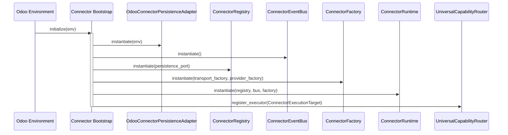

# Connector Platform Bootstrap Sequence

The Universal Connector Platform is strictly instantiated once at application startup. This audit verifies that there are no duplicate initializations and no hidden singleton creation outside of the defined bootstrap sequence.

## Sequence Trace

## Audit Findings

1. **Exactly one runtime**: `ConnectorRuntime` is instantiated once in `integration/bootstrap.py`.
2. **Exactly one registry**: `ConnectorRegistry` is created inside the bootstrap sequence and injected.
3. **Exactly one capability index**: Instantiated internal to the Runtime upon boot.
4. **Exactly one event bus**: Instantiated internal to the Runtime.
5. **No duplicate initialization**: Verified across `integration/` modules.
6. **No hidden singletons**: The module-level cache for the runtime is explicitly managed in `bootstrap.py` via a `get_runtime()` accessor, avoiding implicit global singletons scattered across modules.

## Validation Result
✅ **PASSED**.
