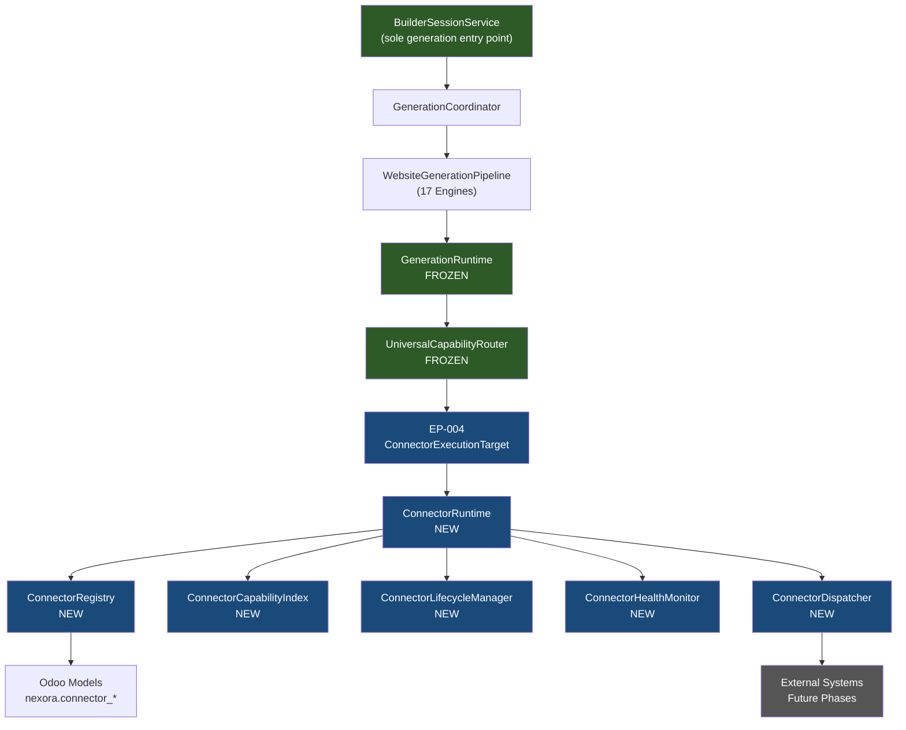
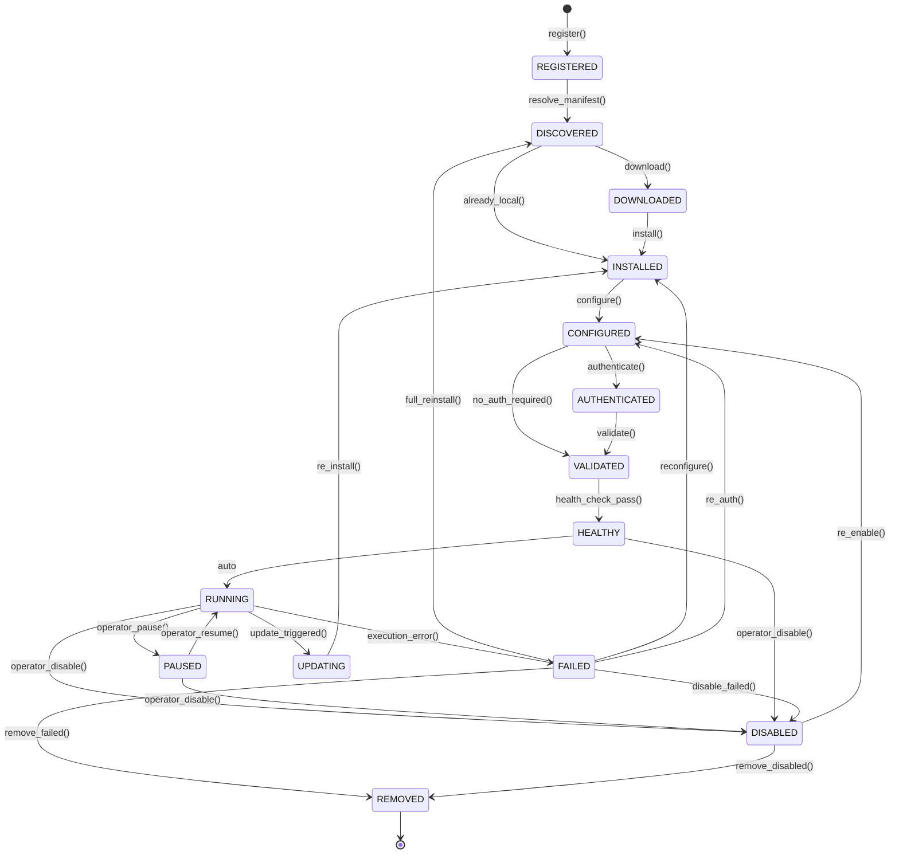
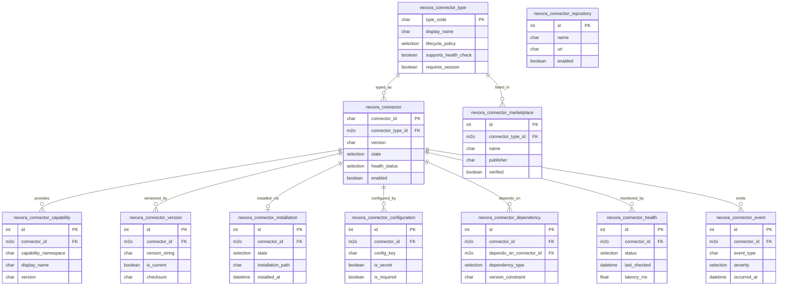
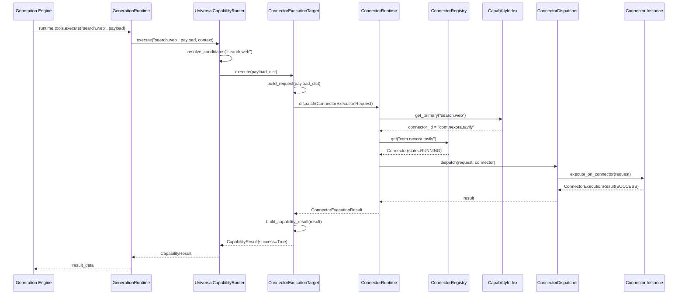
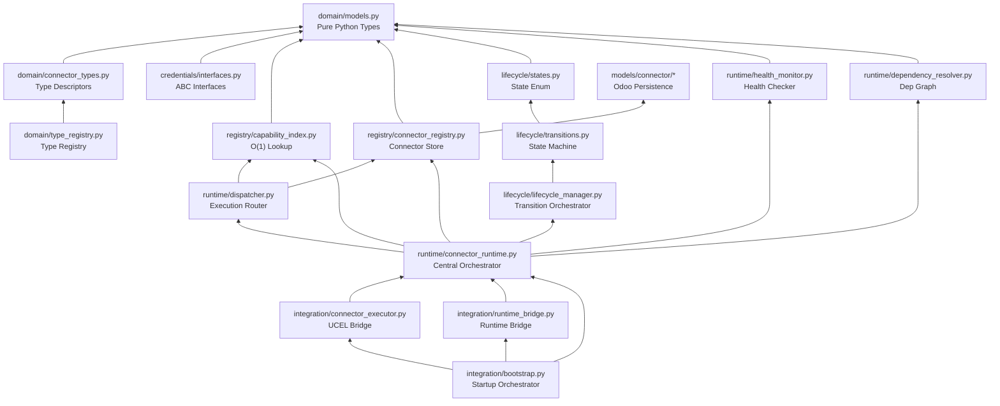

# Phase 26 — Connector Platform Architecture Diagrams
## Universal Connector Platform Foundation

---

## 1. Architecture Overview



**Legend:** Green = Frozen (Generation Platform). Blue = New (Connector Platform).

---

## 2. Connector Lifecycle State Diagram



---

## 3. Odoo Model Relationship Diagram



---

## 4. UCEL → Connector Runtime Interaction Diagram



---

## 5. Connector Platform Ownership Matrix

| Responsibility | Owner | Must NOT Be In |
|---------------|-------|---------------|
| Connector discovery | `ConnectorRegistry` | `GenerationRuntime` |
| Connector lifecycle state | `ConnectorLifecycleManager` | `GenerationRuntime` |
| Capability namespace routing | `UniversalCapabilityRouter` (UCEL) | `ConnectorRuntime` |
| Credential storage | `SecretsProvider` (CP Phase 1) | Generation engines |
| Credential resolution | `CredentialResolver` | UCEL, GenerationRuntime |
| Health monitoring | `ConnectorHealthMonitor` | Generation engines |
| Dependency resolution | `ConnectorDependencyResolver` | UCEL |
| Execution dispatch | `ConnectorDispatcher` | `GenerationRuntime` |
| Connector manifest authority | `nexora.connector` (Odoo) | Services layer |
| UCEL routing decisions | `CapabilitySelectionEngine` | `ConnectorRuntime` |
| Generation session | `BuilderSessionService` | Connector Platform |
| Workspace artifacts | `WorkspaceAdapter` | Connector Platform |
| AI model selection | `OdooCapabilityResolver` | `ConnectorRuntime` |

---

## 6. Connector Dependency Graph



---

## 7. Risk Assessment

| Risk | Severity | Mitigation |
|------|---------|-----------|
| Connector execution adapter not yet implemented | P2 | Dispatcher returns `NO_EXECUTION_ADAPTER` failure — non-blocking until CP Phase 2 |
| MCP transport layer is a stub | P1 | Connector dispatch for MCP type returns failure until PRE-004 resolved |
| SecretsProvider not yet implemented | P1 | `NullConfigurationAdapter` ensures non-null `runtime.configuration` — safe no-op |
| Bootstrap timing before DB ready | P2 | `startup()` gracefully handles None env; sync deferred |
| Odoo module load order | P2 | `connector` package loaded last in `models/__init__.py` |
| ConnectorTypeRegistry concurrent writes at startup | P3 | Protected by RLock; only builtins written at startup |
| UCEL `ExecutionTargetType.CONNECTOR` not yet defined | P2 | Bootstrap logs warning and skips registration — non-fatal |

---

## 8. Migration Timeline

```
Phase 26 (NOW)    → Architecture + Foundation (no connectors)
Phase 27 (CP-1)   → SecretsProvider + Resolver hardcode fix + Bootstrap hardening
Phase 28 (CP-2)   → GitHub + Git connectors + MCP transport + ADR-0044 migration
Phase 29 (CP-3)   → REST connectors (Gosom, Firecrawl, Tavily, Penpot, Spline, Context7)
Phase 30 (CP-4)   → Docker + CLI + Figma + Deployment connectors
Phase 31 (CP-GA)  → Legacy provider deprecation + Final migration
```
