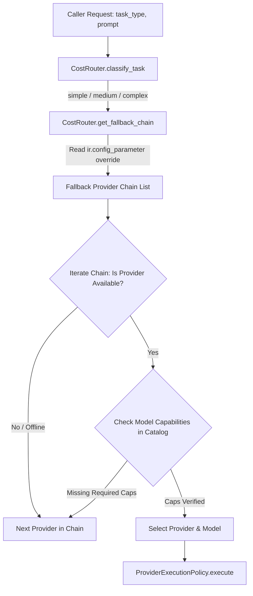

# AI Architecture Audit (Phase 2 Audit Report)

**Date:** July 2026  
**Type:** Strictly Read-Only Architecture Audit  
**Scope:** Nexora Studio AI Subsystem (`services/ai/` & `models/ai_*.py`)  

---

## Executive Summary

This report documents the architectural assessment of the **Nexora Studio AI Subsystem**. The subsystem is engineered as an adapter-based, multi-tiered AI execution platform responsible for LLM provider routing, prompt engineering, rate limit handling, cost optimization, and automated code patching. While the current architecture provides robust reliability controls (circuit breakers, retry policies), its provider registration mechanism relies on static model dictionaries, which must evolve into a dynamic database-backed registry in future phases.

---

## 1. Subsystem Component Breakdown (`services/ai/`)

| Component Module | Odoo Abstract Model / Class | Primary Responsibility & Design Pattern | Key Methods & APIs |
| :--- | :--- | :--- | :--- |
| **`base_adapter.py`** | `BaseAIAdapter`<br>(`nexora.ai_adapter.base`) | **Abstract Base Class.** Defines the mandatory contract for all LLM provider integrations. Enforces uniform response formats and error raising. | `execute(prompt, ctx)`<br>`is_available(credentials)`<br>`get_display_name()`<br>`get_provider_metadata()` |
| **`provider_manager.py`** | `AIProviderManager`<br>(`nexora.ai_provider_manager`) | **Central Facade & Router.** Serves as the single entry point for AI operations. Manages the adapter registry, delegates to `CostRouter`, and records execution history. | `route_request(task_type, prompt, ctx)`<br>`get_adapter(provider_key)`<br>`get_available_providers()`<br>`get_all_provider_metadata()` |
| **`cost_router.py`** | `CostRouter`<br>(`nexora.ai_cost_router`) | **Intelligent Cost Tiering.** Maps task complexity to provider tiers (`simple`, `medium`, `complex`) and evaluates fallback chains against model capabilities. | `classify_task(task_type)`<br>`get_fallback_chain(tier)`<br>`resolve_provider(ctx, adapters, caps)` |
| **`provider_execution_policy.py`**| `ProviderExecutionPolicy`<br>(`nexora.provider_execution_policy`) | **Reliability & Circuit Breaking.** Wraps HTTP executions with exponential backoff retries and an in-memory circuit breaker pattern. | `execute(ctx, fn)`<br>`_is_circuit_open(provider_key)`<br>`_record_success()`<br>`_record_failure()` |
| **`provider_health_service.py`** | `ProviderHealthService`<br>(`nexora.provider_health_service`)| **Active Health Diagnostics.** Regularly verifies API key validity and network reachability across registered adapters. | `check_all_providers()`<br>`check_provider_health(key)` |
| **`ai_configuration_service.py`**| `AIConfigurationService`<br>(`nexora.ai_configuration_service`)| **Configuration Management.** Interfaces with `ir.config_parameter` to retrieve encrypted API keys, active model IDs, and cost routing overrides. | `get_provider_credentials(key)`<br>`get_active_model(key)`<br>`get_config(domain, key)` |
| **`context_builder.py`** | `ContextBuilder`<br>(`nexora.ai_context_builder`) | **Prompt Engineering & Enrichment.** Compiles system prompts, injects design system tokens, formats active file context, and formats conversation history. | `build_context(session, prompt)`<br>`inject_design_tokens(project)`<br>`format_active_file(file_path)` |
| **`patch_engine.py`** | `PatchEngine`<br>(`nexora.ai_patch_engine`) | **Code Diff & Healing.** Intercepts LLM code outputs (markdown code blocks, unified diffs), extracts target files, and applies atomic modifications to VFS. | `parse_patch(llm_response)`<br>`apply_patch(session, patch)`<br>`validate_syntax(code, lang)` |
| **`template_analyzer.py`** | `TemplateAnalyzer`<br>(`nexora.ai_template_analyzer`)| **Design Requirement Analysis.** Evaluates client requirements and template structures to guide the AI Planner. | `analyze_template(template_id)`<br>`extract_requirements(prompt)` |

---

## 2. Provider Registration & Selection Architecture

### 2.1 Current Provider Registration Mechanism
Currently, provider registration is governed by a static dictionary in `provider_manager.py`:
```python
_ADAPTER_MODELS = {
    'ollama': 'nexora.ai_adapter.ollama',
    'openrouter': 'nexora.ai_adapter.openrouter',
    'nvidia': 'nexora.ai_adapter.nvidia',
    'openai': 'nexora.ai_adapter.openai',
    'claude': 'nexora.ai_adapter.claude',
    'gemini': 'nexora.ai_adapter.gemini',
    'generic_openai': 'nexora.ai_adapter.generic_openai',
    'test': 'nexora.ai_adapter.test',
}
```
**Architectural Assessment:** While simple and performant, this static mapping prevents third-party plugins from registering new LLM providers dynamically without modifying `provider_manager.py`.

### 2.2 Provider Selection & Fallback Chain Flow
When a caller invokes `AIProviderManager.route_request()`, execution flows through the following selection sequence:



---

## 3. Execution Reliability & Error Handling

### 3.1 Circuit Breaker Mechanism (`_CIRCUIT_BREAKERS`)
To prevent cascading timeouts when an external LLM API experiences an outage, `ProviderExecutionPolicy` implements an in-memory circuit breaker:
- **Trip Threshold:** 3 consecutive HTTP failures or connection timeouts on a given `provider_key`.
- **Open State Action:** Immediately raises `CircuitBreakerOpenException` without attempting network I/O, allowing the CostRouter to instantly fall back to the next provider in the chain (e.g., falling back from OpenRouter to local Ollama).
- **Cooldown & Half-Open:** After a 60-second cooldown (`next_attempt_at`), the breaker transitions to half-open, allowing a single test request through. If successful, `_record_success()` resets the failure counter to 0.

### 3.2 Retry & Timeout Policy
- Requests are executed within a loop: `for attempt in range(1, retries + 2)`.
- If an `HTTPError` occurs, the policy classifies the error:
  - **429 (Rate Limit):** Raises `RateLimitException`, triggering immediate fallback or exponential backoff delay.
  - **5xx (Server Error):** Increments retry counter and sleeps for `2 ** attempt` seconds before re-trying.

---

## 4. Existing Provider Adapters Inventory

| Adapter Key | Module File | Odoo Model Name | Target API / Protocol | Capabilities Supported | Default Model (Dev Config) |
| :--- | :--- | :--- | :--- | :--- | :--- |
| **`openrouter`** | `openrouter_adapter.py` | `nexora.ai_adapter.openrouter` | OpenRouter REST API | Chat, Streaming, Function Calling, Cost Tracking | `anthropic/claude-3.5-sonnet` / `meta-llama/llama-3-70b` |
| **`ollama`** | `ollama_adapter.py` | `nexora.ai_adapter.ollama` | Local Ollama HTTP API | Local Chat, Code Completion, Zero-Cost | `llama3:latest` / `codellama:latest` |
| **`openai`** | `openai_adapter.py` | `nexora.ai_adapter.openai` | OpenAI API (v1) | Chat, Vision, JSON Mode, Function Calling | `gpt-4o` / `gpt-4o-mini` |
| **`claude`** | `claude_adapter.py` | `nexora.ai_adapter.claude` | Anthropic Messages API | Chat, High-Context Reasoning, Code Generation | `claude-3-5-sonnet-20240620` |
| **`gemini`** | `gemini_adapter.py` | `nexora.ai_adapter.gemini` | Google Gemini API | Multimodal, Long-Context, Chat | `gemini-1.5-pro` / `gemini-1.5-flash` |
| **`nvidia`** | `nvidia_adapter.py` | `nexora.ai_adapter.nvidia` | NVIDIA NIM / AI Foundation | High-Performance Inference | `meta/llama3-70b-instruct` |
| **`generic_openai`**| `generic_openai_adapter.py`| `nexora.ai_adapter.generic_openai`| Any OpenAI-Compatible Endpoint| Custom LLM Endpoints, Local vLLM, LM Studio | User Configured |
| **`test`** | `test_adapter.py` | `nexora.ai_adapter.test` | In-Memory Mock Engine | Deterministic Test Responses, Latency Simulation | `mock-model-v1` |

---

## 5. Architectural Limitations & Extension Points

### 5.1 Current Limitations
1. **Static Adapter Registration:** New provider plugins cannot register themselves via database records; they must be hardcoded into `_ADAPTER_MODELS`.
2. **In-Memory Circuit Breakers:** Circuit breaker state (`_CIRCUIT_BREAKERS`) is stored in Python module memory. In a multi-process Odoo deployment (e.g., with gunicorn workers), one worker may trip a breaker while other workers continue hammering the failing API.
3. **Lack of Unified Streaming Abstraction:** While some adapters support streaming tokens, `route_request()` aggregates the full response before returning to the caller.

### 5.2 Safe Extension Points
- **Adding New Providers:** Subclass `BaseAIAdapter` (`nexora.ai_adapter.base`), implement `execute()`, and register the model name in `_ADAPTER_MODELS` (or in the future database registry).
- **Custom Cost Routing Rules:** Override `CostRouter.get_fallback_chain()` or configure `ir.config_parameter` keys (`nexora.cost_router_tier_*`).
- **Prompt Enrichment:** Extend `ContextBuilder.build_context()` to inject additional domain knowledge (e.g., custom MCP tool schemas or brand intelligence).
