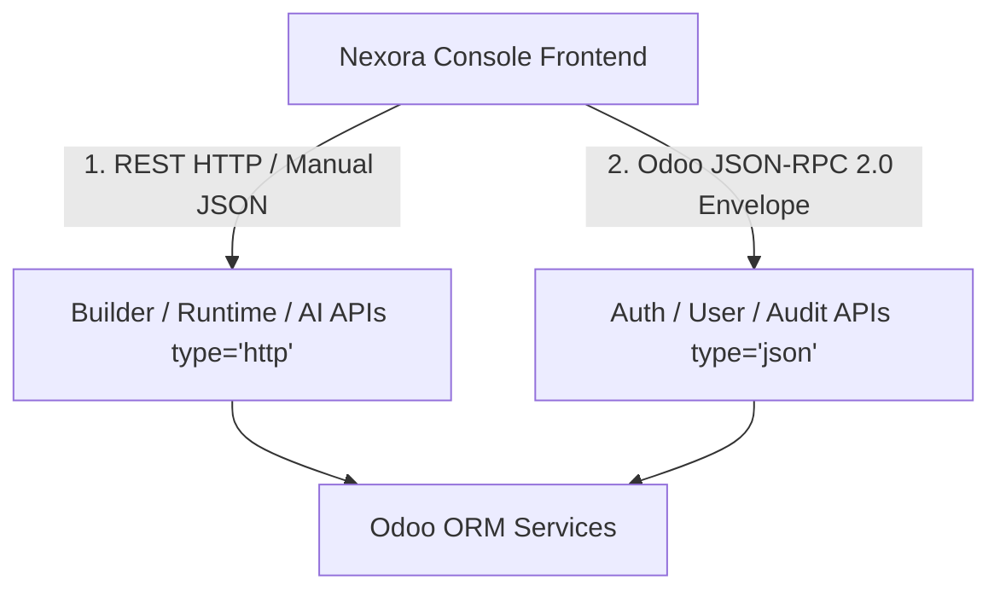

# API & Communication Layer Audit (Phase 10 Audit Report)

**Date:** July 2026  
**Type:** Strictly Read-Only Architecture Audit  
**Scope:** REST API Endpoints, Transport Protocols, Serialization, and Authentication (`controllers/`)  

---

## Executive Summary

This report evaluates the API and communication architecture of **Nexora Studio** across its 11 controller modules. Our audit reveals a **Bifurcated Communication Protocol**: the platform mixes standard HTTP REST endpoints (`type='http'`, manual JSON serialization) with Odoo JSON-RPC endpoints (`type='json'`). Furthermore, real-time status updates currently rely on HTTP client polling rather than WebSockets or Server-Sent Events (SSE). We document these architectural discrepancies below and outline the requirements for protocol unification in Phase 15.

---

## 1. Controller & Route Inventory

| Controller Module | Route Prefix | Odoo Route Type (`type`) | CORS Policy | Purpose / Domain |
| :--- | :--- | :--- | :--- | :--- |
| `builder_session_api.py` | `/api/v1/sessions` | `http` (REST) | None (Same-Origin) | Session CRUD & Lifecycle (`start`, `stop`, `restart`, `recover`). |
| `workspace_api.py` | `/api/v1/workspaces` | `http` (REST) | None (Same-Origin) | Workspace directory trees and status. |
| `runtime_api.py` | `/api/v1/runtimes` | `http` (REST) | None (Same-Origin) | Runtime process monitoring and log retrieval. |
| `project_api.py` | `/api/v1/projects` | `http` (REST) | None (Same-Origin) | Project configuration and generation history. |
| `ai_api.py` | `/api/v1/ai` | `http` (REST) | None (Same-Origin) | AI provider listing, generation execution, and patching. |
| `client_provisioning_api.py`| `/api/v1/provisioning`| `http` (REST) | None (Same-Origin) | Database provisioning, backups, and restores. |
| `auth_controller.py` | `/api/v1/auth` | `json` (JSON-RPC)| `cors='*'` | User login, logout, password reset, and session verification. |
| `user_controller.py` | `/api/v1/users` | `json` (JSON-RPC)| `cors='*'` | User profile management and unlocking. |
| `session_controller.py` | `/api/v1/sessions/...`| `json` (JSON-RPC)| `cors='*'` | Forced user session termination. |
| `audit_controller.py` | `/api/v1/audit` | `json` (JSON-RPC)| `cors='*'` | Audit log querying. |

---

## 2. Architectural Analysis & Inconsistencies

### 2.1 Protocol & Serialization Bifurcation
The controller layer currently implements two mutually incompatible transport contracts:
1. **Manual REST JSON (`type='http'`):** Used by core builder services (`sessions`, `runtimes`, `workspaces`, `ai`). Endpoints parse raw request bodies via `json.loads(request.httprequest.data)` and return manual HTTP responses via `request.make_response(json.dumps({'data': ...}))`.
2. **Odoo JSON-RPC (`type='json'`):** Used by administrative services (`auth`, `users`, `audit`). Odoo automatically wraps responses in the JSON-RPC 2.0 envelope (`{"jsonrpc": "2.0", "id": ..., "result": ...}`) and requires clients to wrap requests similarly.

### 2.2 Absence of Real-Time Push Transport (No WebSockets / SSE)
Despite having an extensive event timeline table (`nexora.runtime_event`), there are zero WebSocket or Server-Sent Events (SSE) streaming controllers in `nexora_studio`. Consequently:
- Frontend clients must continuously **poll** HTTP endpoints (`GET /api/v1/sessions/<uuid>/status`, `GET /api/v1/runtimes/<id>/status`) to observe generation progress or dev server port allocations.
- Polling introduces unnecessary HTTP overhead and latency during rapid AI code generation phases.

### 2.3 Authentication & Authorization Governance
- **Role-Based Access Control (RBAC):** Endpoints enforce security via helper methods like `_check_auth()`, requiring users to hold either `agency.group_agency_admin` or `base.group_system` permissions.
- **CSRF Protection:** All routes explicitly disable Odoo's web form CSRF token validation (`csrf=False`), relying on Odoo session cookies and CORS boundaries for stateless API authentication.

---

## 3. Remediation Roadmap for Phase 15

1. **Protocol Standardization:** Standardize all API endpoints on clean REST HTTP (`type='http'`) with standardized error envelopes (`{"error": {"code": ..., "message": ...}}`) and consistent CORS configuration.
2. **WebSocket / SSE Event Bridge:** Implement an SSE streaming controller (`/api/v1/events/stream`) that subscribes to `nexora.runtime_event` inserts and pushes real-time generation and runtime status updates directly to the Nexora Console.
