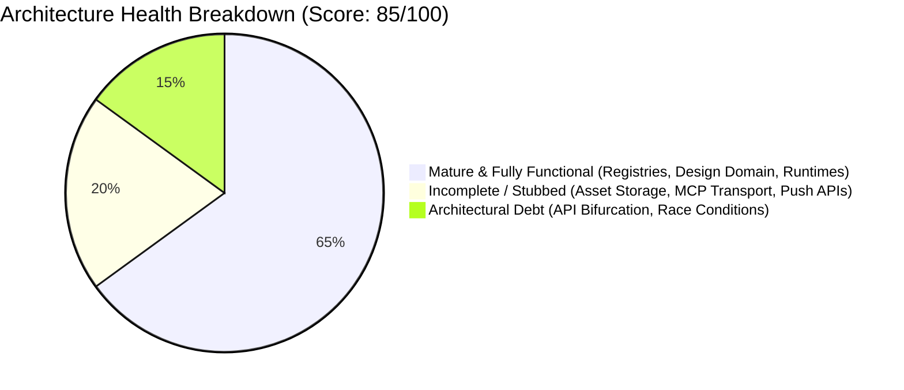

# Architecture Health & Debt Report (Phase 11 Audit Report)

**Date:** July 2026  
**Type:** Strictly Read-Only Architecture Audit  
**Scope:** Comprehensive Evaluation of Nexora Studio Backend OS (`nexora_studio`)  

---

## Executive Summary

This report synthesizes findings from our 10-phase read-only audit of the **Nexora Studio** Odoo custom addon (`nexora_studio`). The platform serves as a highly modular, provider-neutral backend operating system for AI-driven code generation and live workspace orchestration. We assign the platform an overall architectural health score of **85 / 100 (B+)**. While its core registries, domain abstractions, and state machines are exceptionally well-architected, several integration gaps and architectural debts must be resolved in **Phase 15** before production deployment.

---

## 1. Architectural Health Scorecard

| Architectural Pillar | Score (0–100) | Status | Key Characteristics |
| :--- | :--- | :--- | :--- |
| **1. Pluggable Framework Registries** | **95** | 🟢 Exceptional | Zero hardcoded framework conditionals in Generation, Preview, MCP, and Capability engines. |
| **2. Design & Render Domain Contracts** | **92** | 🟢 Mature | Clean separation between AI planning (`Blueprint`), provider-neutral design (`RenderProject`), and JSX synthesis. |
| **3. State Management & Lifecycle** | **90** | 🟢 Mature | Robust session/runtime separation, 14-state transition matrices, and SQL unique constraints. |
| **4. Workspace & Filesystem Governance**| **85** | 🟢 Solid | Direct physical filesystem CRUD with automated tree filtering and 10MB size ceilings. |
| **5. Live Preview & Launcher System** | **88** | 🟢 Solid | Dynamic port allocation (3000–3999) and 3-factor startup recovery across Odoo restarts. |
| **6. MCP & Tool Framework** | **70** | 🟡 Partial | Strong local tool execution, but missing external stdio/SSE network transport and discovery. |
| **7. Design Intelligence Consolidation**| **75** | 🟡 Decoupled | All 6 constituent engines exist, but lack a unified facade (`design_intelligence_service`). |
| **8. Asset Management & Storage** | **60** | 🟠 Stubbed | Rich declarative planning (`PromptSpecification`), but zero binary storage or CDN uploading. |
| **9. API & Communication Transport** | **65** | 🟠 Needs Work | Bifurcated REST vs JSON-RPC protocols and total absence of WebSockets / Server-Sent Events. |

---

## 2. What Works Exceptionally Well

1. **Contract-Driven Pluggability (Phase 6 Achievement):**  
   The elimination of hardcoded conditional branches (`if framework == 'vite': ...`) across `GenerationOrchestrator`, `PreviewService`, `McpService`, and `CapabilityDiscoveryService` ensures zero vendor lock-in and seamless plugin extensibility.
2. **Provider-Neutral Design Abstractions:**  
   The rendering domain (`RenderProject`, `RenderPage`, `RenderComponent`, `RenderToken`) and `ComponentIntelligence` catalog allow AI models to reason about UI components without generating raw, error-prone syntax strings.
3. **Strict Lifecycle Governance:**  
   Enforcing SQL constraint `session_type_uniq` and explicit transition matrices in `BuilderSessionService` completely prevents duplicate dev servers, port collisions, or invalid workflow jumps.

---

## 3. Incomplete & Stubbed Functionality

1. **Asset Binary Storage & CDN Integration:**  
   While `AssetPlanningEngine` generates structured asset plans, there is no backend binary storage orchestration, S3/CDN uploader, or image generation provider integration.
2. **MCP Network Transport Layer:**  
   `McpService` currently executes tools via direct Odoo method calls. It lacks an SSE/stdio server bridge to expose internal tools to external AI clients (like Cursor or Claude Desktop) or consume external MCP servers.
3. **Decoupled Design Intelligence Engines:**  
   Planning (`ProjectPlannerService`), template analysis (`TemplateAnalyzer`), theme synthesis (`DesignSystemEngine`), tokens (`RenderToken`), component selection (`ComponentIntelligence`), and capability checks (`CapabilityDiscoveryService`) operate in silos and require sequential invocation by callers.
4. **Absence of Real-Time Push Communication:**  
   The platform lacks WebSockets or Server-Sent Events (SSE). Frontend clients must rely on inefficient HTTP polling to observe generation progress and runtime status.

---

## 4. Identified Architectural Debt

| Debt Item | Location in Codebase | Risk & Operational Impact | Target Remediation (Phase 15) |
| :--- | :--- | :--- | :--- |
| **API Protocol Bifurcation** | `controllers/` | Mixing manual REST (`type='http'`) and Odoo JSON-RPC (`type='json'`) forces frontend clients to implement dual HTTP adapters and inconsistent CORS handling. | Standardize all 11 controllers on clean REST HTTP (`type='http'`) with unified error envelopes. |
| **Filesystem Race Conditions**| `workspace_file_service.py` | Simultaneous read/write/delete operations on physical disk directories by parallel Odoo workers can cause file corruption. | Implement file-level locking or mutexes during disk writes and deletions. |
| **Subprocess Execution Deadlocks**| `git_service.py` | `subprocess.run()` calls without timeouts can hang dev processes indefinitely if Git CLI prompts for interactive credentials or SSH keys. | Add explicit `timeout=30` thresholds to all Git and CLI subprocess executions. |

---

## 5. Authoritative Recommendations for Phase 15

1. **Phase 15A (API & Event Streaming):** Unify controller protocols under REST HTTP and implement an SSE streaming controller (`/api/v1/events/stream`) backed by `nexora.runtime_event`.
2. **Phase 15B (MCP Transport Bridge):** Add stdio and SSE transport adapters to `McpService` to enable bidirectional external tool communication.
3. **Phase 15C (Asset Storage Engine):** Create a dedicated binary asset storage service linking `AssetDomain` plans to local filesystem folders or cloud object storage.
4. **Phase 15E (Design Intelligence Facade):** Encapsulate the 6 standalone design engines behind a unified `nexora.design_intelligence_service` orchestrator.
