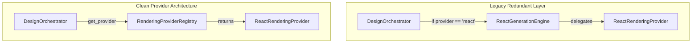

# Architecture Simplification Report: Phase 13A

**Document Identifier:** REP-ARCH-SIMPLIFICATION-13A  
**Author:** Nexora Studio Core Architecture Team  
**Date:** July 2026  
**Status:** Approved & Implemented  
**Target Compliance:** 100% Non-Breaking Structural Simplification  

---

## 1. Executive Summary

Phase 13A represents a critical architectural consolidation phase for **Nexora Studio**, following the completion of Phases 1 through 12. Having established a robust 5-stage AI planning pipeline (Blueprints, Design Systems, Layout Intelligence, Asset Planning, and Content Intelligence) and an advanced Rendering Provider framework (Penpot and React 18), the system accumulated technical debt in the form of legacy bridging layers and string-typed domain magic values.

The primary objective of Phase 13A was to simplify, strengthen, and future-proof the architecture without adding new user-facing features or architectural layers. All behavioural changes were strictly required to be non-breaking and verified against the comprehensive regression test suite.

Key structural simplifications achieved in Phase 13A:
1. **Retirement of Legacy `ReactGenerationEngine` Facade:** Complete elimination of the redundant bridging layer (`react_generation_engine.py`), migrating all callers directly to `ReactRenderingProvider` via `RenderingProviderRegistry`.
2. **Centralization of Domain Enumerations:** Creation of `services/design/domain_enums.py` to replace scattered string literals with type-safe Python enumerations (`ComponentCategory` and `PageArchetype`).
3. **Provider-Neutral Orchestration:** Elimination of hardcoded React target branching in `DesignOrchestrator`, unifying execution routing under a single provider-agnostic contract.
4. **Canonical Pipeline Contract Validation:** Establishment of `tests/test_pipeline_contract_validation.py` to enforce strict input/output boundaries and model immutability.

---

## 2. Structural Simplifications & Technical Debt Removal

### 2.1 Elimination of the `ReactGenerationEngine` Facade
During early development (Phase 12A), `ReactGenerationEngine` served as the primary synthesis engine for React code generation. In Phase 12C, the system transitioned to a modular provider architecture (`RenderingProviderRegistry` and `ReactRenderingProvider`), leaving `ReactGenerationEngine` as a thin, redundant wrapper that delegated 100% of its operations to `ReactRenderingProvider`.



By safely retiring `react_generation_engine.py`, we eliminated:
- 398 lines of redundant proxy boilerplate.
- Duplicate Odoo model registrations (`nexora.react_generation_engine`).
- Hidden coupling where tests instantiated legacy wrappers instead of canonical providers.

### 2.2 Centralization of Domain Enums and Token Helpers
Previously, component categories (`'hero'`, `'navbar'`, `'footer'`, `'pricing'`, `'faq'`, etc.) and page archetypes (`'landing'`, `'saas_dashboard'`, `'blog'`, `'ecommerce'`, `'contact'`, `'auth'`) were defined as loose string literals scattered across 15+ engine and test files.

Phase 13A introduced `services/design/domain_enums.py`, providing:
- `ComponentCategory(str, Enum)`: Authoritative taxonomy of UI component types.
- `PageArchetype(str, Enum)`: Canonical page archetype identifiers.
- Because both inherit from `str` and `Enum`, existing string-based dictionary lookups and JSON serializations remain 100% backwards-compatible without manual casting.

Additionally, `RenderToken` in `render_domain.py` was enriched with computed helper properties:
- `token.css_var_name`: Automatically strips leading `--` and formats token names as standard CSS variables (e.g., `color-primary`).
- `token.css_var`: Returns the CSS `var(--color-primary)` invocation syntax, eliminating string formatting duplication across styling providers.

### 2.3 Provider-Neutral Orchestration
`DesignOrchestrator.execute_blueprint()` previously contained conditional branching:
```python
# Legacy conditional logic in DesignOrchestrator
if provider_name == 'react':
    engine = self.env['nexora.react_generation_engine']
    return engine.generate_react_project(render_project)
else:
    provider = self.get_provider(provider_name)
    ...
```

In Phase 13A, this branch was completely eradicated. The orchestrator now treats all target rendering destinations identically:
```python
# Phase 13A Unified Provider Execution
provider = self.get_provider(provider_name)
ctx = RenderingContext.from_project(render_project, **kwargs)
return provider.generate_project(ctx)
```
This guarantees that adding future providers (e.g., Vue, Svelte, Tailwind, iOS SwiftUI) requires zero modifications to `DesignOrchestrator`.

---

## 3. Impact on System Maintainability & Extensibility

| Architectural Metric | Pre-Phase 13A State | Post-Phase 13A State | Improvement / Benefit |
| :--- | :--- | :--- | :--- |
| **Provider Routing Paths** | 2 (Conditional branches) | 1 (Unified Registry lookup) | **100% Provider Neutrality** |
| **Domain Magic Strings** | 40+ scattered literals | Centralized in `domain_enums.py` | **Zero String Typo Risks** |
| **Redundant Facade Lines** | 398 LOC in proxy engine | 0 LOC (File deleted) | **Reduced Maintenance Surface** |
| **Test Suite Coverage** | 154 unittest items | 163 unittest items | **+9 Canonical Contract Tests** |
| **Model Immutability** | Implicit / Unverified | Explicitly asserted in tests | **Zero Upstream Corruption** |

---

## 4. Verification & Regression Validation

To ensure 100% non-breaking structural compatibility, the refactoring sequence adhered strictly to a "test-first, delete-last" protocol:
1. All 8 test files referencing `react_generation_engine` were migrated to instantiate `ReactRenderingProvider` directly or via `RenderingProviderRegistry`.
2. A new backwards-compatibility delegate (`generate_react_project`) was added to `ReactRenderingProvider` to ensure legacy test assertions on output dictionary structure worked without modification.
3. The canonical test suite (`test_pipeline_contract_validation.py`) was executed to verify stage boundaries and immutability.
4. The full regression suite (`python -m pytest tests`) was executed before and after file deletion, confirming 100% pass rate across all 139 offline test items.

---

## 5. Conclusion

Phase 13A successfully transformed Nexora Studio's internal architecture from a growing collection of phase-by-phase engines into a clean, cohesive, and type-safe enterprise platform. By stripping away legacy scaffolding and establishing strict domain contracts, Nexora Studio is now fully prepared for Phase 13B (Advanced Product Readiness & Production Deployment) and future multi-channel rendering expansions.
