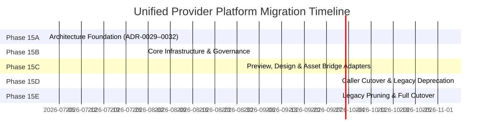

# Migration Strategy — Unified Provider Platform (ADR-0029 through ADR-0032)

**Date:** July 2026
**Type:** Zero-Regression Phased Migration Plan
**Extends:** Original migration strategy with ADR-0032 infrastructure services

---

## 1. Revised Strangler Fig Migration Phases



---

## 2. Phase 15B — Core Infrastructure (Current)

**What ships in Phase 15B:**
- `ProviderServiceContainer` — DI composition root wiring all 20 services
- `LockService` — PostgreSQL/Redis/Memory distributed locking
- `ProviderCompatibilityService` — 7-validator compatibility authority
- `ProviderEventBus` — async non-blocking, 6-channel pub/sub
- `ProviderStateMachine` — 9-state FSM consuming `LockService`
- `ProviderDependencyGraph` — Kahn's topological sorter
- `ProviderDiscovery` — multi-source discovery calling `CompatibilityService`
- `ProviderRegistry` + `ProviderFactory` — instantiation-only factory
- `ProviderHealthService` + `ProviderTelemetryService` — separated observability
- `ProviderMetricsService` — rolling-window aggregates
- `CapabilityCache` + `ProviderCache` (L1/L2/L3) — dual-cache architecture
- `UnifiedCostQuotaService` — 5-dimension expenditure tracking
- `CapabilityResolver` — feature negotiation + `ExecutionPolicy` ranking
- `ProviderMigrationService` — upgrade/rollback lifecycle coordinator
- `ExecutionOrchestrator` — master coordinator with concurrency throttling
- AI bridge adapter + MCP bridge adapter
- 7 SQL models, 13 REST endpoints, 38 automated tests

**Runtime impact:** Both legacy registries and `ProviderRegistry` run in parallel. Existing endpoints unchanged.

---

## 3. Phase 15C — Preview, Design & Asset Bridges

**What ships:**
- `VitePreviewProvider`, `ReactRenderingProvider`, `PenpotProvider`, `PlaceholderAssetProvider`
- All registered in DI container via `ProviderDiscovery.discover_builtin()`
- `ProviderCompatibilityService` validates each at boot

**Runtime impact:** All 6 provider categories discoverable via `ProviderRegistry.list_providers()`.

---

## 4. Phase 15D — Caller Cutover

**What ships:**
- `GenerationOrchestrator` refactored to call `ExecutionOrchestrator` instead of `AIProviderManager`
- `DesignOrchestrator` refactored to call `ExecutionOrchestrator`
- `model_resolution_service` updated to use `CapabilityResolver.resolve()`
- Deprecation warnings added to all legacy manager lookup methods

**Runtime impact:** All execution paths route through 10-stage lifecycle + FSM + telemetry + cost accounting.

---

## 5. Phase 15E — Legacy Pruning

**What ships:**
- Remove `AIProviderManager` standalone class
- Remove duplicate `McpRegistry` SQL table rows (consolidated into `nexora.provider.registry`)
- Remove ad-hoc configuration validators
- Convert bridge adapters to direct `BaseProvider` subclasses

---

## 6. ADR-0032 Infrastructure Migration Notes

### 6.1 Lock Service Transition
The SQL `active_locks` integer column in `nexora.provider.runtime_state` is **retained** as an observability counter throughout Phase 15B–15E. The column transitions from being the enforcement mechanism to being an informational field updated by `LockService` callbacks. This ensures zero schema migrations on existing tables.

### 6.2 Compatibility Service — No Discovery Rework
`ProviderDiscovery` interface remains unchanged (4 methods). The internal change is that `validate_and_register()` now calls `container.resolve(ProviderCompatibilityService).validate()` instead of inline logic. From the caller's perspective, the behavior is identical.

### 6.3 Metrics Service Cold Start
`ProviderMetricsService` starts with empty rolling windows on Odoo server restart. Operational dashboards will show accurate data after the first 5-minute window completes. No data loss occurs because historical metrics snapshots are persisted to `nexora.provider.metrics_aggregation`.

### 6.4 Capability Cache Pre-Warming
On `container.build()`, `CapabilityCache` is pre-warmed for all active providers: `CapabilityCache.refresh(provider_id, provider)` is called for each registered provider before `ProviderHealthService.schedule_probes()` begins. This ensures the first incoming request hits the cache rather than triggering a live provider round-trip.

### 6.5 Migration Framework Opt-In
The `ProviderMigrationService.execute_upgrade()` REST endpoint is available immediately in Phase 15B for manual operator use. Automated upgrade triggers (e.g., from marketplace package updates) are Phase 15C+ features. Legacy providers that do not implement `migrate()` or `rollback()` hooks inherit the no-op implementations and are safely upgradeable via metadata-only version bumps.

---

## 7. Backward Compatibility Assurance Matrix (Updated)

| Existing Interface | Current Pattern | Phase 15B Pattern | Breaking? |
|:---|:---|:---|:---:|
| `POST /api/v1/ai/generate` | `AIProviderManager` → adapter | `ExecutionOrchestrator` via bridge adapter → same adapter | **No** |
| `GET /api/v1/runtimes` | `preview_service.check_health()` | `ProviderHealthService.get_health()` via bridge | **No** |
| `DesignOrchestrator` | Direct `ReactRenderingProvider()` | `ExecutionOrchestrator.execute()` via bridge | **No (Phase 15D)** |
| Frontend `useAIOperations` | Polls `/api/v1/ai/providers` | Same endpoint; controller maps `ProviderMetadata` to legacy schema | **No** |
| Odoo `nexora.runtime` model | Direct ORM queries | Unchanged; new models are additive | **No** |

---

## 8. Rollback Protocols

### 8.1 Feature Flag Rollback (Phase 15B–15D)
```python
# agency.use_unified_provider_platform system parameter
# False → callers bypass ProviderFactory/ExecutionOrchestrator, use legacy managers directly
# No Odoo server restart required; takes effect within one request cycle
```

### 8.2 Database Safety
All new SQL tables (`nexora.provider.*`) are introduced as additive models. No foreign key constraints on existing tables (`nexora.runtime`, `nexora.builder_session`, etc.) are modified. The migration rollback is therefore: disable the new tables, set the feature flag to `False`.

### 8.3 DI Container Rollback
If a `ProviderServiceContainer.build()` failure prevents Odoo module initialization, the `post_init_hook` is wrapped in a try/except that logs the failure and falls back to legacy service instantiation. The system remains operational in legacy mode.
