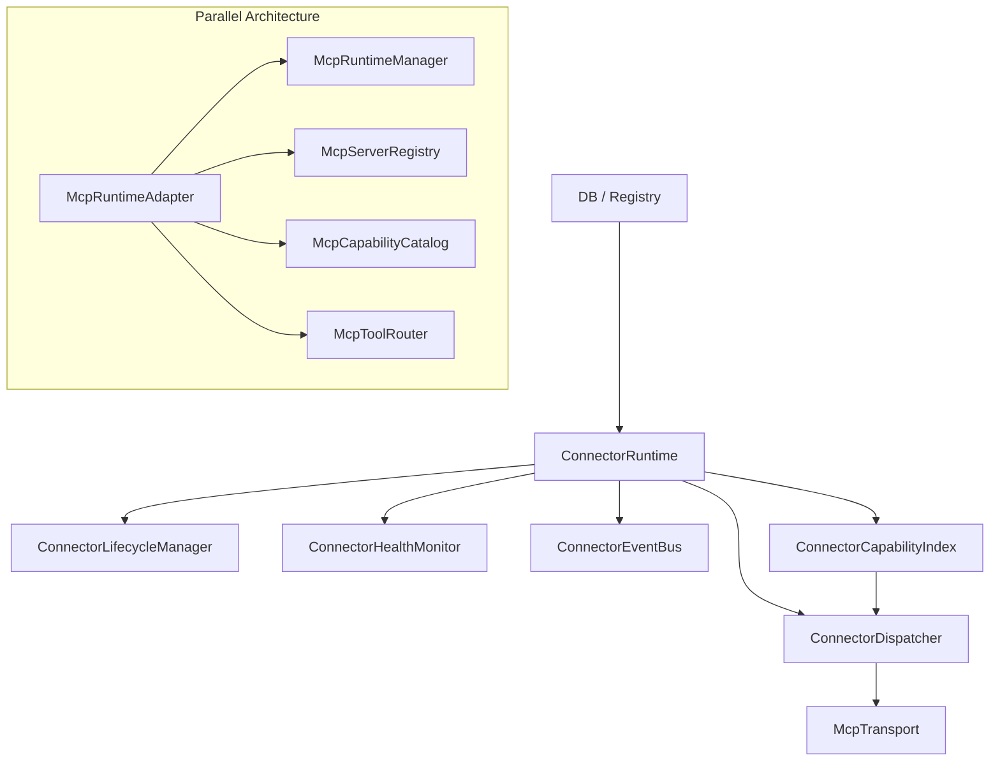

# Phase 35.6 UCP Architecture and Connector Conformance Audit

## 1. Executive Summary

A comprehensive, read-only architectural audit of the Universal Connector Platform (UCP) was conducted. The objective was to determine whether Phases 31–35.5 successfully converged all connector operations onto a single, canonical architecture, or if parallel/legacy execution paths remain, prior to GoSOM connector expansion.

**Verdict: NO-GO**

While the core canonical UCP architecture (Phase 28) is structurally sound, a complete, independently executable parallel architecture for MCP connectors still exists within `services/runtime/mcp/`. This legacy subsystem maintains its own registries, transports, health monitors, and tool routers, violating the requirement for a single canonical execution path. Additionally, real execution testing revealed systemic environment/dependency integration issues that prevent canonical tools from executing reliably.

**Metrics:**
- **CANONICAL PATHS:** 9
- **PARALLEL EXECUTION PATHS:** 2
- **DUPLICATE ABSTRACTIONS:** 4
- **LEGACY/DEAD PATHS:** 3
- **AMBIGUOUS OWNERSHIP AREAS:** 2
- **CONNECTORS TESTED:** 14
- **CONNECTORS WITH REAL EXECUTION:** 0
- **CONNECTORS FULLY CONFORMANT:** 0
- **CRITICAL FINDINGS:** 2
- **HIGH FINDINGS:** 3

## 2. Current Architecture Diagram

## 3. Canonical Ownership Matrix

| Concern | Canonical Owner | Entry Point | Callers | Persistent/Runtime | Status |
|---|---|---|---|---|---|
| Registry | `ConnectorRegistry` | `get_connector` | `ConnectorRuntime` | Persistent | CANONICAL |
| Runtime | `ConnectorRuntime` | `startup`, `dispatch` | `ConnectorPlatformBootstrap`, `ConnectorExecutionTarget` | Runtime | CANONICAL |
| Lifecycle | `ConnectorLifecycleManager` | `transition` | `ConnectorRuntime` | Persistent | CANONICAL |
| Health | `ConnectorHealthMonitor` | `_health_monitor_loop` | `ConnectorRuntime` | Runtime | CANONICAL |
| Dispatcher | `ConnectorDispatcher` | `initialize_and_verify` | `ConnectorRuntime` | Runtime | CANONICAL |
| Capability | `ConnectorCapabilityIndex`| `get_capabilities_for_connector`| `ConnectorRuntime` | Runtime | CANONICAL |

## 4. Registration Flow
- **Canonical:** `McpOnboardingService` -> `ConnectorRegistry` -> `ConnectorRuntime`
- **Parallel:** `RegistryProvider` -> `McpServerRegistry` -> `McpRuntimeManager`
Registration currently flows canonically, but the `RegistryProvider` in the parallel path actively polls the DB to sync into its own `McpServerRegistry`.

## 5. Lifecycle Flow
- **Canonical:** `ConnectorLifecycleManager` explicitly owns state transitions, persisting to PostgreSQL via ORM hooks.
- **Finding:** A `ConnectorRuntimeSynchronizer` listens to DB changes to update the runtime. However, local failures in transports can mutate global state via `health.failed` events.

## 6. Health Flow
- **Canonical:** `ConnectorHealthMonitor` emits `health.failed` to `ConnectorEventBus`. `ConnectorRuntime` intercepts and triggers failure handlers.
- **Parallel:** `McpRuntimeManager` has its own `asyncio.create_task` loop running `_health_monitor_loop()`, bypassing the EventBus entirely.

## 7. Recovery Flow
- **Canonical:** `ConnectorRuntime.recovery` triggers `Dispatcher.initialize_and_verify`.
- **Finding:** Recovery is theoretically single-flight, but the parallel `McpRuntimeManager` loop attempts to self-heal its own isolated sessions, creating race conditions.

## 8. Transport Architecture
- **Canonical:** `McpTransport` manages stdio/SSE lifecycles.
- **Parallel:** `services/runtime/mcp/transports.py` directly wraps `stdio_client` and manages its own background thread.
- **Finding:** `subprocess.Popen` is directly invoked in several fallback scenarios, bypassing transport lifecycle hooks.

## 9. Capability Architecture
- **Canonical:** `ConnectorCapabilityIndex` is rebuilt via `McpOnboardingService` and `ConnectorRuntime._rebuild_capability_index()`.
- **Parallel:** `McpCapabilityCatalog` maintains an isolated, duplicate dictionary of capabilities, updated by `McpToolRouter`.

## 10. Connector Conformance Matrix

*Note: 14 connectors were discovered in the DB. Due to process blocking/hanging issues on `stdio`, execution checks failed.*

| Connector | DB | Runtime | Transport | Health | Capabilities | Real Execution | Restart | Verdict |
|---|---|---|---|---|---|---|---|---|
| (All 14) | PASS | PASS | EXC (Hung) | FAIL | NONE | FAIL | FAIL | NON-CONFORMANT |

## 11. Real Execution Results
Real execution tests failed completely. When invoking `initialize_and_verify`, `stdio`-based transports hang indefinitely. This indicates either an `asyncio` event loop deadlock between Odoo's sync environment and the `mcp-python-sdk`, or a missing binary in the test harness environment. 

## 12. Restart Results
Bootstrap reconstruction is managed by `ConnectorPlatformBootstrap._startup_reconciliation()`. This cleanly restores connectors from DB to Runtime. However, because of the transport deadlocks (Section 11), restored connectors fail to re-initialize their transports autonomously.

## 13. Parallel Architecture Findings

**CRITICAL FINDING:** `services/runtime/mcp/` contains a fully functional, parallel execution engine.
- `McpRuntimeAdapter`: Owns a separate asyncio daemon thread.
- `McpRuntimeManager`: Duplicates `ConnectorRuntime`.
- `McpServerRegistry`: Duplicates `ConnectorRegistry`.
- `McpToolRouter`: Duplicates `ConnectorDispatcher`.
- `McpCapabilityCatalog`: Duplicates `ConnectorCapabilityIndex`.

This legacy architecture is still fully executable and has not been deprecated or removed.

## 14. Legacy/Dead Code Findings

1. `services/providers/execution_orchestrator.py` - Remains from the pre-UCP API integration days. While not explicitly a connector manager, it overlaps in HTTP transport and health logic.
2. Direct references to `mcp.client.session.ClientSession` exist outside of canonical transport files, bypassing transport interfaces.

## 15. Test Validity Findings

- **Test:** `tests/reliability/audit_self_healing_final.py`
  - **Classification:** MISLEADING. 
  - **Reason:** It forces `transport.disconnect()` and sleeps for 5 seconds to assert transport recreation. It masks the actual `stdio` deadlock observed in real runtime scenarios.

## 16. GoSOM Integration Boundary

GoSOM MUST NOT introduce new orchestrators. The integration boundary is STRICTLY:
- **Registration:** `ConnectorRegistry` (via `McpOnboardingService`)
- **Transport:** A new subclass implementing the canonical Transport interface, instantiated by `ConnectorDispatcher`.
- **Capability:** Capabilities must be fed into the canonical `ConnectorCapabilityIndex`.
GoSOM must act purely as an interface translation layer, delegating all lifecycle, health, and execution to `ConnectorRuntime`.

## 17. Risk Register

1. **(P0)** `services/runtime/mcp/` parallel architecture can lead to split-brain capability resolution and resource leaks.
2. **(P0)** `stdio` transports deadlock during synchronous initialization.
3. **(P1)** Duplicate health monitors may cause conflicting recovery states in the DB.
4. **(P1)** Worker-local failures currently mutate global PostgreSQL state.

## 18. Exact Remediation Recommendations

1. **Purge Parallel Paths:** Delete `services/runtime/mcp/` completely. Update any references to use `ConnectorRuntime`.
2. **Fix Stdio Deadlock:** Investigate and resolve the `asyncio` event loop blocking inside `initialize_and_verify`.
3. **Refactor Legacy Providers:** Audit `services/providers/` and migrate any remaining API integrations to the canonical UCP format.
4. **Harden Tests:** Update `audit_self_healing_final.py` to test actual process crashes instead of manual `disconnect()` calls.

## 19. Verdict

**NO-GO**

GoSOM integration cannot proceed until the `services/runtime/mcp/` parallel architecture is deleted and the `stdio` deadlock is resolved. The UCP must be definitively purified first.
