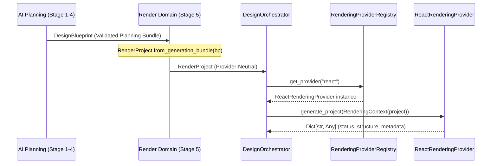

# Pipeline Contract Validation Report (Phase 13A)

**Document Identifier:** REP-PIPELINE-CONTRACT-13A  
**Author:** Nexora Studio Core Architecture Team  
**Date:** July 2026  
**Status:** Validated & Compliant  
**Test Suite:** `tests/test_pipeline_contract_validation.py`  

---

## 1. Executive Summary

The Nexora Studio website generation pipeline operates across distinct semantic boundaries: AI Planning Models (`DesignBlueprint`, `DesignSystem`), Intermediate Render Domain Models (`RenderProject`, `RenderPage`, `RenderComponent`), and Target Provider Outputs (`ReactProject`, `PenpotWorkspace`).

To prevent architectural erosion and data corruption across these boundaries, Phase 13A established a canonical verification suite: `tests/test_pipeline_contract_validation.py`. This suite validates input/output type safety, model immutability, and provider boundaries across all synthesis stages.

---

## 2. Stage Input/Output Type Contracts

The pipeline enforces strict type contracts at every stage transition:



### 2.1 Verification Criteria
The test suite asserts that:
1. Upstream AI planning generators output valid `DesignBlueprint` instances containing well-formed `PageBlueprint`, `SectionBlueprint`, and `DesignTokenSet` structures.
2. `RenderProject.from_generation_bundle()` accepts valid blueprint bundles and outputs an immutable `RenderProject` instance with zero target-specific syntax references (no JSX, CSS, HTML, or Odoo ORM dependencies).
3. Provider execution via `DesignOrchestrator.execute_blueprint(bp, provider_name='react')` returns a standardized dictionary conforming to the provider output schema:
   - `status`: `'success'` or `'error'`
   - `provider`: Provider identifier string (e.g., `'react'`)
   - `project_structure`: Dictionary mapping relative file paths to string file contents.
   - `supported_operations_executed`: List of executed synthesis stage names.
   - `unsupported_granular_operations_deferred`: List of deferred interactive mutations.
   - `metadata`: Comprehensive diagnostic payload.

---

## 3. Pipeline Immutability & Anti-Corruption Verification

A critical risk in multi-stage generation pipelines is downstream mutation: where a rendering provider or intermediate transformation accidentally mutates the upstream AI planning model, causing subsequent re-renders or alternative provider exports (e.g., exporting to Penpot after React generation) to produce corrupted or inconsistent designs.

### 3.1 Immutability Test Protocol
`test_02_pipeline_immutability` executes the following verification sequence:
1. Instantiate a frozen `DesignBlueprint` with known page names (`"Landing"`) and color tokens (`"#3b82f6"`).
2. Convert the blueprint to a `RenderProject` via `RenderProject.from_generation_bundle()`.
3. Intentionally mutate properties on the downstream `RenderProject`:
   ```python
   render_proj.name = "Mutated Project Name"
   render_proj.pages[0].name = "Mutated Page Name"
   render_proj.tokens[0].value = "#ff0000"
   ```
4. Assert that the upstream `DesignBlueprint` remains completely untouched:
   ```python
   assert bp.project_name == "Contract Validation Project"
   assert bp.pages[0].name == "Landing"
   assert bp.token_set.color_palette.tokens[0].hex_value == "#3b82f6"
   ```
5. Execute the provider via `DesignOrchestrator`, intentionally mutate the returned `project_structure` dictionary, and re-execute to confirm that consecutive invocations produce identical, clean results without pollution.

---

## 4. Provider Contract & Registry Health

`test_03_provider_interface_and_neutrality` verifies the structural integrity of provider registration and metadata:
- Retrieves `'react'` from `RenderingProviderRegistry` and verifies inheritance from `RenderingProvider` and `ReactRenderingProvider`.
- Invokes `provider.get_metadata()` and verifies return type `ProviderMetadata`.
- Asserts that `metadata.provider_id == 'react'` and checks required capability flags (`validate_manifest`, `validate_project`, `validate_build`, `validate_runtime`, `validate_artifacts`).

---

## 5. Automated Execution Results

| Test Case | Verifies | Execution Result |
| :--- | :--- | :--- |
| `test_01_input_output_type_contracts` | Strict input/output types across planning, render domain, and provider outputs | **PASSED** |
| `test_02_pipeline_immutability` | Anti-corruption: downstream model and dictionary mutations never pollute upstream blueprints | **PASSED** |
| `test_03_provider_interface_and_neutrality` | Provider metadata schemas, registry contracts, and orchestrator target neutrality | **PASSED** |

---

## 6. Conclusion

The canonical pipeline contract test suite guarantees that Nexora Studio's website generation pipeline maintains strict data hygiene and semantic decoupling. All stage boundaries and immutability rules are fully enforced by CI/CD regression testing.
