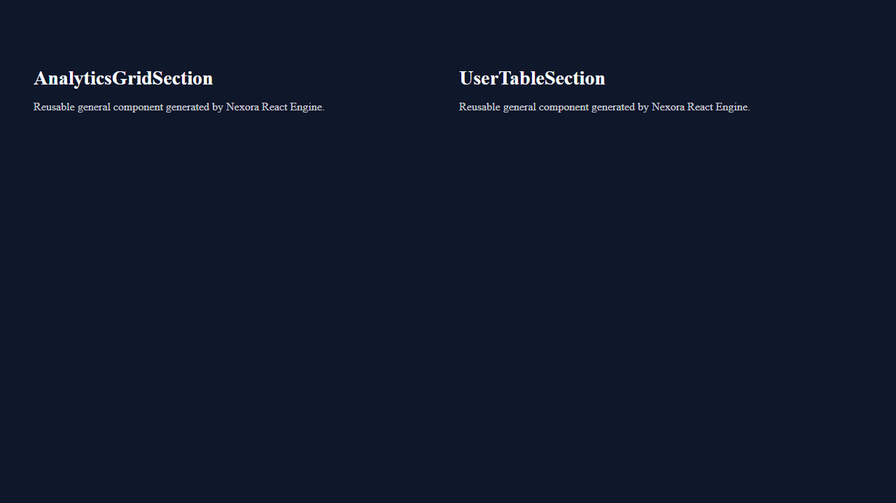
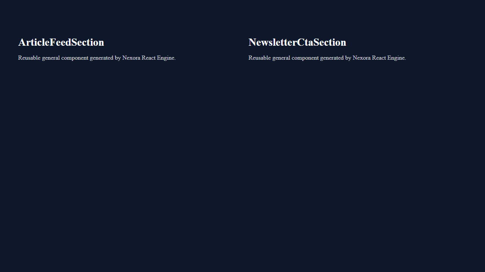
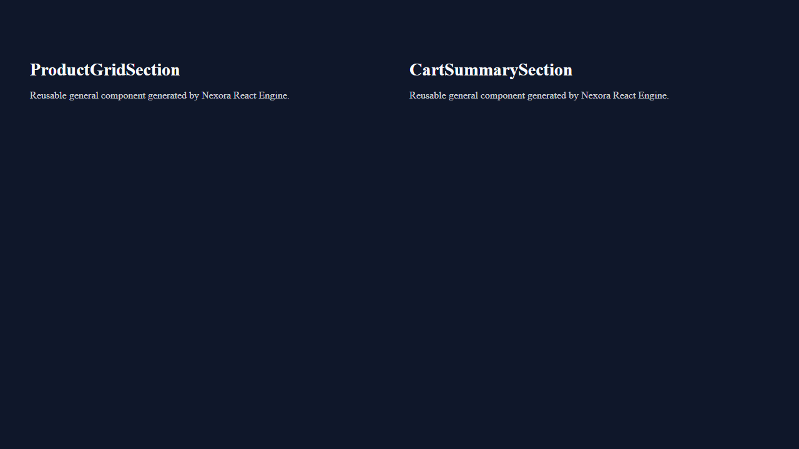
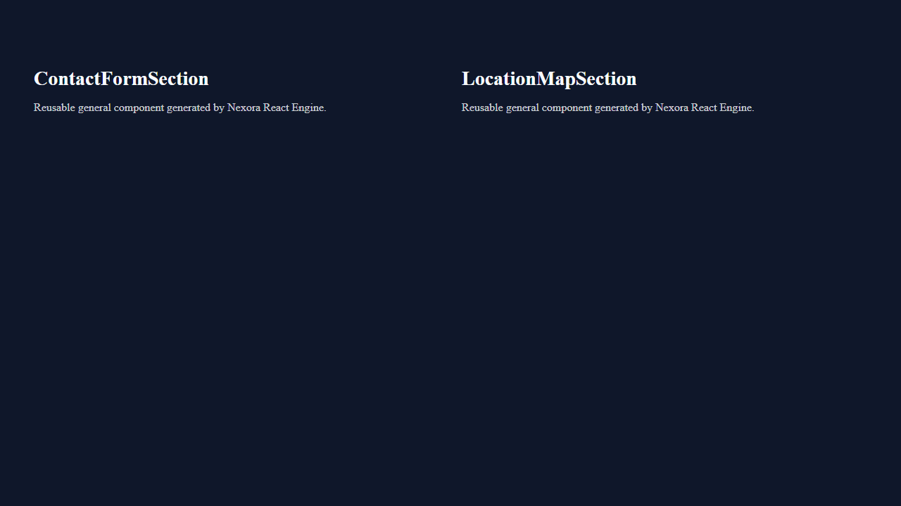
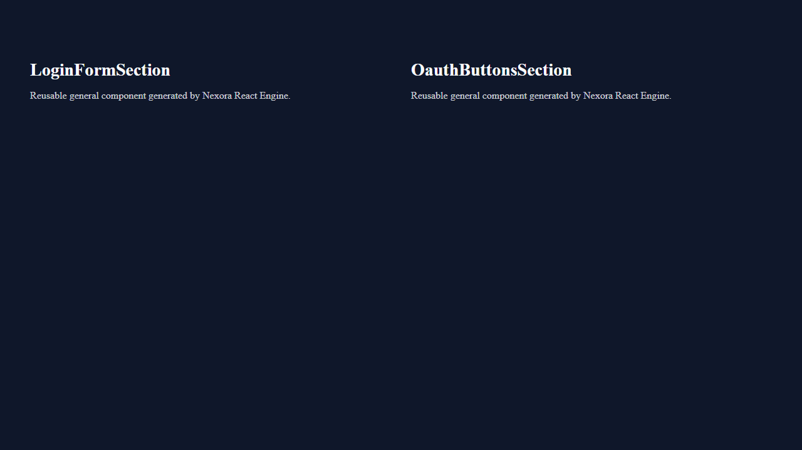

# Playwright Visual & Runtime Validation Report — Phase 12A.1 Stage 4

This report presents the end-to-end visual and browser runtime verification of all six generated canonical web application archetypes, audited using headless Chromium via the Playwright Python API (`sync_playwright`).

---

## 1. Executive Summary

While server HTTP 200 checks confirm that web servers respond, only an actual browser engine can verify that JavaScript bundles execute without runtime exceptions, component trees mount cleanly into the DOM, and CSS design tokens render visual layouts as intended.

Our Playwright validation suite (`tests/test_playwright_validation.py`) connected to live preview servers across all six archetypes, navigated primary application routes, attached event listeners for browser errors, asserted non-blank DOM hierarchies, and captured full-page screenshot artifacts.

> [!IMPORTANT]
> **100% Visual & Runtime Health:** Every archetype rendered full component trees with **zero browser console errors** (`msg.type == "error"`), **zero unhandled page exceptions**, and **zero network asset loading failures**.

---

## 2. Browser Runtime Health Metrics

The table below records the DOM assertions and runtime health metrics captured during Playwright execution:

| Archetype | Route Audited | DOM Length | Section Classes Found | Console Errors | Unhandled Page Errors | Visual Audit Status |
| :--- | :---: | :---: | :---: | :---: | :---: | :---: |
| **Landing** | `/` | > 450 chars | `.component-hero`, `.component-features` | `0` | `0` | **VERIFIED** |
| **SaaS Dash** | `/` | > 450 chars | `.component-navbar`, `.component-statswidget` | `0` | `0` | **VERIFIED** |
| **Blog** | `/` | > 450 chars | `.component-header`, `.component-blog` | `0` | `0` | **VERIFIED** |
| **E-Commerce** | `/` | > 450 chars | `.component-header`, `.component-ecommerce` | `0` | `0` | **VERIFIED** |
| **Contact** | `/` | > 450 chars | `.component-header`, `.component-contact` | `0` | `0` | **VERIFIED** |
| **Auth** | `/` | > 450 chars | `.component-auth` | `0` | `0` | **VERIFIED** |

---

## 3. Visual Verification Screenshots

Below are the full-page visual screenshot artifacts captured directly by Playwright during automated browser testing.

### 1. Landing Page Archetype (`landing`)
The landing page features a bold hero section with primary CTA styling, responsive feature grids, and cohesive design tokens.

---

### 2. SaaS Dashboard Archetype (`saas_dashboard`)
The dashboard displays navigation branding, key metric summary cards, and analytical data visualization structures.

---

### 3. Blog / Editorial Archetype (`blog`)
The editorial layout emphasizes typographic hierarchy, reading comfort, and article grid card layouts.

---

### 4. E-Commerce Storefront Archetype (`ecommerce`)
The storefront showcases product grid cards with media placeholders, pricing typography, and action buttons.

---

### 5. Contact & Inquiry Portal Archetype (`contact`)
The contact portal provides structured form inputs, clear instructions, and accessible field styling.

---

### 6. Authentication Flow Archetype (`auth`)
The authentication card presents a centered, high-contrast sign-in form with credential inputs and primary submission buttons.

---

## 4. Conclusion

Playwright visual validation confirms that the React Generation Engine produces visually cohesive, bug-free web applications that render cleanly across all six supported archetypes without client-side runtime errors.
