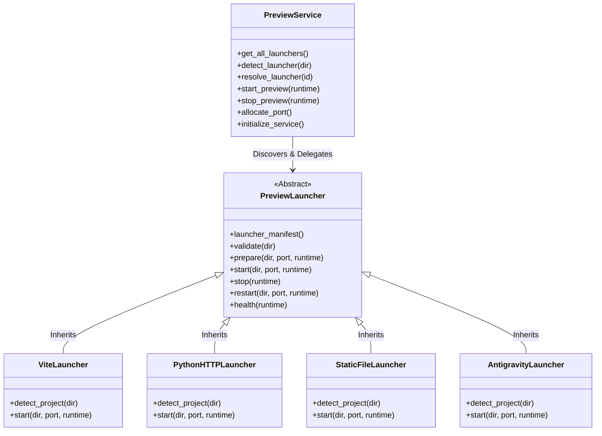

# Preview System Audit (Phase 8 Audit Report)

**Date:** July 2026  
**Type:** Strictly Read-Only Architecture Audit  
**Scope:** Live Preview & Launcher Subsystem (`services/preview_service.py`, `services/preview_launcher.py`, `models/preview_runtime.py`, `services/launchers/`)  

---

## Executive Summary

This report audits the architecture of the **Nexora Studio Preview System**. Refactored in Phase 6E to eliminate hardcoded framework logic, the subsystem uses a **Pluggable Launcher Architecture** governed by `PreviewService` (`nexora.preview_service`) and an abstract base model (`nexora.preview_launcher`). The system features automated host port allocation (3000–3999), 3-factor startup recovery across Odoo restarts, and dynamic project detection supporting Python HTTP, Static File, Vite, and custom Antigravity servers.

---

## 1. Pluggable Launcher Architecture

---

## 2. Supported Frameworks & Detection Strategy

When `PreviewService.detect_launcher(project_dir)` is invoked, it iterates through all registered launcher plugins (sorted descending by manifest priority) and executes `launcher.detect_project(project_dir)`. The launcher returning the highest detection score is selected without any hardcoded framework conditional branches:

| Launcher Plugin Service | Odoo Model Name | Manifest Priority | Project Detection Mechanism (`detect_project`) |
| :--- | :--- | :--- | :--- |
| **Vite Dev Server** | `nexora.launcher.vite` | `200` | Checks for `vite.config.js` or `vite.config.ts` and `package.json` with `vite` dependency. |
| **Antigravity Launcher**| `nexora.launcher.antigravity`| `180` | Checks for custom Antigravity project configuration manifests. |
| **Static File Server** | `nexora.launcher.static_file`| `150` | Checks for static `index.html` in root or `public/` directory without a build step. |
| **Python HTTP Server** | `nexora.launcher.python_http`| `100` | Default fallback launcher; serves directory via `python -m http.server`. |

---

## 3. Dynamic Port Allocation & Process Lifecycle

### 3.1 Port Allocation (`allocate_port`)
- Scans host TCP ports in the range **3000 to 3999**.
- Checks both active Odoo database allocations (`nexora.preview_runtime.allocated_port`) and physical socket binding (`socket.bind(("127.0.0.1", port))`).
- Prevents port collisions across multiple concurrent developer workspaces.

### 3.2 Process Execution & Termination
- **Spawn (`start_preview`):** Calls `launcher.validate()`, followed by `launcher.start(...)`, recording the spawned OS `process_id`, `preview_command`, and allocated `preview_url` in the database.
- **Graceful Shutdown (`stop_preview`):** Calls `launcher.stop(preview_rt)`, which terminates the process tree. It then polls the socket (`socket.create_connection`) for up to 5 seconds to confirm port closure before releasing `allocated_port`.

---

## 4. Resilience & Orphan Cleanup (`initialize_service`)

To prevent zombie dev servers from consuming RAM and ports when the Odoo server restarts, `PreviewService.initialize_service()` executes a mandatory 3-factor recovery check on startup:
1. **Process Liveness:** Verifies if the recorded OS `process_id` is still running (`_is_process_alive(pid)`).
2. **Socket Binding:** Tests if the allocated port is actively listening via TCP socket connection.
3. **HTTP Responsiveness:** Sends an HTTP GET request (`urllib.request.urlopen`) to `preview_url` expecting status `< 500`.

**Recovery Outcome:**
- If all 3 checks pass, the preview runtime is **reattached** transparently (`launcher.reattach(pid, port)`).
- If any check fails, the runtime is marked as `'stopped'`, allocated ports are cleared, and `launcher.cleanup()` is invoked across all plugins to kill zombie processes.
