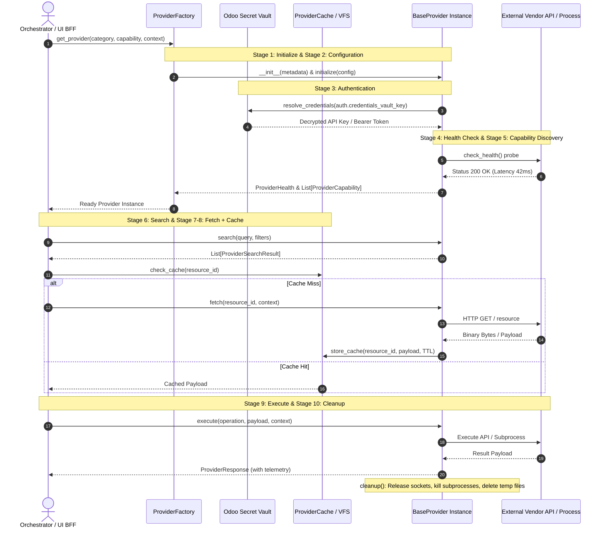

# Provider Lifecycle & Governance Specification (Phase 15A Report)

**Date:** July 2026  
**Type:** Strictly Read-Only Architecture Specification  
**Scope:** In-Depth Operational Governance for the 10-Stage Universal Provider Lifecycle  

---

## Executive Summary

To prevent resource leaks, ensure deterministic error handling, and guarantee universal observability across all subsystems, the **Unified Provider Platform** enforces a strict **10-Stage Universal Lifecycle Contract** on every registered provider. 

Whether an adapter integrates an LLM (`category = 'ai'`), an icon library (`category = 'asset'`), a dev server launcher (`category = 'preview'`), or a local workspace script (`category = 'mcp'`), its execution must strictly traverse these ten sequential stages. This document establishes the operational governance, transition rules, and safety assertions for each stage.

---

## 1. Lifecycle Transition Flow

---

## 2. In-Depth Stage Specifications

### Stage 1: Initialize (Instantiation & Metadata Binding)
- **Objective:** Bind the provider class to its static `ProviderMetadata` identity without establishing network connections or allocating heavy resources.
- **Governance:** Executed exclusively by `ProviderFactory`. If a provider class fails initialization (e.g., missing dependencies or Python syntax errors), the factory logs a critical error in `nexora.runtime_event` and excludes the provider from active routing.

### Stage 2: Configuration (Schema Validation & Manifest Merge)
- **Objective:** Inject runtime parameters (`timeout_seconds`, `max_retries`, `cache_ttl`) into the provider.
- **Governance:** The provider merges system-wide Odoo defaults with project-level manifest overrides. If the configuration schema is invalid, a `ProviderConfigurationError` is raised immediately before authentication is attempted.

### Stage 3: Authentication (Secure Credential Resolution)
- **Objective:** Resolve API keys, OAuth tokens, or SSH certificates required for vendor communication.
- **Governance:** Secrets **must never** be passed in plaintext via configuration dictionaries or environment variables. The adapter receives a `ProviderAuthentication` object containing a `credentials_vault_key`. The adapter calls Odoo's internal secret vault to decrypt the credential in memory just-in-time for request header injection.

### Stage 4: Health Check (Diagnostic Probing & Circuit Breaking)
- **Objective:** Verify operational health and network reachability before executing expensive operations.
- **Governance:** The provider executes a lightweight diagnostic probe (`check_health()`). If the probe fails or latency exceeds acceptable thresholds, Odoo trips the central **Circuit Breaker** (`circuit_breaker_open = True`), marking the status in `ProviderHealth`. Subsequent calls bypass this provider instantly, routing to configured fallbacks.

### Stage 5: Capability Discovery (Schema & Quota Enumeration)
- **Objective:** Declare exact operational capabilities (`operation_type`), parameter JSON schemas, and rate limits.
- **Governance:** Callers use this manifest to validate payloads locally before transmission. If a caller submits a payload violating the capability's `parameter_schema`, a validation exception is thrown without making an external network request.

### Stage 6: Search (Structured Resource Querying)
- **Objective:** Enumerate available resources (e.g., Unsplash images, Penpot symbols, MCP tools) matching natural language queries and filters.
- **Governance:** Results must be returned as a list of normalized `ProviderSearchResult` dataclasses, ensuring the Nexora Console frontend can render uniform grid browsers regardless of the underlying vendor.

### Stage 7: Fetch (Network & Binary Retrieval)
- **Objective:** Download specific resource payloads (image blobs, font WOFF2 files, external schemas).
- **Governance:** Network calls must strictly adhere to `config.timeout_seconds` and `config.max_retries` with exponential backoff. Network timeouts raise a `ProviderTimeoutError`.

### Stage 8: Cache (Storage & TTL Invalidation)
- **Objective:** Eliminate redundant external API requests and reduce financial token costs.
- **Governance:** Fetched responses are passed through `ProviderCache`. Binary assets are written to the project's local Virtual File System (VFS), while JSON metadata is stored in Odoo's Redis/memory cache with strict TTL expiration.

### Stage 9: Execute (Sandboxed Operation Execution)
- **Objective:** Perform the primary business operation (AI generation, JSX synthesis, dev server port binding, tool execution).
- **Governance:** The operation executes within a sandboxed `ProviderExecutionContext` that monitors cost budgets (`cost_budget_usd`). Upon completion, the provider must return a `ProviderResponse` populating `execution_ms` and `token_cost_usd`. The platform automatically emits a `ProviderEvent` into `nexora.runtime_event` for timeline auditability.

### Stage 10: Cleanup (Deterministic Resource Teardown)
- **Objective:** Guarantee zero resource leaks across Odoo worker processes.
- **Governance:** Enforced via Python context managers (`with provider:`). Regardless of whether execution succeeded or raised an unhandled exception, `cleanup()` is guaranteed to execute, terminating open background subprocesses, closing TCP sockets, and deleting temporary disk files.
