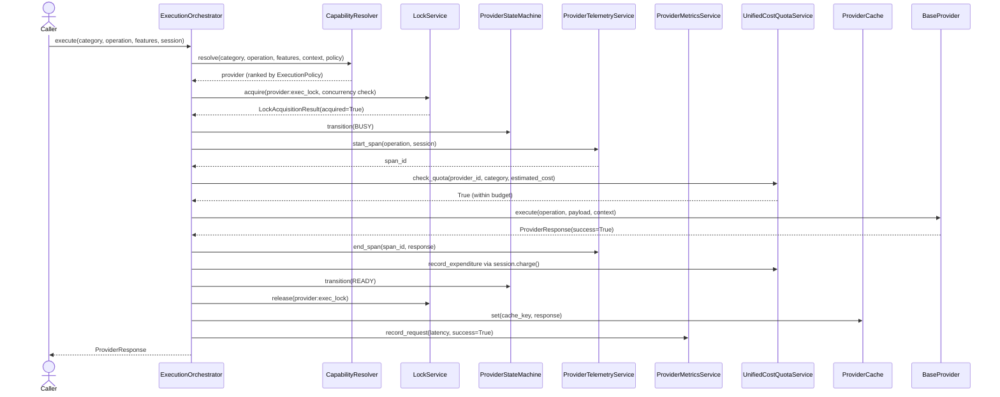
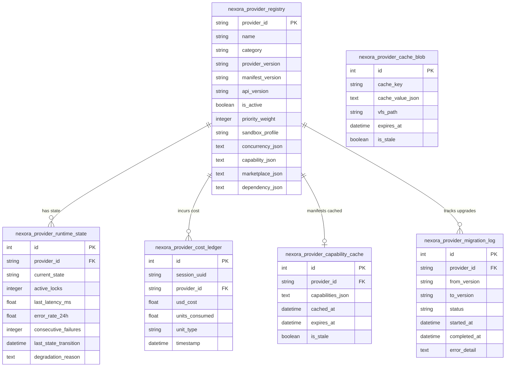

# Provider Platform Design — Unified Architecture (ADR-0029 + ADR-0030 + ADR-0031 + ADR-0032)

**Date:** July 2026
**Type:** Architecture Design Document — Full Topology, Class Hierarchy, and Service Topology

---

## 1. Three-Tier Architecture Overview

```
┌───────────────────────────────────────────────────────────────────────────────┐
│  PRESENTATION LAYER — Nexora Developer Console (React + TanStack + Zustand)  │
│  Provider Mgmt Dashboard │ Model Selector │ Asset Browser │ Marketplace UI   │
│  Metrics Dashboard │ Migration Control │ Compatibility Report Viewer          │
└───────────────────────────┬───────────────────────────────────────────────────┘
                            │ REST HTTP / SSE / WebSocket
┌───────────────────────────▼───────────────────────────────────────────────────┐
│  ORCHESTRATION & GOVERNANCE KERNEL — Odoo Backend OS                         │
│                                                                               │
│  ┌──────────────────────────────────────────────────────────────────────────┐ │
│  │  ProviderServiceContainer (DI Composition Root — ADR-0032)              │ │
│  └────────────────────────────────┬─────────────────────────────────────────┘ │
│                                   │ resolves                                  │
│  ┌─────────────────┐  ┌───────────▼─────────┐  ┌─────────────────────────┐  │
│  │  LockService    │  │  ProviderEventBus   │  │ ProviderStateMachine    │  │
│  │  PG/Redis/Mem   │  │  Async ThreadPool   │  │ 9-State FSM             │  │
│  └─────────────────┘  └─────────────────────┘  └─────────────────────────┘  │
│  ┌─────────────────┐  ┌─────────────────────┐  ┌─────────────────────────┐  │
│  │CompatibilitySvc │  │  ProviderDiscovery  │  │ ProviderDependencyGraph │  │
│  │ 7 Validators    │  │  4 Source Types     │  │ Kahn's BFS              │  │
│  └─────────────────┘  └─────────────────────┘  └─────────────────────────┘  │
│  ┌─────────────────┐  ┌─────────────────────┐  ┌─────────────────────────┐  │
│  │ProviderRegistry │  │  ProviderFactory    │  │ CapabilityResolver      │  │
│  │ SQL + LRU Cache │  │  Instantiation Only │  │ Feature + Policy Rank   │  │
│  └─────────────────┘  └─────────────────────┘  └─────────────────────────┘  │
│  ┌─────────────────┐  ┌─────────────────────┐  ┌─────────────────────────┐  │
│  │ HealthService   │  │ TelemetryService    │  │ MetricsService          │  │
│  │ Probes+Breaker  │  │ Spans+Audit+WS      │  │ Rolling-Window Agg      │  │
│  └─────────────────┘  └─────────────────────┘  └─────────────────────────┘  │
│  ┌─────────────────┐  ┌─────────────────────┐  ┌─────────────────────────┐  │
│  │ CapabilityCache │  │ ProviderCache L1/2/3│  │ CostQuotaService        │  │
│  │ 24h Manifest TTL│  │ Memory/Redis/VFS    │  │ 5-Dimension Accounting  │  │
│  └─────────────────┘  └─────────────────────┘  └─────────────────────────┘  │
│  ┌─────────────────┐  ┌─────────────────────┐  ┌─────────────────────────┐  │
│  │MigrationService │  │ ExecutionOrchestrat.│  │ ProviderSession (Scoped)│  │
│  │Upgrade+Rollback │  │ Master Coordinator  │  │ Per-Request Container   │  │
│  └─────────────────┘  └─────────────────────┘  └─────────────────────────┘  │
└───────────────────────────────────────────────────────────────────────────────┘
                            │ executes via BaseProvider contract
┌───────────────────────────▼───────────────────────────────────────────────────┐
│  ADAPTER BRIDGE LAYER — Polymorphic Sandboxed Adapters                       │
│  AI (OpenAI, Claude, Gemini, Ollama, NVIDIA)    — SandboxProfile.TRUSTED     │
│  MCP External Servers                           — SandboxProfile.DEVELOPMENT  │
│  MCP Internal Tools                             — SandboxProfile.WORKSPACE    │
│  Asset Providers (Unsplash, Pixabay, Fonts)     — SandboxProfile.WORKSPACE    │
│  Design Providers (Penpot, React UI Kits)       — SandboxProfile.WORKSPACE    │
│  Preview Providers (Vite, HTTP Servers)         — SandboxProfile.DEVELOPMENT  │
│  Storage Providers (VFS, Cloud S3)              — SandboxProfile.TRUSTED      │
└───────────────────────────────────────────────────────────────────────────────┘
```

---

## 2. Complete Service Class Hierarchy

```mermaid
classDiagram
    class ProviderServiceContainer {<<abstract>> register() resolve() create_scope() build()}
    class LockService {<<abstract>> acquire() release() extend() is_held() get_backend()}
    class ProviderEventBus {<<abstract>> publish() subscribe() drain()}
    class ProviderStateMachine {<<abstract>> VALID_TRANSITIONS transition() get_state() is_invocable()}
    class ProviderDependencyGraph {<<abstract>> add_dependency() resolve_startup_order() detect_cycles()}
    class ProviderCompatibilityService {<<abstract>> validate() validate_platform_version() validate_odoo_version() validate_manifest_schema()}
    class ProviderDiscovery {<<abstract>> discover_builtin() discover_community() discover_marketplace() validate_and_register()}
    class ProviderRegistry {<<abstract>> register_provider() get_metadata() list_providers() unregister_provider()}
    class ProviderFactory {<<abstract>> create_provider() resolve_provider_for_capability()}
    class ProviderHealthService {<<abstract>> probe_health() get_health() schedule_probes()}
    class ProviderTelemetryService {<<abstract>> start_span() end_span() emit_event()}
    class ProviderMetricsService {<<abstract>> record_request() record_cache_event() record_selection() get_snapshot()}
    class CapabilityCache {<<abstract>> get() set() invalidate() refresh() get_or_refresh()}
    class ProviderCache {<<abstract>> get() set() invalidate()}
    class UnifiedCostQuotaService {<<abstract>> check_quota() record_expenditure()}
    class CapabilityResolver {<<abstract>> resolve() resolve_all()}
    class ProviderMigrationService {<<abstract>> plan_upgrade() execute_upgrade() rollback_upgrade() get_migration_history()}
    class ExecutionOrchestrator {<<abstract>> execute() execute_streaming() execute_parallel()}
    class BaseProvider {<<abstract>> metadata sandbox state initialize() authenticate() check_health() discover_capabilities() search() fetch() execute() cleanup() +8 lifecycle hooks +4 migration hooks}

    ProviderServiceContainer --> LockService
    ProviderServiceContainer --> ProviderEventBus
    ProviderServiceContainer --> ProviderStateMachine
    ProviderStateMachine --> LockService
    ProviderDiscovery --> ProviderCompatibilityService
    CapabilityResolver --> CapabilityCache
    CapabilityResolver --> ProviderMetricsService
    ExecutionOrchestrator --> CapabilityResolver
    ExecutionOrchestrator --> ProviderStateMachine
    ExecutionOrchestrator --> LockService
    ExecutionOrchestrator --> ProviderTelemetryService
    ExecutionOrchestrator --> ProviderMetricsService
    ExecutionOrchestrator --> UnifiedCostQuotaService
    ExecutionOrchestrator --> ProviderCache
    ProviderMigrationService --> LockService
    ProviderMigrationService --> ProviderStateMachine
    ProviderMigrationService --> ProviderCompatibilityService
    ProviderMigrationService --> CapabilityCache
```



---

## 3. ExecutionOrchestrator Flow (Complete Sequence)



---

## 4. Provider Category Specialization Matrix

| Category | Sandbox Profile | discover_capabilities() | execute() primary operation | Cost dimension |
|:---|:---|:---|:---|:---|
| `AI` | `TRUSTED` | LLM model specs (context, vision, tools, cost) | `generate` / `embed` | AI tokens (USD) |
| `ASSET` | `WORKSPACE` | Image/font search schemas | `search` / `fetch` | Bandwidth (MB) |
| `MCP` (external) | `DEVELOPMENT` | Tool schemas from MCP server | `tool-call` | CPU time (ms) |
| `MCP` (internal) | `WORKSPACE` | Odoo tool reflection | `tool-call` | CPU time (ms) |
| `DESIGN` | `WORKSPACE` | Render/synthesis specs | `render` / `synthesize` | AI tokens (USD) |
| `PREVIEW` | `DEVELOPMENT` | Port/process specs | `launch` / `restart` | Uptime (hours) |
| `STORAGE` | `TRUSTED` | Storage quota + path specs | `read` / `write` / `delete` | Storage (bytes) |
| `COMPONENT` | `WORKSPACE` | Component prop schemas | `resolve` / `generate` | AI tokens (USD) |

---

## 5. Odoo SQL Data Model Overview


