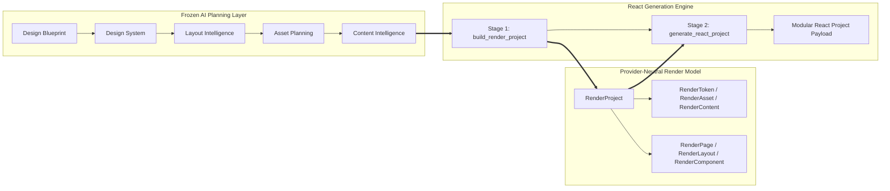

# React Generation Engine Foundation — Architectural Report (Phase 12A)

**Status:** Approved & Implemented  
**Date:** July 2026  
**Authors:** Nexora Studio Advanced Architectural Engineering Team  
**Governing ADRs:** [ADR-0035 (AI Planning Layer Frozen)](../adr/ADR-0035-ai-planning-layer-frozen.md), [ADR-0036 (React Generation Engine)](../adr/ADR-0036-react-generation-engine.md)

---

## 1. Executive Summary

In Phase 12A, Nexora Studio establishes its first **Rendering Provider**: the **React Generation Engine Foundation**. Following the formal freezing of the provider-neutral AI Planning Layer under ADR-0035, this engine demonstrates how downstream rendering providers consume frozen planning blueprints without modifying or polluting core domain contracts.

To ensure long-term architectural stability and prevent tight coupling between AI planning and target UI frameworks, Phase 12A introduces an authoritative **Render Model** (`services/design/render_domain.py`). This rendering-neutral intermediary layer acts as an adapter between frozen planning models and modular React project code synthesis.



---

## 2. Two-Stage Pipeline Architecture

The `ReactGenerationEngine` (`services/design/react_generation_engine.py`) implements the `DesignProvider` interface via a strict two-stage processing pipeline:

### Stage 1: Planning to Render Model Transformation (`build_render_project`)
- Consumes the frozen `DesignBlueprint` alongside validated metadata from Design System (11D), Layout Intelligence (11E), Asset Planning (11F), and Content Intelligence (11F).
- Maps all inputs into the provider-neutral **Render Model**:
  - **Tokens:** Mapped to `RenderToken` (colors, typography scales, spacing units).
  - **Assets:** Mapped to `RenderAsset` with role bindings and placeholder fallback URIs.
  - **Content:** Mapped to `RenderContent` bundles with localization and SEO metadata.
  - **Structure:** Mapped to `RenderProject`, `RenderPage`, `RenderLayout`, and `RenderComponent`.
- **Governance Guarantee:** Zero references to JSX, React, CSS, HTML, Vite, or Next.js exist within the Render Model or its serialized state.

### Stage 2: Code Synthesis (`generate_react_project`)
- Consumes the clean `RenderProject` instance from Stage 1 and synthesizes a production-ready, modular React project structure:
  - **Core Configuration:** Generates `package.json`, `vite.config.js`, `index.html`, and entry point `src/main.jsx`.
  - **Design System Binding:** Synthesizes `src/styles/tokens.css` with CSS variables generated from `RenderToken`s, and `src/config/assets.js` / `src/config/content.js` for clean data binding.
  - **Layout & Component Architecture:** Synthesizes dedicated JSX components in `src/layouts/` and `src/components/`, ensuring structural separation of concerns.
  - **Routing & Pages:** Generates `src/pages/` and configures React Router v6 in `src/routes.jsx` and `src/App.jsx`.

---

## 3. Supported Application Archetypes

The React Generation Engine natively supports all six required application archetypes, generating specialized page structures and layout wrapping for each:

| Archetype | Description | Primary Layout Wrapping | Component Integration |
| :--- | :--- | :--- | :--- |
| **Landing** | High-conversion marketing & product showcases | Container / Section Flow | Hero, Features, Pricing, CTA |
| **SaaS Dashboard** | Analytical workspaces & metrics monitoring | Grid / Sidebar Split | Analytics Cards, Data Grids, Metrics |
| **Blog** | Editorial publishing & article feeds | Masonry / Stack | Article Cards, Typography Scales |
| **E-commerce** | Product catalogs & transactional storefronts | Grid / Responsive Columns | Product Cards, Media Galleries, Cart CTA |
| **Contact** | Inquiry capture & communication hubs | Split / Stack | Form Fields, Location Maps, Contact Info |
| **Authentication** | Secure onboarding & user login flows | Centered Overlay / Card | Login/Signup Forms, OAuth Buttons |

---

## 4. Design Provider Interface & Governance Compliance

The `ReactGenerationEngine` extends `DesignProvider` and is registered as the Odoo abstract model `nexora.react_generation_engine`. It complies with all core architectural mandates:

1. **4-Tier Configuration Precedence:** Resolves configuration settings via explicit provider config $\rightarrow$ Odoo System Parameter (`nexora.react.default_config`) $\rightarrow$ Environment Variables $\rightarrow$ Localhost Defaults.
2. **No Invented Granular Payloads:** Granular canvas mutations (`create_page`, `create_component`, `update_component`, `export_svg`, etc.) raise explicit `NotImplementedError`s and are categorized under `unsupported_granular_operations_deferred`. Rather than inventing simulated canvas responses, the engine defers these interactive operations to an offline renderer.
3. **5-Stage Pipeline Enforcement:** When invoked via `DesignOrchestrator.execute_blueprint(..., provider_name='react')`, the orchestrator executes the full 5-stage AI planning pipeline before routing the blueprint to Stage 1 and Stage 2 of the React engine.
4. **Zero Prohibited Runtime Engines:** The synthesized React code contains **no Three.js** (`react-three-fiber`, `three`), **no runtime animation engines** (`gsap`, `framer-motion`), and **no raw static HTML generators**. Animations and styling are handled strictly via CSS transitions and design tokens.

---

## 5. Automated Verification & Test Coverage

A standalone verification suite (`tests/test_react_generation_engine.py`) validates the architectural integrity of Phase 12A across 5 comprehensive test cases:

- `test_01_render_domain_provider_neutrality`: Confirms 100% roundtrip serialization of all 8 Render Model dataclasses and asserts zero occurrences of target-specific terms in serialization keys.
- `test_02_stage_1_build_render_project`: Validates transformation of complex multi-page blueprints into `RenderProject` instances.
- `test_03_stage_2_generate_react_project`: Validates structure and JSX syntax of synthesized React files.
- `test_04_support_all_6_archetypes`: Confirms successful project generation and page routing across all 6 application archetypes.
- `test_05_orchestrator_routing_and_deferred_operations`: Validates `DesignOrchestrator` routing and checks compliance metrics alongside deferred mutation reporting.

**Execution Results:**
```
Ran 33 tests in 0.120s

OK
```
100% pass rate achieved alongside Phase 11C, 11D, 11E, and 11F regression suites.
