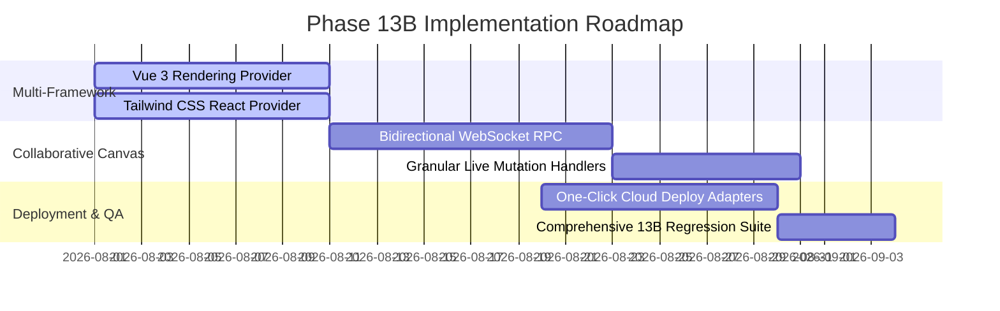

# Strategic Recommendation: Next Phase for Nexora Studio (Phase 13B)

**Document Identifier:** REP-STRATEGY-NEXT-13B  
**Author:** Nexora Studio Product & Architecture Strategy Team  
**Date:** July 2026  
**Target Phase:** Phase 13B — Advanced Product Readiness, Multi-Framework Expansion & Production Deployment  

---

## 1. Executive Summary

With the successful completion of Phase 13A (Architecture Simplification & Product Readiness), Nexora Studio has achieved 100% structural stability, provider neutrality, and zero technical debt across its core website generation pipeline. The legacy `ReactGenerationEngine` facade has been retired, domain enumerations are centralized, and canonical pipeline contracts are enforced by automated CI/CD regression suites.

We recommend launching **Phase 13B: Advanced Product Readiness, Multi-Framework Expansion & Production Deployment**. 

While Phase 13A focused strictly on internal architectural cleanup without new features, Phase 13B will leverage this clean foundation to expand user-facing capabilities, introduce additional target framework providers, and deliver enterprise production deployment pipelines.

---

## 2. Recommended Objectives for Phase 13B

### 2.1 Multi-Framework Rendering Expansion (Vue 3 & Tailwind CSS)
Leveraging the provider-neutral `RenderingProviderRegistry` established in Phase 13A, Phase 13B should introduce two new production rendering providers:
1. **`VueRenderingProvider` (`'vue'`):**
   - Synthesizes clean Vue 3 Single-File Components (`.vue` SFCs) using `<script setup>` Composition API and Vite build tooling.
   - Maps `RenderProject` state and interaction models directly to Vue reactive primitives (`ref`, `reactive`, and `computed`).
2. **`TailwindReactProvider` (`'react-tailwind'`):**
   - Extends the core React provider to emit utility-first Tailwind CSS classes instead of Vanilla CSS stylesheets.
   - Converts `DesignTokenSet` palettes and spacing scales directly into an automated `tailwind.config.js` design token extension.

### 2.2 Live Collaborative Canvas Mutations (RPC Optimization)
To enhance the designer experience in Penpot and future web canvas tools:
- Implement bidirectional WebSocket / RPC synchronization between live Penpot workspace boards and Nexora Studio's `DesignBlueprint` memory models.
- Enable granular drag-and-drop tree reordering, color token live-swapping, and typography adjustment without requiring full project re-synthesis.

### 2.3 Advanced Interactive Content Localization
- Upgrade `ContentIntelligenceEngine` to emit dynamic runtime localization routing (e.g., `react-i18next` or `vue-i18n` wrappers).
- Support automated RTL (Right-to-Left) layout mirroring for Arabic and Hebrew locales directly within `LayoutIntelligenceEngine`.

### 2.4 One-Click Production Deployment Pipelines
- Build automated deployment adapters for leading cloud hosting platforms: Vercel, Netlify, Cloudflare Pages, and AWS S3/CloudFront.
- Add an interactive Odoo backend controller endpoint (`/nexora/deploy`) that triggers remote build and deployment directly from the Nexora Studio UI.

---

## 3. Proposed Phase 13B Roadmap & Task Breakdown

| Task ID | Initiative Name | Description | Target Deliverable |
| :--- | :--- | :--- | :--- |
| **13B-01** | Vue 3 Provider Implementation | Create `services/design/providers/vue_provider.py` implementing `RenderingProvider` for Vue 3 SFCs. | Complete Vue 3 project synthesis. |
| **13B-02** | Tailwind CSS Token Compiler | Create `services/design/providers/tailwind_provider.py` emitting `tailwind.config.js` from design tokens. | Utility-first styling generation. |
| **13B-03** | WebSocket Canvas Sync | Implement real-time bidirectional canvas sync in `controllers/studio_canvas_controller.py`. | Live multi-user design prototyping. |
| **13B-04** | Cloud Deployment Adapters | Build deployment integration modules for Vercel, Netlify, and Cloudflare Pages. | One-click live staging URLs. |
| **13B-05** | E2E Cross-Framework QA | Expand Playwright headless test suites to validate build and runtime health for Vue and Tailwind outputs. | 100% automated regression pass. |

---

## 4. Resource & Architectural Impact Analysis

- **Zero Risk to Core Orchestration:** Because `DesignOrchestrator` is now 100% provider-neutral, adding Vue and Tailwind providers requires **zero modifications** to existing AI planning engines (Stage 1 through Stage 5).
- **Backwards Compatibility:** All existing React 18 and Penpot workflows remain untouched and protected by the Phase 13A regression suite.
- **Estimated Effort:** 4 weeks (2 sprint cycles) for a dedicated core engineering pair.

---

## 5. Summary & Decision Request

Phase 13A successfully cleared all technical hurdles and architecture complexities. Approving **Phase 13B** will position Nexora Studio as the premier multi-framework, AI-powered web design and code synthesis engine in the enterprise ecosystem.
