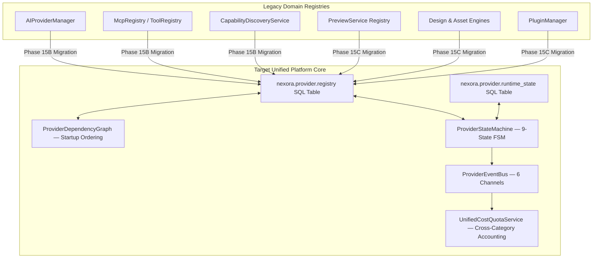

# Registry Consolidation Strategy (Phase 15A Report — Extended with ADR-0030)

**Date:** July 2026  
**Type:** Strictly Read-Only Architecture Strategy  
**Scope:** Evolution & Migration Plan Including ADR-0030 Governance Infrastructure  

---

## Executive Summary

As established in **ADR-0029** and extended by **ADR-0030**, the Unified Provider Platform consolidates six standalone domain registries into a single, authoritative SQL catalog (`nexora.provider.registry`) with a companion runtime state table (`nexora.provider.runtime_state`), managed by a unified `ProviderRegistry` service, `ProviderStateMachine`, `ProviderEventBus`, `ProviderDependencyGraph`, `ProviderSandboxPolicy`, and `UnifiedCostQuotaService`.

This report outlines the technical evolution, migration path, backward compatibility guarantees, and risk mitigation strategies for each existing domain registry and the new governance infrastructure.

---

## 1. Universal Registry Target Architecture (ADR-0030 Extended)

In the target state, all domain registries converge into two SQL tables governed by a unified service stack:

---

## 2. Category-By-Category Consolidation Plan (ADR-0030 Enhanced)

### 2.1 AI Provider Registry (`category = ProviderCategory.AI`)

#### Current Implementation
- **Location:** `services/ai/provider_manager.py`, `provider_health_service.py`, `ai_configuration_service.py`.
- **Mechanism:** Manages a dictionary of active adapter instances, routing requests via a custom 4-tier model resolution engine. Health checks are ping-based with independent circuit state stored in memory only.

#### Target Implementation
- All AI adapters will inherit from `BaseProvider` with `metadata.category = ProviderCategory.AI` and declare full triple-version manifests (`provider_version`, `manifest_version`, `api_version`).
- Model capability schemas (context window, vision, cost per 1k tokens) will be emitted via `discover_capabilities()` with `capability_version` and `supported_revisions`.
- Runtime health state will be tracked in `ProviderStateRecord` via `ProviderStateMachine` transitions (`HEALTHY → DEGRADED → HEALTHY`), replacing the in-memory circuit state dictionary.
- Token cost reporting will be routed through `UnifiedCostQuotaService.record_expenditure()`.
- AI adapters will declare `allow_shell = False`, `allow_docker = False` in their `ProviderSandboxPolicy`.

#### Migration Path
1. Create adapter wrappers (e.g., `UnifiedOpenAIProvider`) that subclass `BaseProvider` and delegate execution to the legacy `OpenAIAdapter`.
2. Register wrappers in `ProviderRegistry` via `register_provider()`; `ProviderDependencyGraph` will sort them against any declared storage or auth dependencies.
3. Transition `AIProviderManager` health-check state to `ProviderStateMachine` FSM transitions.
4. Deprecate and remove `AIProviderManager` after Phase 15D regression testing.

#### Compatibility & Risks
- **Compatibility:** 100% backward compatible. `ProviderCategory.AI == 'ai'` is `True` due to `str` enum inheritance.
- **Risks:** Migration of in-memory circuit breaker state into SQL `ProviderStateRecord` introduces a brief cold-start window on Odoo server restart; mitigated by seeding state from the last known health metrics.

---

### 2.2 Asset Provider Registry (`category = ProviderCategory.ASSET`)

#### Current Implementation
- **Location:** `services/design/asset_planning_engine.py`, `asset_domain.py`.
- **Mechanism:** Produces declarative asset specifications but relies on **stubbed** external fetchers that output placeholder URLs. Zero bandwidth accounting.

#### Target Implementation
- `AssetProvider` extends `BaseProvider` with `metadata.category = ProviderCategory.ASSET`.
- Each implementation declares its `ProviderSandboxPolicy.network_cidr_whitelist` explicitly (e.g., `['images.unsplash.com', 'pixabay.com']`).
- Download bandwidth reporting channels through `UnifiedCostQuotaService`.
- Capability revisions allow negotiating different response formats (e.g., `v1 = {thumbnail_url, title}` vs `v2 = {thumbnail_url, title, exif_metadata, license_attribution}`).

#### Migration Path
1. Build `PlaceholderAssetProvider` (wrapping current stub logic) as the fallback with `priority_weight = 1` and no network whitelist.
2. In Phase 15C+, implement `UnsplashProvider`, `PixabayProvider`, `GoogleFontsProvider`.
3. Refactor `AssetPlanningEngine.resolve_assets()` to invoke `ProviderFactory.resolve_provider_for_capability(category=ProviderCategory.ASSET)`.

---

### 2.3 MCP Provider Registry (`category = ProviderCategory.MCP`)

#### Current Implementation
- **Location:** `services/mcp_registry.py`, `mcp_service.py`, `tool_registry.py`.
- **Mechanism:** Direct Odoo method execution without sandbox controls, stdio transport, or dependency ordering.

#### Target Implementation
- External MCP servers: `allow_shell = True`, `allow_docker = False`, constrained filesystem whitelist.
- Internal workspace tools: `allow_shell = False`, `allow_dynamic_python = False`, read-only filesystem for project VFS.
- Each MCP tool schema maps directly to a `ProviderCapability` with `operation_type = 'tool-call'` and revision support.
- `ProviderDependencyGraph` ensures MCP providers initialize after storage and auth providers are `READY`.

#### Migration Path
1. Subclass `BaseProvider` to create `LocalWorkspaceToolProvider` and `ExternalMcpServerProvider`.
2. Map `nexora.mcp_server` rows to `ProviderMetadata` entries with appropriate `ProviderSandboxPolicy`.
3. `ProviderStateMachine` governs subprocess lifecycle: `INSTALLED → CONFIGURED → AUTHENTICATED → HEALTHY → READY ↔ BUSY`.

---

### 2.4 Component Source Registry (`category = ProviderCategory.COMPONENT`)

#### Current Implementation
- **Location:** `services/design/component_intelligence.py`, `react_component_library.py`.
- **Mechanism:** Static in-memory dictionaries; no capability versioning.

#### Target Implementation
- `BuiltInReactComponentProvider` registers with `priority_weight = 100` and `capability_version = 'v2'`, `supported_revisions = ['v1', 'v2']`.
- External component sources (Penpot, Figma UI kits) register with lower priority weights.
- Component schema revisions allow migrating prop interface schemas without breaking existing callers.

---

### 2.5 Design Provider Registry (`category = ProviderCategory.DESIGN`)

#### Current Implementation
- **Location:** `services/design/design_provider.py`, `penpot_provider.py`.
- **Mechanism:** Standalone factory functions; no dependency declaration.

#### Target Implementation
- `ReactRenderingProvider` declares dependency `['ai.openai>=1.0']` (for AI-assisted layout inference).
- `PenpotProvider` declares dependency `['storage.local>=2.0']` (for asset blob storage).
- `ProviderDependencyGraph` guarantees these dependencies are `READY` before design providers boot.

---

### 2.6 Preview Provider Registry (`category = ProviderCategory.PREVIEW`)

#### Current Implementation
- **Location:** `services/preview_service.py`, `preview_launcher.py`.
- **Mechanism:** Custom port allocation and socket polling; no cost accounting for uptime.

#### Target Implementation
- `VitePreviewProvider` registers with `allow_shell = True` sandbox policy (required to spawn Node.js subprocesses).
- Dev server uptime (running hours) tracked via `UnifiedCostQuotaService` resource dimension `PREVIEW`.
- `ProviderStateMachine` governs subprocess state: `READY → BUSY` (when port is allocated and server spawned) → `READY` (when shutdown requested).

---

### 2.7 New: Storage Provider Registry (`category = ProviderCategory.STORAGE`)
The ADR-0030 `STORAGE` category enables explicit dependency injection for providers requiring persistent binary storage (asset blobs, font files, design exports):
- `LocalVfsStorageProvider` initializes first (highest dependency priority).
- Future `S3StorageProvider` or `R2StorageProvider` can register as higher-priority alternatives.
- Design and Asset providers declare `requires: ['storage.local>=1.0']` in their manifests.

---

## 3. ADR-0030 Governance Infrastructure Migration

### 3.1 `ProviderStateMachine` — SQL State Tracking
| Legacy Pattern | Unified Platform Pattern |
|:---|:---|
| AI circuit breaker stored in Python dictionary (lost on restart) | `ProviderStateRecord.current_state` persisted in `nexora.provider.runtime_state` |
| Preview port allocation tracked via `preview_service._processes` dict | FSM `BUSY` state with `active_locks` count in `ProviderStateRecord` |
| Plugin activation toggle stored in `nexora.runtime` | FSM `DISABLED / ARCHIVED` transitions via `ProviderStateMachine.transition()` |

### 3.2 `ProviderEventBus` — Channel Consolidation
| Legacy Pattern | Unified Platform Pattern |
|:---|:---|
| `nexora.runtime_event` records inserted directly by services | `ProviderEventBus.publish(channel=TELEMETRY)` |
| Frontend polls REST endpoint for provider status | `ProviderEventBus.publish(channel=WEBSOCKET)` — real-time push |
| Print-style `_logger.info()` calls scattered in adapters | `ProviderEventBus.publish(channel=LOGGING)` with trace IDs |
| No Prometheus metrics exported | `ProviderEventBus.publish(channel=METRICS)` |
| No immutable audit trail for secret resolution | `ProviderEventBus.publish(channel=AUDIT)` |
| No user notifications on provider degradation | `ProviderEventBus.publish(channel=NOTIFICATIONS)` |

### 3.3 `UnifiedCostQuotaService` — Resource Accounting
| Legacy Pattern | Unified Platform Pattern |
|:---|:---|
| AI token cost tracked in `ai_execution_context.py` | `UnifiedCostQuotaService.record_expenditure(category=AI)` |
| Asset downloads untracked | `record_expenditure(category=ASSET, units=bandwidth_mb)` |
| MCP invocations untracked | `record_expenditure(category=MCP, units=cpu_ms)` |
| Preview uptime untracked | `record_expenditure(category=PREVIEW, units=running_hours)` |
| Storage bytes untracked | `record_expenditure(category=STORAGE, units=bytes_stored)` |

---

## 4. Consolidation Risk Matrix & Mitigation Summary (Updated)

| Risk Category | Severity | Probability | Architectural Mitigation Strategy |
| :--- | :---: | :---: | :--- |
| **SQL Lock Contention on Runtime State** | High | Medium | Separate `nexora.provider.runtime_state` from `nexora.provider.registry`; runtime state uses row-level locking with `SELECT FOR UPDATE SKIP LOCKED`. |
| **FSM Illegal Transition Attempts** | Medium | Low | `ProviderStateMachine.transition()` validates transitions against `VALID_TRANSITIONS` set; invalid attempts raise `ProviderConfigurationError` and publish `AUDIT` event. |
| **Dependency Graph Circular References** | High | Low | `ProviderDependencyGraph.detect_cycles()` runs at Odoo boot using Kahn's algorithm; circular dependencies abort module initialization with a descriptive error. |
| **Sandbox Policy Bypass** | Critical | Very Low | `ProviderSecurityException` raised at runtime if any adapter attempt to open a file path outside `filesystem_whitelist` or connect to an un-whitelisted CIDR. |
| **Legacy Caller Breakage** | High | Low | Dual-registration bridge adapters maintained throughout Phase 15B/15C; `ProviderCategory(str, Enum)` ensures `== 'ai'` comparisons pass without refactoring. |
