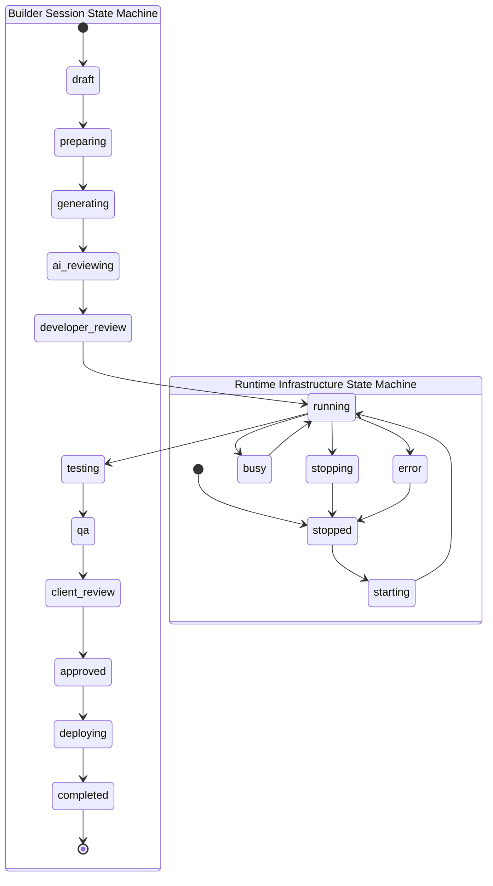

# State Management & Lifecycle Audit (Phase 9 Audit Report)

**Date:** July 2026  
**Type:** Strictly Read-Only Architecture Audit  
**Scope:** State Machines, Event Timeline, and Conversational Memory (`models/builder_session.py`, `models/runtime.py`, `models/runtime_event.py`, `models/builder_conversation.py`, `models/*_runtime.py`)  

---

## Executive Summary

This report evaluates the state management and lifecycle architecture of **Nexora Studio**. The system employs a **Hierarchical State Machine Architecture** that decouples user session workflow states (`nexora.builder_session`) from underlying infrastructure runtime states (`nexora.runtime`). All state transitions and subsystem activities are permanently recorded in a comprehensive event timeline (`nexora.runtime_event`), while AI chat interactions are persisted in structured JSON memory tables (`nexora.builder_conversation`).

---

## 1. Hierarchical State Machine Mapping

---

## 2. Core State Models & Enforcements

### 2.1 Builder Session Workflow (`nexora.builder_session`)
- **Workflow State (`status`):** Tracks the user/project lifecycle across 14 distinct phases: `draft`, `preparing`, `generating`, `ai_reviewing`, `developer_review`, `running`, `testing`, `qa`, `client_review`, `approved`, `deploying`, `completed`, `failed`, and `cancelled`.
- **Transition Governance:** Enforced by `BuilderSessionService.transition_state()`, which validates transitions against a strict `_TRANSITIONS` dictionary before mutating database records and emitting state change events.

### 2.2 Infrastructure Runtimes (`nexora.runtime`)
- **Polymorphic Runtimes:** Represents attached infrastructure processes across 9 types: `workspace`, `git`, `ide`, `preview`, `mcp`, `ai`, `deployment`, `docker`, and `custom`.
- **Uniqueness Constraint:** Enforces SQL constraint `session_type_uniq` (`unique (builder_session_id, runtime_type)`), guaranteeing that a session has at most one active runtime instance per infrastructure type.
- **Runtime State (`status`):** Tracks process execution via 6 statuses: `stopped`, `starting`, `running`, `busy`, `stopping`, and `error`.
- **Health Diagnostics (`health`):** Tracks operational health via 4 levels: `unknown`, `healthy`, `warning` / `degraded`, and `critical` / `failed`.

### 2.3 Specialized Domain Runtime Extensions
- **`nexora.preview_runtime`:** Extends the base runtime with preview-specific attributes: `launcher_type`, `allocated_port`, `preview_url`, and OS `process_id`.
- **`nexora.git_runtime`:** Extends the base runtime with source control attributes: `repository_url`, `current_branch`, `current_commit`, `is_dirty`, `ahead`, and `behind`.

---

## 3. Event Timeline & Conversational Memory

### 3.1 Event Timeline & Audit Log (`nexora.runtime_event`)
- **Event Catalog:** A centralized audit table capturing over 70 distinct lifecycle event types across 16 categories: cache, dependency, plugin, capability, generation, workspace, file, git, preview, ide, mcp, ai, deployment, docker, session, and user.
- **Traceability:** Every event binds to optional foreign keys (`generation_job_id`, `builder_session_id`, `runtime_id`), allowing full chronological debugging and frontend websocket broadcasting.

### 3.2 Conversational Memory (`nexora.builder_conversation`)
- **JSON Storage:** Persists LLM chat history in `messages_json` as a JSON array of message objects (`role`, `content`, `timestamp`, `metadata`).
- **Session Linking:** Binds 1:1 or N:1 to `builder_session_id`, enabling `BuilderAssistantService` to recall previous prompts, code diffs, and debugging instructions during interactive editing sessions.

---

## 4. State Safety Assessment

| Architectural Component | Current State Governance | Identified Architectural Strength | Areas for Future Enhancement |
| :--- | :--- | :--- | :--- |
| **Session Transitions** | Controlled via `_TRANSITIONS` dict in `BuilderSessionService`. | Prevents invalid jumps (e.g., jumping from `draft` directly to `deploying`). | Expose transition rules dynamically via capability manifests so plugins can inject custom review stages. |
| **Runtime Uniqueness** | SQL unique constraint `session_type_uniq`. | Completely eliminates duplicate port allocations or conflicting git runtimes per session. | Maintain strict SQL constraint in Phase 15. |
| **Conversation Growth** | Text field `messages_json` appending full message dicts. | Simple, portable JSON structure easily serialized for LLM context windows. | Add automated context truncation / summarization when message tokens exceed model limits. |
