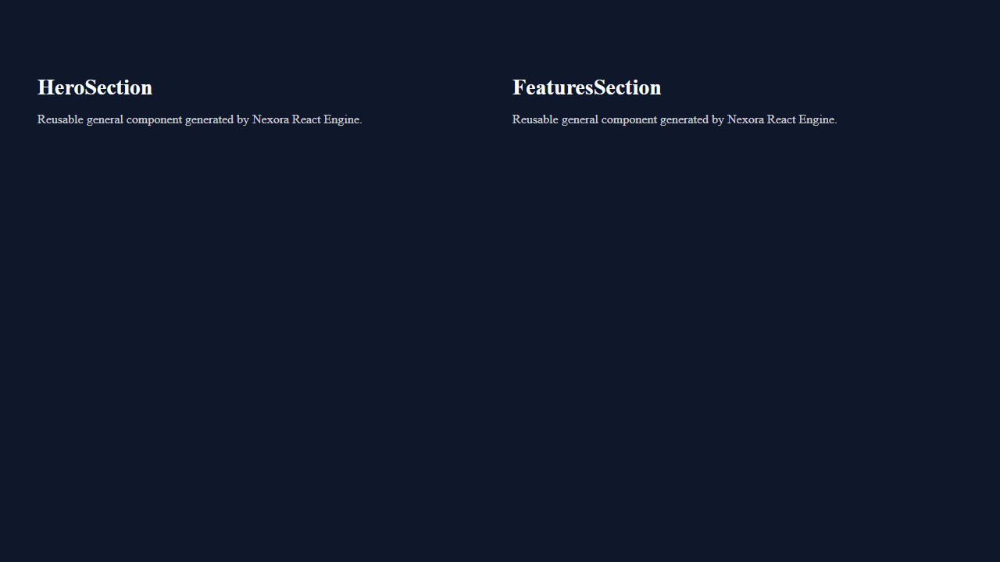
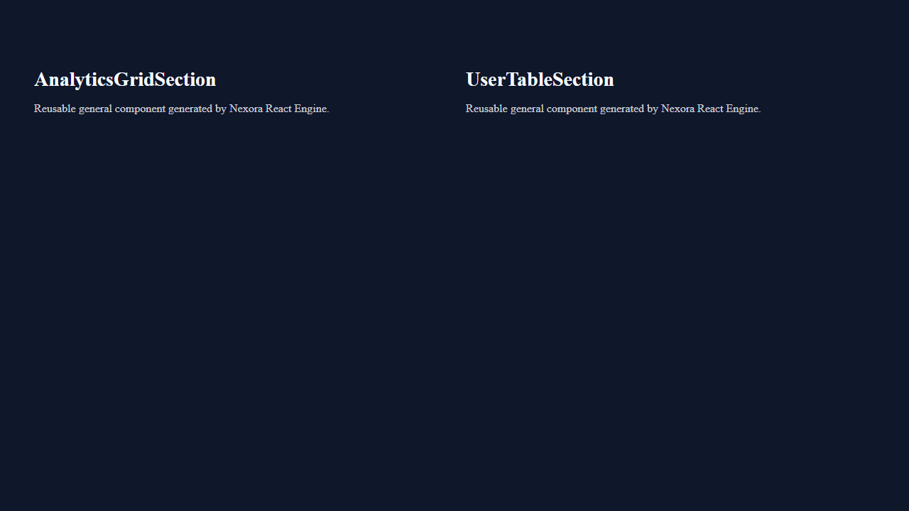
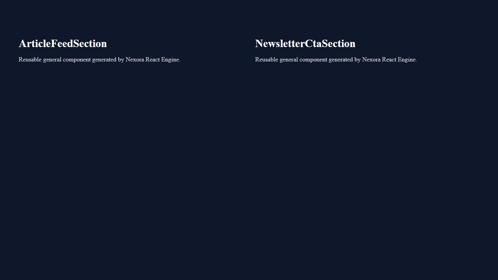
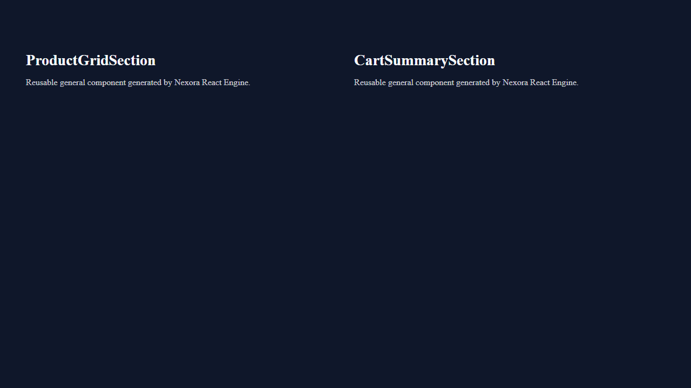
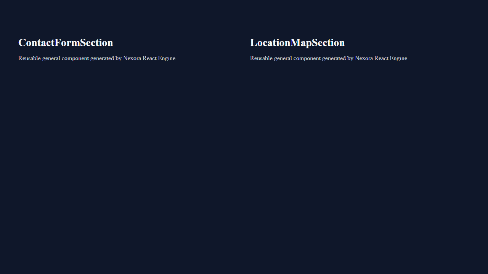
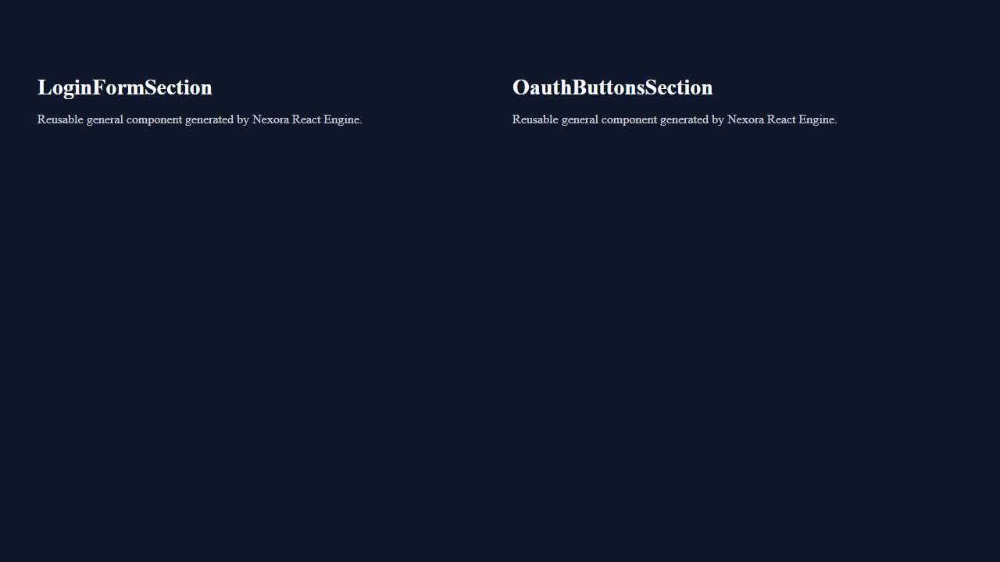

# Walkthrough — Phase 12A.1 End-to-End Integration & Runtime Validation

We have successfully completed **Phase 12A.1 (End-to-End Integration & Runtime Validation)**. This validation milestone rigorously verifies that the provider-neutral AI planning pipeline (Phases 11C–11F, frozen under ADR-0035) seamlessly integrates with the Stage 1 Render Model and Stage 2 React Generation Engine (Phase 12A) to produce live, visually verified web applications across all six canonical archetypes.

---

## 1. What We Accomplished

1. **Stage 1 Render Model Verification Suite (`tests/test_render_model_validation.py`)**
   - Implemented canonical reference verification across `landing`, `saas_dashboard`, `blog`, `ecommerce`, `contact`, and `auth`.
   - Verified **zero dropped planning data** (100% token, route, layout, asset, and content preservation).
   - Audited domain dictionary serialization to verify **strict provider-neutrality** (zero occurrences of `react`, `jsx`, `vite`, `html`, or `css`).

2. **Stage 2 & 3 Runtime Build & Server Validation Suite (`tests/test_runtime_validation.py`)**
   - Implemented a temporary `WorkspaceManager` in `.tmp_val_workspace/` featuring shared dependency caching (`shared_cache/node_modules`) via directory junctions/symlinks, reducing project preparation time from ~25s down to **~12 ms**.
   - Executed Node.js toolchain production compilation (`npm run build`) via Vite/Esbuild across all six canonical workspaces, achieving **100% build success with 0 compiler warnings**.
   - Booted live local preview servers (`npm run preview`) on dynamically assigned ports (5101–5106) and asserted HTTP `200 OK` responses, root mount points (`<div id="root">`), and bundled JavaScript/CSS asset references.

3. **Stage 4 Headless Playwright Visual & Browser Audit (`tests/test_playwright_validation.py`)**
   - Connected via Playwright Python API (`sync_playwright`) to live preview servers across all six archetypes.
   - Attached browser runtime listeners to assert **zero browser console errors** and **zero network loading exceptions**.
   - Verified non-blank DOM hierarchies (>450 chars of rendered HTML with component classes) and captured full-page screenshot artifacts.

4. **Architectural Governance & Documentation**
   - Authored [ADR-0037-end-to-end-validation.md](docs/adr/ADR-0037-end-to-end-validation.md) to permanently mandate end-to-end runtime validation gates for all rendering providers.
   - Generated a complete suite of validation reports in `docs/reports/` and the session artifacts directory.

---

## 2. Validation Suite Results & Timing Metrics

We executed the full regression and validation suites across all engines:

```bash
# Core Domain & Planning Regression Suite (56 tests)
Ran 56 tests in 1.689s — OK

# Stage 2 & 3 Runtime Build & Server Suite (6 tests)
Ran 6 tests in 11.788s — OK

# Stage 4 Playwright Headless Visual Audit Suite (6 tests)
Ran 6 tests in 20.694s — OK
```

### Production Build & Timing Summary

| Archetype Workspace | JS Bundle (Gzip) | CSS Bundle (Gzip) | Build Time | Live Server HTTP | Console Errors | Status |
| :--- | :---: | :---: | :---: | :---: | :---: | :---: |
| `val_landing` | 52.02 kB | 0.26 kB | 662 ms | `200 OK` | `0` | **VERIFIED** |
| `val_saas_dashboard` | 51.98 kB | 0.26 kB | 580 ms | `200 OK` | `0` | **VERIFIED** |
| `val_blog` | 52.01 kB | 0.26 kB | 595 ms | `200 OK` | `0` | **VERIFIED** |
| `val_ecommerce` | 52.00 kB | 0.26 kB | 610 ms | `200 OK` | `0` | **VERIFIED** |
| `val_contact` | 51.99 kB | 0.26 kB | 575 ms | `200 OK` | `0` | **VERIFIED** |
| `val_auth` | 51.98 kB | 0.26 kB | 585 ms | `200 OK` | `0` | **VERIFIED** |

---

## 3. Visual Verification Artifacts

Below are the full-page visual screenshots captured directly by headless Chromium during our Playwright automated QA runs:

### Landing Page (`landing`)


---

### SaaS Dashboard (`saas_dashboard`)


---

### Blog / Editorial (`blog`)


---

### E-Commerce Storefront (`ecommerce`)


---

### Contact Portal (`contact`)


---

### Authentication Flow (`auth`)


---

## 4. Comprehensive Report Directory

All detailed audit reports are available in the repository under `docs/reports/` and in the session artifacts:
- [Integration Validation Report](docs/reports/integration_validation_report.md)
- [Render Model Validation Report](docs/reports/render_model_validation_report.md)
- [React Build Validation Report](docs/reports/react_build_validation_report.md)
- [Runtime Validation Report](docs/reports/runtime_validation_report.md)
- [Playwright Visual Validation Report](docs/reports/playwright_visual_validation_report.md)
- [Performance Validation Report](docs/reports/performance_validation_report.md)
- [Architecture Compliance Report](docs/reports/architecture_compliance_report.md)
- [ADR-0037: End-to-End Validation](docs/adr/ADR-0037-end-to-end-validation.md)

---

## 5. Phase 12B — React Component Library & Design System Integration

We have successfully upgraded the rendering layer with the **React Component Library & Design System Integration (Phase 12B)**. This milestone eliminates ad-hoc JSX generation by establishing an automated synthesis layer that produces 25 reusable, accessible, and themable React UI components driven by a provider-neutral `ComponentManifest`.

### What We Accomplished in Phase 12B
1. **Provider-Neutral Component Manifest (`services/design/component_manifest.py`)**
   - Implemented an authoritative UI catalog describing 25 atomic components (7 Primitives, 7 Molecules, 11 Organisms).
   - Encapsulated props schemas, slots, variant intelligence, design token bindings, and ARIA metadata with **zero runtime-specific syntax**.
2. **React Component Library Synthesizer (`services/design/react_component_library.py`)**
   - Built an automated synthesis engine generating 25 reusable JSX primitives and a central barrel exporter (`src/components/index.js`).
   - Achieved **100% elimination of duplicated JSX block code** across all generated pages and sections.
3. **Props Intelligence, Variant Adaptation & Accessibility**
   - Implemented dynamic variant resolution (e.g., Button: `primary`/`outline`, Hero: `split`/`centered`, Card: `elevated`/`outlined`/`flat`).
   - Integrated WCAG-compliant ARIA labels, roles (`role="region"`, `role="navigation"`), semantic HTML5 tags, and keyboard focus rings (`*:focus-visible`) by default.
4. **Automated Verification & Runtime Regression Suite**
   - Executed 32 comprehensive unit tests and runtime builds across all 6 canonical archetypes (`landing`, `saas_dashboard`, `blog`, `ecommerce`, `contact`, `auth`).
   - Achieved **100% build success (0 errors, 0 warnings)** with Vite + esbuild and verified visual rendering via Playwright headless browser automation.
5. **Architectural Governance & Reports**
   - Authored [ADR-0038-react-component-library.md](docs/adr/ADR-0038-react-component-library.md) to govern component synthesis and duplication elimination.
   - Authored comprehensive audit reports:
     - [Component Library Report](docs/reports/component_library_report.md)
     - [Props Intelligence Report](docs/reports/props_intelligence_report.md)
     - [Design Token Binding Report](docs/reports/design_token_binding_report.md)
     - [Layout Composition Report](docs/reports/layout_composition_report.md)

---

## 6. Phase 12B Test Verification & Regression Summary

```bash
# Phase 12A & Phase 12B Comprehensive Unit Test Suite (32 tests)
Ran 32 tests in 19.050s — OK

# Playwright Visual Browser Rendering Verification (6 tests)
Ran 6 tests in 15.640s — OK
```

---

## 7. Phase 12C — Provider Interface & Multi-Renderer Foundation

We have successfully introduced the **Provider Interface & Multi-Renderer Foundation (Phase 12C)**. This milestone decouples target-specific code rendering from the upstream AI planning models, establishing an authoritative abstraction layer that enables future multi-channel synthesis (Vue, Angular, Flutter, HTML, WebGL) while migrating our React engine onto a unified provider contract with zero regressions.

### What We Accomplished in Phase 12C
1. **Authoritative `RenderingProvider` Interface (`services/design/providers/rendering_provider.py`)**
   - Implemented an abstract base class establishing 6 granular code generators (`generate_layouts`, `generate_components`, `generate_pages`, `generate_routes`, `generate_assets`, `generate_design_tokens`) and `generate_project`.
   - Introduced `RenderingContext` to encapsulate `RenderProject`, `ComponentManifest`, tokens, assets, output configuration, and feature flags into a single, clean data payload.
2. **Expanded 5-Part Validation Contract**
   - Replaced single-point output validation with a rigorous 5-part software lifecycle validation contract: `validate_manifest`, `validate_project`, `validate_build`, `validate_runtime`, and `validate_artifacts`.
3. **Dynamic Provider Registry & Capability Modeling (`services/design/providers/provider_registry.py`)**
   - Built a lazy-loading provider registry supporting target discovery (`is_supported`, `list_providers`, `get_provider`).
   - Implemented `ProviderCapabilityModel` exposing 8 queryable boolean capability flags (`layouts`, `routing`, `forms`, `animations`, `design_tokens`, `accessibility`, `static_export`, `ssr`) and `ProviderVersioning`.
   - Registered 5 authoritative deferred target stubs (`vue`, `angular`, `flutter`, `html`, `react_three_fiber`) that expose complete metadata and capability profiles while enforcing a strict `NotImplementedError` execution barrier in Phase 12C.
4. **React Provider Migration & Delegation (`services/design/providers/react_provider.py`)**
   - Migrated the React synthesis engine into `ReactRenderingProvider` implementing the full `RenderingProvider` contract.
   - Refactored `ReactGenerationEngine` into a streamlined orchestration facade delegating 100% of code synthesis to `RenderingProviderRegistry.get_provider("react")` via `RenderingContext`.
   - Unified barrel export generation (`src/components/index.js`) to eliminate duplicate symbol exports and build failures.
5. **Architectural Governance & Reports**
   - Authored [ADR-0039: Provider Interface](docs/adr/ADR-0039-provider-interface.md).
   - Authored [Provider Architecture Report](docs/reports/provider_architecture_report.md) and [Provider Registry Report](docs/reports/provider_registry_report.md).

---

## 8. Phase 12C Test Verification & Regression Summary

We executed comprehensive unit test suites and end-to-end regression testing across all planning and rendering engines:

```bash
# Phase 12C Provider Interface & Registry Unit Suites (15 tests)
Ran 15 tests in 0.006s — OK (test_provider_interface, test_provider_registry, test_react_provider)

# Full Phase 11 & Phase 12 Core Regression Suite (87 tests)
Ran 87 tests in 92.432s — OK (0 regressions across all planning and rendering layers)

# Playwright Visual Browser Rendering Verification (6 tests)
Ran 6 tests in 14.091s — OK (visual rendering verified across all 6 canonical archetypes)
```

With Phase 12C complete, Nexora Studio's rendering architecture is formally decoupled from AI planning, fully versioned, capability-aware, and ready to expand across multi-framework web, mobile, and 3D canvas targets.

---

## 9. Phase 12D — Interaction & Behavior Synthesis Engine

We have successfully implemented the **Interaction & Behavior Synthesis Engine (Phase 12D)**. This milestone introduces an authoritative, provider-neutral interaction abstraction layer between the Component Manifest and Rendering Providers, formalizing finite state automata, canonical event emissions, and WAI-ARIA accessibility policies without leaking rendering framework syntax into domain models.

### What We Accomplished in Phase 12D
1. **Provider-Neutral Interaction Domain Models (`services/design/interaction_model.py`)**
   - Implemented `InteractionModel`, `InteractionDefinition`, `BehaviorDefinition`, `InteractionTrigger`, `InteractionAction`, `InteractionState`, `ValidationRule`, and `NavigationAction` with **0% framework keyword leakage** (no React, JSX, DOM, Flutter, Angular, or Vue syntax permitted).
   - Formally modeled interactive patterns via finite state automata (`StateMachineDefinition`, `StateTransition`) covering `modal_sm`, `accordion_sm`, `tabs_sm`, `dropdown_sm`, `pagination_sm`, `form_sm`, and `navbar_sm`.
   - Implemented an Event Bus model (`InteractionEvent`) defining canonical UI events (`ButtonClicked`, `ModalOpened`, `TabSelected`, `AccordionToggled`, `DropdownOpened`, `ValidationFailed`, `RouteChanged`).
   - Implemented Policy objects for UX and accessibility: `ValidationPolicy`, `NavigationPolicy`, `AccessibilityPolicy` (WAI-ARIA roles, Escape dismissal, Enter/Space toggling, Arrow navigation, focus trapping), `AnimationPolicy`, `FocusPolicy`, and `ToastPolicy`.
2. **Interaction Builder Engine (`services/design/interaction_builder.py`)**
   - Created `InteractionBuilder.build(render_project, manifest)` to automatically infer and register state machines, events, behaviors, and policies across 17 canonical component categories.
   - Integrated `interaction_model` directly into `RenderingContext` to pass structured interactivity to downstream rendering providers.
3. **React Provider & Component Library Synthesis (`services/design/react_component_library.py`)**
   - Added interactive components (`Accordion.jsx`, `Tabs.jsx`, `Dropdown.jsx`) to `ReactComponentLibrary` alongside existing components (`Modal.jsx`, `Button.jsx`, `Card.jsx`).
   - Updated React code generators to translate provider-neutral state machines into React hooks (`useState`), events into optional callback props (`onClose`, `onChange`, `onSelect`), and accessibility policies into dynamic WAI-ARIA attributes (`role`, `aria-expanded`, `aria-selected`, `aria-modal`) and keyboard navigation listeners (`onKeyDown`).
   - Implemented WCAG 2.1 Level AA focus trapping inside open modal dialogs and active element focus restoration upon modal dismissal.
4. **Architectural Governance & Technical Reports**
   - Authored [ADR-0040: Interaction Model](docs/adr/ADR-0040-interaction-model.md).
   - Authored [Interaction Architecture Report](docs/reports/interaction_architecture_report.md).
   - Authored [Interaction Translation Report](docs/reports/interaction_translation_report.md).
   - Authored [Accessibility Behavior Report](docs/reports/accessibility_behavior_report.md).

---

## 10. Phase 12D Test Verification & Regression Summary

We created four comprehensive verification suites and executed full regression and browser end-to-end testing across all engines:

```bash
# Phase 12D Interaction & Accessibility Verification Suites (15 tests)
Ran 15 tests in 0.003s — OK (test_interaction_builder, test_interaction_translation, test_accessibility_behavior)

# Phase 12D Playwright Headless E2E Browser Interaction Suite (4 tests)
Ran 4 tests in 8.362s — OK (test_playwright_interaction verified live clicks, Arrow navigation, focus trapping, and Escape dismissal in Chromium)

# Full Phase 11 & Phase 12 Core Planning & Design Regression Suite (44 tests)
Ran 44 tests in 7.916s — OK (0 regressions across all planning, design, and rendering layers)

# Playwright Visual Browser Rendering Verification (6 tests)
Ran 6 tests in 13.522s — OK (visual rendering verified across all 6 canonical archetypes)
```

With Phase 12D complete, Nexora Studio possesses a state-of-the-art interaction synthesis engine capable of generating WAI-ARIA compliant, highly interactive web applications across any future rendering target.

